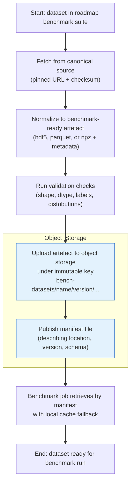

# Benchmark dataset retrieval assessment

## 1. Scope

This document assesses each dataset listed in the roadmap benchmark suite[^1]
and estimates:

- effort to automate download and preparation for benchmark use
- cached/prepared dataset size
- approximate retrieval cost from object storage (AWS S3, Scaleway Object
  Storage, and DigitalOcean Spaces)

Pricing and source checks were refreshed on 2026-03-02.

## 2. Process

For each dataset, use this repeatable pipeline:

1. Fetch from canonical source using a pinned URL and checksum validation.
2. Normalize to one benchmark-ready artefact format (Hierarchical Data Format
   version 5 (HDF5; `.hdf5`), `.parquet`, or `.npz`) with metadata (`dataset`,
   version, schema, preprocessing hash).
3. Run validation checks (shape, dtype, label or ground-truth integrity, and
   basic distribution sanity checks).
4. Upload to object storage under an immutable key
   (`bench-datasets/<name>/<version>/...`) and publish a manifest file.
5. Retrieve by manifest in benchmark jobs, with local cache fallback.

For screen readers: The following flowchart shows the benchmark dataset
retrieval pipeline from canonical fetch through prepared artefact upload,
manifest publication, and benchmark-side retrieval with cache fallback.

_Figure 1: Benchmark dataset retrieval pipeline from source fetch to benchmark
consumption._

## 3. Shared implementation and infrastructure tasks

### 3.1. Shared retrieval crate and contracts

- Create a shared dataset retrieval crate (`chutoro-bench-datasets`) with a
  `DatasetRecipe` abstraction (`fetch`, `validate`, `prepare`, `publish`).
- Standardize integrity checks (SHA-256 checksums, optional signatures, and
  explicit source URL pinning).
- Normalize all prepared datasets to a canonical schema:
  `features`, optional `labels`, optional `ground_truth`, and an immutable
  `manifest.json`.
- Version preprocessing so model-dependent transforms (for example CIFAR
  embeddings) are hash-addressed and reproducible.

### 3.2. Transport, cache, and object storage

- Add resumable transfer support with retry and backoff plus partial-download
  cleanup logic.
- Implement object-store adapters via Rust `object_store`[^2] to support AWS S3
  and S3-compatible endpoints (Scaleway and DigitalOcean) with the same code
  path, including endpoint override support from `AmazonS3Builder`.[^3]
- Add local cache index and lockfile controls to prevent duplicate preparation
  work across concurrent matrix jobs.

### 3.3. Governance and telemetry

- Enforce provenance and licence metadata gates; fail fast when an upstream
  dataset requires interactive or legal steps.
- Emit preparation telemetry (download seconds, transform seconds, compressed
  and expanded bytes, and checksum outcomes).

## 4. Matrix benchmark framework and result publication

### 4.1. Execution mechanism

Recommended implementation mechanism:

- Keep `criterion`[^4] for benchmark timing, confidence intervals, and baseline
  comparisons.
- Add a dedicated Rust orchestration binary (for example
  `chutoro-bench-matrix`) that:
  - reads a declarative matrix spec (`benchmarks/matrix.toml`) across
    dataset/version, chutoro backend, metric, and profile (`smoke`, `cpu`, and
    `scale`),
  - resolves prepared dataset artefacts required by the manifest,
  - executes benchmark tuples with deterministic seeds,
  - records tuple-level run metadata.
- Use `cargo-criterion --message-format=json`[^5] for machine-consumable
  benchmark events.

### 4.2. Publishable result schema

Convert benchmark outputs into:

- `results.jsonl` (per-tuple raw records)
- `summary.parquet` (analytics-friendly summary)
- `report.md` (human-readable publishable report)

### 4.3. Object-store persistence model

Persist run artefacts and baseline references in object storage:

- `bench-results/<run-id>/...`
- `bench-results/baselines/<dataset>/<backend>/<metric>/latest.json`

This design keeps benchmark logic in Rust and avoids shell-only orchestration
while preserving reproducibility and publishability.

## 5. Cost model

Retrieval cost is modeled as:

`cost ~= egress_cost + request_cost`

Assumptions:

- These are retrieval-only estimates (not storage-at-rest).
- Sizes are presented in gibibytes (GiB, `2^30` bytes).
- Provider egress list prices are quoted in decimal gigabytes (GB, `10^9`
  bytes). For rough planning estimates, this document treats `1 GiB ~= 1 GB`.
- Numbers below are marginal egress costs (assume included transfer quotas are
  already exhausted).
- AWS request charge for `GET` is included as a note; it is negligible for the
  object counts expected here.

Provider pricing inputs used:

- AWS S3 Standard (US East): data transfer out to internet `$0.09/GB`
  (first 10 TB), `GET` `$0.0004` per 1,000 requests.[^6]
- Scaleway Object Storage: requests included; egress `75GB` free every month,
  then `EUR0.01/GB`.[^7]
- DigitalOcean Spaces: `1,024GiB` outbound included per subscription; outbound
  overage `$0.01/GiB`; no separate standard per-request retrieval fee listed on
  Spaces pricing docs.[^8]

Included-transfer notes:

- AWS lists a `100GB` per month free transfer allowance to internet on the S3
  pricing page.[^6]
- Scaleway includes `75GB` per month egress.[^7]
- DigitalOcean Spaces includes `1,024GiB` per month outbound transfer.[^8]

For matrix jobs, retrieval cost scales approximately with:

`dataset_size_gib * number_of_tuples_that_pull_dataset * provider_egress_rate`

In practice, local worker cache hits reduce this significantly when tuple
ordering groups by dataset.

## 6. Dataset assessments

Effort scale:

- `XS`: fully scriptable, <0.5 day
- `S`: scriptable, ~1 day
- `M`: scriptable with non-trivial preprocessing, 1-3 days
- `L`: partially gated and/or heavier pipeline, 3-5 days
- `XL`: very large-scale operational pipeline, ~1-2 weeks+

| Dataset                                            | Automatability and prep effort                                                                                               | Cached/prepared size (gibibytes, GiB)                   | AWS S3 retrieval (USD) | Scaleway retrieval (EUR) | DigitalOcean retrieval (USD) |
| -------------------------------------------------- | ---------------------------------------------------------------------------------------------------------------------------- | ------------------------------------------------------: | ---------------------: | -----------------------: | ---------------------------: |
| `make_blobs`                                       | Fully automatable synthetic generation. No external download. `XS`.                                                          | 0.000                                                   | 0.000                  | 0.000                    | 0.000                        |
| MNIST digits                                       | Fully automatable (prefer approximate nearest neighbour (ANN) HDF5 packaging). `S`.                                          | 0.212                                                   | 0.019                  | 0.002                    | 0.002                        |
| Fashion-MNIST                                      | Fully automatable with direct IDX links and checksums. `S`.                                                                  | 0.212                                                   | 0.019                  | 0.002                    | 0.002                        |
| CIFAR-10 / CIFAR-100                               | Fully automatable downloads; medium prep to produce fixed embeddings. `M`.                                                   | 0.228 (both)                                            | 0.021                  | 0.002                    | 0.002                        |
| 20 Newsgroups                                      | Fully automatable via `fetch_20newsgroups`; medium prep for text vectorization. `M`.                                         | 0.027 (384d embeddings)                                 | 0.002                  | 0.000                    | 0.000                        |
| RCV1-v2                                            | Fully automatable via `fetch_rcv1`; larger sparse-to-dense prep. `M-L`.                                                      | 1.151 (384d embeddings)                                 | 0.104                  | 0.012                    | 0.012                        |
| SNAP com-Amazon                                    | Fully automatable download; medium graph-to-vector prep. `M`.                                                                | 0.160 (128d embeddings)                                 | 0.014                  | 0.002                    | 0.002                        |
| SNAP com-DBLP                                      | Fully automatable download; medium graph-to-vector prep. `M`.                                                                | 0.151 (128d embeddings)                                 | 0.014                  | 0.002                    | 0.002                        |
| Peripheral blood mononuclear cell (PBMC) 68k (10x) | Source page is lead-form gated; pipeline is only partly automatable end-to-end. `L`.                                         | 0.013 (50d principal component analysis (PCA) + labels) | 0.001                  | 0.000                    | 0.000                        |
| GloVe word vectors                                 | Fully automatable download; moderate normalize/select-dimension prep. `M`.                                                   | 0.896 (GloVe-200 HDF5)                                  | 0.081                  | 0.009                    | 0.009                        |
| SIFT1M                                             | Fully automatable via ANN-Benchmarks HDF5. `S`.                                                                              | 0.489                                                   | 0.044                  | 0.005                    | 0.005                        |
| GIST1M                                             | Fully automatable via ANN-Benchmarks HDF5. `S-M`.                                                                            | 3.600                                                   | 0.324                  | 0.036                    | 0.036                        |
| DEEP1B / BigANN                                    | Automatable but operationally heavy (multi-hundred-GB artefacts, resumable download, sharded upload, long validation). `XL`. | 89.4-476.8 (1B vectors, uint8 to float32)               | 8.046-42.912           | 0.894-4.768              | 0.894-4.768                  |

_Table 1: Dataset preparation effort, cache size, and approximate one-time
retrieval cost by provider._

## 7. Dataset-specific implementation tasks for suite and matrix readiness

### 7.1. `make_blobs`

- Implement deterministic recipe presets (seed, centres, anisotropy,
  imbalance, and noise).
- Export generated features and labels into canonical artefact format and
  manifest it like external datasets.
- Register tuples in `smoke` profile for quick backend parity checks.

### 7.2. MNIST digits

- Add pinned IDX downloader and checksum verifier.
- Convert to canonical dense array artefact with labels and benchmark metadata.
- Register `smoke` and `cpu` tuples with ARI, NMI, and recall outputs.

### 7.3. Fashion-MNIST

- Reuse MNIST ingestion flow with separate source URLs and checksums.
- Validate class-label mapping consistency with manifest metadata.
- Register as a harder small-scale profile tuple alongside MNIST.

### 7.4. CIFAR-10 / CIFAR-100

- Add deterministic image embedding pipeline (frozen model revision and
  config).
- Store prepared embeddings and labels with preprocessing hash in the manifest.
- Register separate tuples for CIFAR-10 and CIFAR-100 class granularity.

### 7.5. 20 Newsgroups

- Add deterministic text cleaning, tokenization, and embedding recipe.
- Cache vectors and topic labels in canonical schema; persist recipe version.
- Add `cpu` profile tuples with topic recovery metrics.

### 7.6. RCV1-v2

- Add fetch and normalization for multilabel targets.
- Implement sparse-to-dense projection recipe with fixed dimensionality and a
  checksum of transform configuration.
- Register long-running tuples in `cpu` profile with multilabel-aware scoring.

### 7.7. SNAP com-Amazon

- Add graph ingestion with deterministic node ordering and parsing validation.
- Build and cache node embeddings with pinned hyperparameters.
- Add tuples that evaluate community recovery and graph-quality metrics.

### 7.8. SNAP com-DBLP

- Mirror SNAP ingestion and embedding flow for DBLP graph files.
- Preserve overlapping-community label structures in prepared artefacts.
- Register graph profile tuples parallel to com-Amazon for regression diffs.

### 7.9. PBMC 68k (10x Genomics)

- Define internal mirrored-source ingestion because the upstream path is
  interactive and lead-form gated.
- Add a fixed preprocessing chain (normalization, highly variable gene
  selection, and PCA) with explicit version hash.
- Gate matrix execution on provenance confirmation metadata.

### 7.10. GloVe vectors

- Add downloader for selected dimensionality bundles and checksum verification.
- Normalize storage format and optionally include sampled subsets for smoke
  runs.
- Register angular-distance tuples for `cpu` and `scale` profiles.

### 7.11. SIFT1M

- Integrate ANN-Benchmarks HDF5 ingestion with ground-truth validation.
- Convert or expose data in benchmark suite schema while preserving exact
  neighbours.
- Register recall-focused tuples across backends in `cpu` and `scale`
  profiles.

### 7.12. GIST1M

- Integrate ANN-Benchmarks ingestion for high-dimensional vectors.
- Add preparation-time and run-time memory guards to avoid host overcommit.
- Register `scale` tuples on runners meeting documented memory thresholds.

### 7.13. DEEP1B / BigANN

- Implement sharded ingestion pipeline for 1M, 10M, 100M, and 1B subsets.
- Use multipart and resumable object-store uploads plus per-shard checksum
  manifests.
- Partition matrix runs by scale profile and dedicated runner class to keep
  jobs bounded and reproducible.

## 8. Notes on size estimates

- MNIST, Fashion-MNIST, SIFT1M, GIST1M, and GloVe-200 use published
  ANN-Benchmarks HDF5 sizes.[^9]
- `make_blobs` sizing is based on generated arrays from the canonical
  scikit-learn API.[^10]
- CIFAR assumes a one-time fixed image embedding step and caching both
  CIFAR-10 and CIFAR-100 in 512d float32 vectors.[^11]
- 20 Newsgroups and RCV1 assume caching dense 384d float32 embeddings for
  repeatable ANN or clustering runs.[^12][^13]
- SNAP datasets assume caching 128d float32 node embeddings plus labels.[^14]
- PBMC assumes caching 50d PCA embeddings plus cell-type labels.[^15]
- DEEP1B or BigANN range is computed from datatype and dimensionality in
  Big-ANN specifications: `1B * dims * bytes-per-dim`.[^16]

## 9. Key risks and recommendations

- PBMC 68k is the least automation-friendly source because the 10x dataset page
  is form-gated; keep a mirrored internal artefact and treat it as controlled
  input.
- DEEP1B or BigANN should use chunked transfers and manifest-level checksums,
  then sharded object keys to avoid very large single-object retries.
- For recurring benchmark jobs, retrieval cost is dominated by egress. Request
  charges are usually negligible compared with transfer.

## 10. References

[^1]: Roadmap dataset list and benchmark tiers: repository-local
  `docs/roadmap.md` section "Benchmark dataset suite".
[^2]: Rust `object_store` crate:
  <https://docs.rs/object_store/latest/object_store/>.
[^3]: `AmazonS3Builder` endpoint configuration:
  <https://docs.rs/object_store/latest/object_store/aws/struct.AmazonS3Builder.html>.
[^4]: Criterion command-line options:
  <https://bheisler.github.io/criterion.rs/book/user_guide/command_line_options.html>.
[^5]: `cargo-criterion` JSON message output:
  <https://bheisler.github.io/criterion.rs/book/cargo_criterion/external_tools.html>.
[^6]: AWS S3 pricing: <https://aws.amazon.com/s3/pricing/>.
[^7]: Scaleway storage pricing:
  <https://www.scaleway.com/en/pricing/storage/>.
[^8]: DigitalOcean Spaces pricing:
  <https://docs.digitalocean.com/products/spaces/details/pricing/>.
[^9]: ANN-Benchmarks dataset table:
  <https://github.com/erikbern/ann-benchmarks>.
[^10]: scikit-learn `make_blobs`:
  <https://scikit-learn.org/stable/modules/generated/sklearn.datasets.make_blobs.html>.
[^11]: CIFAR-10 and CIFAR-100 dataset page:
  <https://www.cs.toronto.edu/~kriz/cifar.html>.
[^12]: scikit-learn `fetch_20newsgroups`:
  <https://scikit-learn.org/stable/modules/generated/sklearn.datasets.fetch_20newsgroups.html>.
[^13]: scikit-learn `fetch_rcv1`:
  <https://scikit-learn.org/stable/modules/generated/sklearn.datasets.fetch_rcv1.html>.
[^14]: SNAP dataset pages:
  <https://snap.stanford.edu/data/com-Amazon.html> and
  <https://snap.stanford.edu/data/com-DBLP.html>.
[^15]: PBMC 68k dataset landing page (lead-form gate):
  <https://www.10xgenomics.com/datasets/fresh-68-k-pbm-cs-donor-a-1-standard-1-1-0>.
[^16]: Big-ANN benchmark dataset specifications:
  <https://big-ann-benchmarks.com/neurips21.html>.
