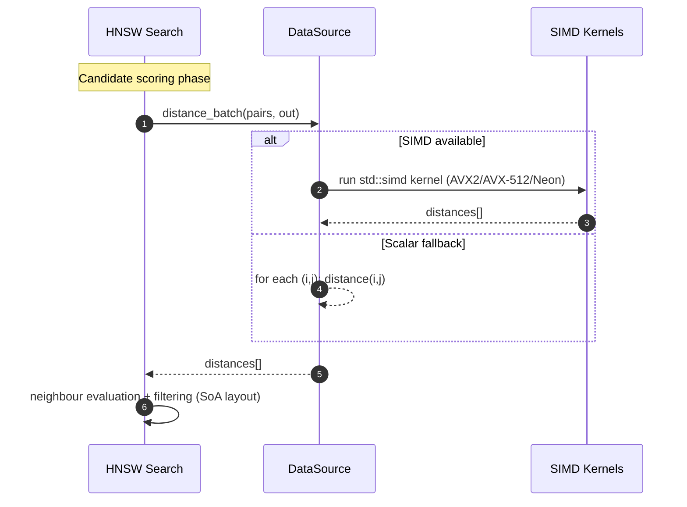

# Chutoro: a high-performance, extensible FISHDBC implementation in Rust

This document presents the architectural design and literature survey for
`chutoro`.

## Part I: Foundational Analysis and State of the Art

While the FISHDBC algorithm's value is proven, a truly high-performance, safe,
and extensible implementation has remained a significant challenge. This
document outlines the architecture for `chutoro`, a Rust-based implementation
poised to unlock new potential in large-scale clustering. By leveraging Rust's
unique ownership model, zero-cost abstractions, and modern concurrency tools,
`chutoro` addresses critical performance and safety gaps not well-served by
existing solutions in Python or C++. This initial section establishes the
theoretical groundwork for this novel implementation, deconstructing the
FISHDBC algorithm and surveying the state-of-the-art to justify the
architectural decisions that make `chutoro` a game-changer in the scalable
clustering space. This Rust and GPU architecture aims for significant speedups
over established benchmarks such as `hnswlib` and existing parallel Python
implementations.

### 1. The FISHDBC Algorithm Deconstructed

To fully appreciate the design of the FISHDBC algorithm and the rationale for
its implementation, it is essential to understand its position within the
broader landscape of density-based clustering. FISHDBC represents a pragmatic
and highly effective engineering solution to the inherent scalability
limitations of its predecessors. Its architecture is a direct response to the
computational challenges posed by large, high-dimensional, or non-metric
datasets.

#### 1.1. Lineage and Motivation: From DBSCAN to HDBSCAN* to FISHDBC

The evolution of density-based clustering algorithms reveals a clear trajectory
toward greater flexibility and scalability. The journey begins with DBSCAN
(Density-Based Spatial Clustering of Applications with Noise), a seminal
algorithm that introduced the powerful concept of identifying clusters as dense
regions of points separated by sparser regions.[^1] Its primary strengths are
its ability to discover clusters of arbitrary shape and its inherent notion of
noise, allowing it to robustly handle outliers.[^2] However, DBSCAN's
effectiveness is critically dependent on two user-defined parameters:

`eps`, the neighbourhood radius, and `minPts`, the minimum number of points
required to form a dense region. The `eps` parameter is particularly
problematic, as a single global value is often insufficient to capture clusters
of varying densities within the same dataset.[^3]

HDBSCAN (Hierarchical Density-Based Spatial Clustering of Applications with
Noise) was developed to address this fundamental limitation.[^4] By
transforming the space based on density and building a hierarchy of clusters,
HDBSCAN effectively converts the

`eps` parameter from a fixed distance threshold into a range of distances,
allowing it to identify clusters with varying densities simultaneously.[^4] The
algorithm constructs a minimum spanning tree (MST) of the data points and
derives a rich cluster hierarchy from it. A stability measure is then applied
to this hierarchy to extract a flat, optimal clustering without requiring the
user to specify the number of clusters or a distance scale.[^3] The most robust
variant, HDBSCAN*, operates on the mutual reachability graph, but this comes at
a significant computational cost. For arbitrary data types and distance
functions where no specialized indexing structures exist (e.g., k-d trees for
Euclidean distance), HDBSCAN* has a computational complexity of

O(n^2), stemming from the need to compute a large number of pairwise distances
to build its core data structures.[^3] This quadratic complexity renders it
impractical for large-scale datasets.

This is the precise problem that FISHDBC (Flexible, Incremental, Scalable,
Hierarchical Density-Based Clustering) was designed to solve.[^5] FISHDBC is
explicitly positioned as a scalable

_approximation_ of HDBSCAN*.[^6] The core philosophy of FISHDBC is to accept a
minor, controlled loss of accuracy in exchange for a massive gain in
performance and scalability. It achieves this by fundamentally altering how the
underlying graph structure is built, thereby avoiding the

O(n^2) bottleneck that plagues its predecessors in non-metric spaces.[^5] This
makes FISHDBC a powerful tool for modern data science, where datasets are often
too large for traditional methods.

The central innovation of FISHDBC is not the creation of a new clustering
paradigm, but a critical act of algorithmic substitution. It recognizes that
the quadratic complexity of HDBSCAN* originates from the need for an all-pairs
(or near all-pairs) distance computation to construct the exact mutual
reachability graph and, subsequently, the exact minimum spanning tree. FISHDBC
replaces this computationally intractable step with a highly efficient
approximate nearest neighbour (ANN) search. This is a deliberate and
well-reasoned engineering trade-off. By using an ANN method to find candidate
edges for the MST, FISHDBC forgoes the guarantee of finding the mathematically
perfect single-linkage hierarchy. In return, it achieves a complexity class
(often near O(nlogn)) that makes density-based clustering feasible on a scale
that was previously impossible for arbitrary distance metrics.[^5] This
substitution demonstrates the crucial insight that an

_approximate_ single-linkage hierarchy is often sufficient to produce
high-quality, meaningful clusters, effectively unlocking the power of
density-based methods for big data applications.

#### 1.2. The Three Pillars of FISHDBC

The FISHDBC algorithm can be understood as a three-stage pipeline, with each
stage building upon the last. The first two stages are focused on efficiently
constructing a graph that approximates the single-linkage hierarchy of the
data, while the final stage extracts clusters from this graph.

1. **Pillar 1: Approximate nearest neighbour search via HNSW:** The first and
   most critical stage is the construction of an approximate nearest neighbour
   graph using the Hierarchical Navigable Small World (HNSW) algorithm.[^7]
   HNSW is a graph-based data structure that allows for extremely fast ANN
   queries. Instead of computing all

O(n^2) pairwise distances, FISHDBC incrementally builds an HNSW graph. As each
point is added to the HNSW structure, the algorithm performs a search to find
its nearest neighbours. The distances computed during these limited searches
are the only ones the algorithm considers.[^8] This process effectively
generates a sparse set of candidate edges and their weights (distances) that
are likely to be part of the true minimum spanning tree, while avoiding the
vast majority of unnecessary distance calculations. This is the primary source
of the algorithm's scalability and its approximative nature.[^7]

1. **Pillar 2: Minimum Spanning Tree (MST) Construction:** The candidate edges
   and distances discovered during the HNSW construction phase are used to
   build a Minimum Spanning Tree (MST) over the entire dataset.[^5] An MST is a
   subgraph that connects all vertices together with the minimum possible total
   edge weight.[^8] In the context of clustering, the MST is a powerful
   structure because it is equivalent to the dendrogram produced by
   single-linkage hierarchical clustering. It represents the underlying
   connectivity and density structure of the data in a compact and efficient
   format. By building an MST from the sparse set of edges generated by HNSW,
   FISHDBC creates an approximation of the true single-linkage hierarchy
   without the quadratic cost.
2. **Pillar 3: Hierarchical Cluster Extraction:** The final stage of FISHDBC
   mirrors the process used by HDBSCAN to extract clusters from the MST.[^4]
   The edges of the MST are sorted in order of decreasing weight. The algorithm
   then conceptually removes edges one by one, from longest to shortest. Each
   edge removal has the potential to split a connected component into two,
   thereby creating a hierarchy of nested clusters. This process generates a
   complete cluster hierarchy tree. To produce a useful "flat" clustering,
   HDBSCAN's stability-based technique is employed. This method analyzes the
   persistence of clusters as the distance threshold (represented by the edge
   weights) changes. Clusters that exist over a wide range of distances are
   considered more "stable" and are selected for the final output, while
   short-lived clusters are discarded.[^4] This allows the algorithm to
   automatically determine the best clusters without requiring user-defined
   thresholds.

#### 1.3. Key Properties: Flexibility, Incrementality, and Scalability

The three-pillar architecture of FISHDBC endows it with a unique combination of
properties that make it exceptionally well-suited for a wide range of
real-world clustering tasks.

- **Flexibility:** A standout feature of FISHDBC is its ability to work with
  arbitrary data types and user-defined distance functions.[^5] Traditional
  clustering algorithms often require data to be represented as numerical
  feature vectors in a metric space. This forces domain experts to engage in a
  potentially lossy feature extraction process. FISHDBC bypasses this
  requirement. A user can provide a dataset of, for example, protein sequences
  and a function that computes the Levenshtein distance between them.[^8] The
  algorithm will operate directly on this data, allowing domain knowledge to be
  encoded in the distance metric itself. This flexibility is significantly
  enhanced by Rust's powerful type system and compile-time safety guarantees.
  Unlike Python environments which often rely on C++ wrappers and can introduce
  runtime errors at the boundary, Rust allows for the creation of highly
  performant, user-defined distance functions that are verified by the
  compiler, ensuring both safety and speed without compromise.[^5]
- **Incrementality:** The data structures at the core of FISHDBC—the
  HNSW graph and the MST—are amenable to efficient updates. When new data
  points arrive, they can be added to the existing HNSW graph and the MST can
  be updated with lightweight computations, rather than re-running the entire
  clustering process from scratch.[^5] This makes FISHDBC an excellent
  candidate for streaming data applications, where clustering needs to be
  updated dynamically as new information becomes available.
- **Scalability:** As previously discussed, scalability is the primary
  motivation behind FISHDBC. By leveraging HNSW to avoid the computation of a
  full distance matrix, the algorithm circumvents the O(n^2) complexity that
  limits other density-based methods in non-metric spaces.[^5] Experimental
  evidence shows that it can scale to millions of data items, making it a
  viable tool for big data analytics.[^5]

### 2. Survey of Parallel Clustering Techniques

To design a high-performance implementation of FISHDBC, it is crucial to learn
from existing parallelization efforts in the field of clustering. The
literature provides valuable precedents for both multi-core CPU and many-core
GPU architectures. A recurring theme is the decomposition of the problem into
smaller, independently solvable parts, followed by a merge or reduction step.

#### 2.1. Case Study: A Shared-Memory Python Implementation

A master's thesis by Edoardo Pastore presents a detailed parallel
implementation of FISHDBC using Python's `multiprocessing` module, designed for
shared-memory multi-core systems.[^8] This implementation serves as an
invaluable case study, as it directly addresses the specific bottlenecks of the
FISHDBC algorithm.

Profiling of the sequential FISHDBC algorithm reveals two primary performance
bottlenecks: the creation of the HNSW graph (specifically, the `add()`
function, which is called for every point) and the subsequent computation of
the MST.[^8] The parallel implementation focuses on accelerating these two
stages.

The architecture employs a multi-process model to circumvent Python's Global
Interpreter Lock (GIL), which would otherwise prevent true parallelism in a
multi-threaded approach. Data is shared between processes using a combination
of mechanisms. Read-only data, such as the input dataset and the distance
function, is shared efficiently using the `fork` system call's copy-on-write
semantics. The HNSW graph, which must be read from and written to by all
processes, is stored in shared memory buffers managed by
`multiprocessing.shared_memory` and exposed as NumPy arrays.[^8]

The parallelization strategy for HNSW involves partitioning the input data and
assigning each partition to a worker process. These processes then concurrently
call the `add()` function to insert their assigned points into the single,
shared HNSW graph structure. A key design choice is the use of a **lock-free**
strategy for updating the shared arrays that represent the graph's adjacency
lists and weights. This is justified by the inherently approximate nature of
FISHDBC; the potential for rare race conditions is accepted as a trade-off for
eliminating lock contention, with minimal observed impact on final clustering
accuracy.[^8]

For MST computation, the implementation adopts a "local-then-global" approach.
Instead of having one process build the MST from the complete, globally
constructed HNSW graph, each worker process first computes a local MST using
only the candidate edges it discovered while adding its partition of points.
These smaller, local MSTs are then returned to the main process, which performs
a final merge step using Kruskal's algorithm on the union of all edges from the
local trees. This significantly reduces the workload of the final MST
computation stage.[^8]

#### 2.2. GPU Acceleration Strategies for Density-Based Clustering

The massively parallel architecture of Graphics Processing Units (GPUs) makes
them an ideal platform for accelerating clustering algorithms, which are often
dominated by distance calculations and graph operations.

Implementations of GPU-accelerated DBSCAN, such as G-DBSCAN, demonstrate the
core principle: parallelize the neighbourhood search (range query) step.[^9]
This is typically achieved by having thousands of GPU threads concurrently
compute distances. One common approach is to first construct a graph on the GPU
where edges connect all points within the

`eps` radius. This graph construction is itself a parallel process where each
pair of points can be evaluated independently. Once the graph is built, the
connected components (which correspond to the clusters) can be found using
parallel graph traversal algorithms like Breadth-First Search (BFS).[^10] The
RAPIDS cuML library provides a highly optimized DBSCAN implementation that
leverages this approach for significant speedups over CPU-based versions.[^11]

More advanced algorithms like HDBSCAN and OPTICS have also been successfully
ported to GPUs. G-OPTICS, for instance, parallelizes the iterative computations
required to build the reachability plot, achieving speedups of over 100x
compared to optimized CPU versions.[^12] The RAPIDS cuML library also includes
a GPU-accelerated HDBSCAN, which can perform the entire pipeline—from MST
construction to hierarchy extraction—on the GPU.[^13] These examples confirm
that the entire FISHDBC workflow is amenable to GPU acceleration, not just
isolated components. The common thread is the exploitation of data parallelism:
the ability to perform the same operation (like a distance calculation or a
neighbour check) on many different data elements simultaneously, which is the
architectural strength of the GPU.[^10]

The "local-then-global" pattern observed in the multi-process Python
implementation of FISHDBC is not merely an artifact of that specific
architecture; it is a manifestation of a more general and powerful parallel
algorithmic paradigm. This divide-and-conquer strategy is fundamental to
scaling graph algorithms where maintaining a consistent global state is
computationally expensive or creates a synchronization bottleneck. Parallel
DBSCAN implementations on distributed clusters exhibit a similar pattern: data
is partitioned across nodes, local clustering is performed independently on
each node, and a final step merges the clusters across the partition
boundaries.[^14] At a finer grain, many parallel MST algorithms, such as
Borůvka's, operate on the same principle. They begin with trivial local
components (each vertex is its own MST) and iteratively merge them in parallel
rounds.[^15] This recurring pattern—decompose the problem, solve subproblems in
parallel with minimal communication, and perform a final merge or reduction—is
a cornerstone of parallel algorithm design. This principle can be directly
applied to a GPU implementation of FISHDBC. The dataset can be partitioned
among GPU thread blocks, with each block responsible for finding candidate
edges or even constructing local MST fragments within its fast shared memory. A
subsequent global kernel can then efficiently merge these fragments into the
final, complete MST.

### 3. Component-Level Survey: High-Performance Primitives

A successful implementation of chutoro requires high-performance
implementations of its constituent parts. This section surveys the state of the
art for each component, informing the technology choices for both the CPU and
GPU execution paths.

#### 3.1. Approximate nearest neighbour search: HNSW

The performance of the entire FISHDBC algorithm is heavily dependent on the
efficiency of the HNSW implementation.

- **CPU Implementations:** The canonical and most widely used implementation is
  `hnswlib`, a highly optimized C++ library with Python bindings created by the
  algorithm's author, Yury Malkov.[^16] It serves as the de facto performance
  benchmark for any new CPU-based implementation. Its design emphasizes speed
  and efficient memory usage, making it the standard against which the Rust CPU
  module will be measured.
- **GPU Implementations:** The `cuhnsw` library provides a direct CUDA
  implementation of HNSW, demonstrating the feasibility and benefits of porting
  the algorithm to the GPU.[^17] The project's performance analysis yields
  critical findings for the design. index on the GPU can be significantly
  faster (reportedly 8-9 times) than a multi-threaded CPU implementation using

`hnswlib`. Second, it highlights that GPU acceleration for the search phase is
most effective when performed in batches (i.e., searching for the nearest
neighbours of many query points simultaneously). This is because batching
maximizes the parallelism and amortizes the overhead of kernel launches and
memory transfers.[^17] This strongly validates the decision to develop a GPU
path for the index-building phase of chutoro, as it is equivalent to a large
batch insertion process.

#### 3.2. Minimum Spanning Tree Construction

The choice of MST algorithm is critical, especially for a parallel
implementation. The three classical algorithms—Prim's, Kruskal's, and
Borůvka's—have vastly different characteristics when parallelized.

- **Prim's Algorithm:** This algorithm is inherently sequential. It grows the
  MST one edge at a time from an arbitrary starting vertex, always adding the
  cheapest edge that connects a vertex in the tree to a vertex outside the
  tree.[^15] This greedy, step-by-step growth makes it difficult to parallelize
  effectively on a massive scale, as the choice of which edge to add next
  depends on all previous choices. While some of its sub-operations (like
  finding the minimum-weight edge from the current tree) can be parallelized,
  the core logic remains a serial bottleneck.[^18]
- **Kruskal's Algorithm:** This algorithm's strategy is to first sort all edges
  in the graph by weight, from least to greatest. It then iterates through the
  sorted list, adding an edge to the MST if and only if it does not form a
  cycle with the edges already added.[^15] The main challenge for
  parallelization is the global sort, which can be a bottleneck, though
  parallel sorting is a well-studied problem. The subsequent edge addition
  phase can be parallelized using a concurrent union-find data structure to
  detect cycles efficiently.
- **Borůvka's Algorithm:** This algorithm is consistently cited as the most
  suitable for parallel implementation, particularly on many-core architectures
  like GPUs.[^15] It operates in a series of rounds. In each round, every
  component (which is initially just a single vertex) finds its cheapest
  outgoing edge to another component, and all such edges are added to the MST
  simultaneously. This merges components together. Because the number of
  components decreases by at least a factor of two in each round, the algorithm
  terminates in a logarithmic number of rounds. The key advantage for
  parallelism is that the search for the cheapest edge for each component can
  be performed completely independently and concurrently.[^15] This structure
  maps perfectly to the Single Instruction, Multiple Data (SIMD) execution
  model of GPUs.

| Algorithm      | Core idea                      | Parallelism characteristics  | Suitability for GPU |
| -------------- | ------------------------------ | ---------------------------- | ------------------- |
| **Prim's**     | Grow tree from one component.  | Little parallel work.        | **Poor**            |
| **Kruskal's**  | Sort edges, add safe edges.    | Sort limits parallelism.     | **Moderate**        |
| **Borůvka's**  | Components pick cheapest edge. | Highly parallel; log rounds. | **Excellent**       |

The selection of Borůvka's algorithm for the GPU-based MST computation is not
merely a matter of choosing the fastest option; it represents a decision based
on deep architectural synergy. The GPU hardware model is predicated on
executing the same instruction across thousands of threads simultaneously
(SIMD). Borůvka's algorithm's computational rhythm is naturally synchronous
with this model. The first phase of each round—"for each component, find the
minimum weight outgoing edge"—is a perfect SIMD task. One can launch a GPU
kernel with one thread or thread block assigned to each component, and every
thread will execute an identical search-and-reduce operation on its local set
of edges with minimal need for inter-thread communication within this phase.
The second phase—merging the components based on the selected edges—can be
implemented as a subsequent kernel launch, acting as a global synchronization
point. This structure contrasts sharply with Prim's algorithm, where the
single-threaded growth would leave the vast majority of the GPU's cores idle,
and with Kruskal's algorithm, where the required global sort involves complex
communication patterns that can be less efficient than the largely independent
work in Borůvka's approach. Therefore, Borůvka's algorithm does not just run
_on_ the GPU; its design is fundamentally in harmony with the GPU's native
execution model, promising a level of performance and efficiency that
less-aligned algorithms cannot achieve.

## Part II: System Architecture and CPU Implementation

This section translates the foundational analysis into a concrete architectural
design for the proposed Rust library. It begins with a high-level overview of
the system's components and then delves into the specific designs for the
pluggable data provider framework and the multi-threaded CPU implementation of
the core clustering engine. The choice of Rust is central to this architecture,
as its performance characteristics and fine-grained control over system
resources—akin to C++—make it an ideal language for building libraries that
push the boundaries of high-performance computing, without sacrificing the core
safety promises that prevent entire classes of common bugs.

### 4. High-Level System Architecture

The system is designed as a modular and extensible library, separating concerns
to promote maintainability and performance. The architecture consists of
several key components that interact to provide the full clustering
functionality, from data ingestion to result presentation, with clear pathways
for both CPU and GPU execution.

A conceptual diagram of the architecture is as follows:

```plaintext
                                
+--------------------------------+
| Application / User             |
+--------------------------------+
            v
+--------------------------------+      +--------------------------------+
| Core Clustering Engine         |----->| Plugin Manager                 |
| (Orchestrator, API)            |      | (Discovers & Loads Plugins)    |
+--------------------------------+      +--------------------------------+
            ^                                   |
            |                                   v
+--------------------------------+      +--------------------------------+
| Data Provider Interface        |<-----| Plugin Implementations         |
| (DataSource Trait)             |      | (.so, .dll files)              |
+--------------------------------+      +--------------------------------+
            v (Data Flow)
+--------------------------------+
| Execution Path Selector        |
| (CPU or GPU)                   |
+--------------------------------+
       +--------+---------+
       v                  v
+-------------------+  +-------------------+
| CPU Module        |  | GPU Offload Module|
| (Rayon-based)     |  | (rust-cuda based) |
| - HNSW            |  | - Host-Device I/O |
| - MST (Kruskal)   |  | - HNSW Kernels    |
| - Cluster Extract |  | - MST Kernels     |
+-------------------+  +-------------------+
       |                  |
       +--------+---------+
                 v
+--------------------------------+
| Results Handler                |
| (ClusteringResult Struct)      |
+--------------------------------+
            v
+--------------------------------+
| Application / User             |
+--------------------------------+
```

The core components are:

- **Data Provider Interface:** A public-facing Rust `trait` that defines a
  standard contract for all data sources. This is the cornerstone of the
  pluggable architecture.
- **Plugin Manager:** A component responsible for discovering, dynamically
  loading, and managing data provider plugins from the filesystem at runtime.
- **Core Clustering Engine:** The central orchestrator and the primary entry
  point for users of the library. It receives data via the `DataSource` trait,
  manages the overall execution flow, and delegates the heavy computational
  work to either the CPU or GPU module based on configuration.
- **CPU Module:** This module contains a high-performance, multi-threaded
  implementation of the entire FISHDBC pipeline (HNSW, MST, cluster extraction)
  written in pure Rust and parallelized using the `rayon` crate.
- **GPU Offload Module:** This module is responsible for all interactions with
  the GPU. It manages memory transfers between the host (CPU) and the device
  (GPU), launches the CUDA kernels for the computationally intensive steps, and
  synchronizes execution.
- **Results Handler:** A well-defined struct that encapsulates the output of
  the clustering process, including cluster labels for each data point,
  membership probabilities, and the condensed hierarchy tree, providing a clean
  and user-friendly format for the results.

### 5. The Pluggable Data Provider Framework

A key requirement of the design is a pluggable architecture for data sources.
This allows the core clustering logic to remain agnostic to the origin and
format of the data, enabling users to integrate new data sources—such as
different file formats, database connections, or network streams—without
modifying or recompiling the main library. Implementing such a system in Rust
presents a unique set of challenges due to the language's design principles,
particularly its lack of a stable Application Binary Interface (ABI).

#### 5.1. The Challenge: ABI Instability in Rust

An ABI defines the low-level interface between compiled code modules,
specifying details like calling conventions, data type layout, and name
mangling. Most compiled languages, like C and C++, have a stable ABI, which
means that a library compiled with one version of the compiler can be linked
against and used by an application compiled with a different version. Rust, by
contrast, does not currently offer a stable ABI.[^19] The internal
representation of types and the way functions are called can change between
compiler versions to allow for ongoing layout optimizations. This means that a
dynamic library (e.g., a

`.so` or `.dll` file) compiled with one version of `rustc` is not guaranteed to
be compatible with an executable compiled with another. This makes the
straightforward dynamic linking of Rust libraries an inherently fragile and
unsafe proposition for a general-purpose plugin system.

#### 5.2. Evaluating Plugin Strategies in Rust

Several strategies exist for creating plugin systems in Rust, each with a
different set of trade-offs regarding safety, performance, and complexity.

- **Approach 1: Compile-Time Features (Static Linking):** The simplest method
  is to use Cargo's feature flags. A user could enable a feature like
  `csv-provider`, which would statically compile the CSV data source code into
  their final application. This is extremely safe and performant but is not
  truly "pluggable" at runtime, as it requires recompilation to add or change
  data sources.[^20] It serves as a good baseline but does not meet the
  requirement for runtime extensibility.
- **Approach 2: Inter-Process Communication (IPC) / WebAssembly (WASM):** This
  approach runs plugins in separate processes or in a sandboxed WASM runtime.
  Communication occurs via IPC mechanisms (like pipes or shared memory) or a
  well-defined WASM host interface. This is the safest option, as a crash in a
  plugin cannot take down the host application.[^20] It is also
  language-agnostic. However, it introduces significant overhead due to data
  serialization/deserialization and the context switching required for
  communication, making it unsuitable for a high-performance system where the

`distance` function might be called billions of times.

- **Approach 3: ABI Stabilization Crates:** Crates such as `abi_stable` and
  `stabby` aim to solve the ABI problem by providing a set of ABI-safe data
  structures and tools to create a stable interface between dynamically linked
  Rust modules.[^19] This is a powerful and promising approach that maintains
  Rust's safety guarantees. However, it can be complex to use and requires both
  the host and the plugin to be built with and adhere to the specific
  conventions and types provided by the crate.
- **Approach 4: Dynamic Loading via C ABI:** This is the most common, flexible,
  and battle-tested approach for dynamic loading in systems languages. The
  plugin is compiled as a C-compatible dynamic library, exposing its
  functionality through `extern "C"` functions that use only C-compatible types
  (like raw pointers and primitive integers) in their signatures.[^21] The host
  application then uses a library like

`libloading` to load the library at runtime, look up the function symbols by
name, and call them.[^22] This approach is language-agnostic and provides
maximum flexibility, but it requires careful handling of

`unsafe` code at the boundary.

| Approach                    | Pros                        | Cons                          | Suitability |
| --------------------------- | --------------------------- | ----------------------------- | ----------- |
| **Static link (features)**  | Safe, fast, easy.           | Needs rebuild; not pluggable. | **Low**     |
| **IPC / WASM**              | Safe and cross-language.    | Serialization overhead.       | **Low**     |
| **ABI crates**              | Keeps FFI safe.             | Adds complexity; evolving.    | **Medium**  |
| **Dynamic loading (C ABI)** | Flexible, widely supported. | Requires `unsafe`; ABI risk.  | **High**    |

#### 5.3. Proposed Design: A Versioned C-ABI V-Table Handshake

To address Rust's ABI instability while retaining the flexibility of dynamic
loading, the recommended design is to use a versioned, C-compatible v-table
(virtual method table). Instead of passing a Rust-specific
`*mut dyn DataSource` trait object, which has an unstable memory layout, the
plugin will expose a C struct containing function pointers. This creates a
stable, language-agnostic contract.

1. **The Contract (The **`chutoro_v1`** Handshake Struct):** The core library
   and all plugins will share a common definition for a `#[repr(C)]` struct.
   This struct acts as a v-table, containing function pointers for all the
   operations a data source must provide. It also includes versioning and
   capability fields to ensure compatibility and enable feature discovery.

    ```rust
    // In a shared Rust module (repr C v-table shared with plugins)
    #[repr(C)]
    pub struct chutoro_v1 {
        pub abi_version: u32, // e.g., 1
        pub caps: u32,        // Bitflags:
                              // HAS_DISTANCE_BATCH, HAS_DEVICE_VIEW,
                              // HAS_NATIVE_KERNELS
        pub state: *mut std::ffi::c_void, // Opaque pointer to plugin's internal state

        // Function pointers for the data source API
        pub len: unsafe extern "C" fn(state: *const std::ffi::c_void) -> usize,
        pub name: unsafe extern "C" fn(
            state: *const std::ffi::c_void,
        ) -> *const std::os::raw::c_char,
        pub distance: unsafe extern "C" fn(
            state: *const std::ffi::c_void,
            idx1: usize,
            idx2: usize,
        ) -> f32,

        // Optional, for high-performance providers
        pub distance_batch: Option<unsafe extern "C" fn(
            state: *const std::ffi::c_void,
            pairs: *const Pair,
            out: *mut f32,
            n: usize,
        )>,
        // Required: plugin-controlled teardown of `state`
        pub destroy: unsafe extern "C" fn(state: *mut std::ffi::c_void),
    }

    #[repr(C)]
    pub struct Pair {
        pub i: usize,
        pub j: usize,
    }

    ```

2. **The Plugin Implementation:** A plugin author implements their data source
   logic in a standard Rust struct. They then expose a single, C-compatible
   function (e.g., `_plugin_create`) with a known name. This function allocates
   the plugin's state struct on the heap, populates an instance of the
   `chutoro_v1` v-table with pointers to C-compatible wrapper functions, and
   returns the v-table struct to the host. The `state` field will hold the
   pointer to the plugin's Rust object.
3. **The Host Loading Mechanism:** The main application's Plugin Manager uses
   `libloading` to load a dynamic library and resolve the `_plugin_create`
   symbol.[^22] It calls this function to get the

`chutoro_v1` struct. The host checks the `abi_version` to ensure compatibility
and, on teardown, must call `vtable.destroy(vtable.state)` exactly once to
release plugin state. Safety contract: the host never calls `destroy` more than
once; plugins must treat `destroy` as idempotent with internal guards to avoid
double-free if probed repeatedly.

1. **Safe Abstraction in the Host:** After receiving the v-table, the host
   wraps it in a safe Rust struct that implements the internal `DataSource`
   trait. Calls to the trait methods on this wrapper will internally delegate
   to the function pointers in the C struct, passing the opaque `state` pointer
   as the first argument. On `Drop`, it invokes the `destroy` callback if
   present to free plugin resources. This design confines all `unsafe` FFI
   calls to this single wrapper, providing a safe and ergonomic interface to
   the rest of the application while completely avoiding any reliance on Rust's
   unstable trait object layout across the FFI boundary. Crucially, once this
   small, `unsafe` boundary is crossed and safely encapsulated, all subsequent
   interactions with the plugin are fully memory-safe and managed by the Rust
   compiler. This provides an unparalleled level of confidence and
   maintainability that is not easily matched in traditional C or C++ FFI
   scenarios, where the burden of safety remains entirely on the developer. If
   `HAS_DISTANCE_BATCH` is absent, the wrapper routes calls to the scalar
   `distance`. If `HAS_DEVICE_VIEW` is missing, host-managed buffers are used.

#### 5.4. Walking skeleton dense ingestion

The initial CPU-only skeleton now materializes Arrow and Parquet feature
columns through `DenseMatrixProvider`. The provider normalizes
`FixedSizeList<Float32, D>` columns into a contiguous row-major `Vec<f32>` so
the rest of the pipeline can reason about cache-friendly slices instead of
nested Arrow arrays. Rows containing null lists or null scalar values are
rejected with structured errors to keep distance computations deterministic.
The Parquet path pushes a projection mask so only the requested feature column
is scanned, helping future backends reuse the same ingestion contract.

### 6. Core Clustering Engine: A Multi-threaded CPU Implementation

The default execution path for the clustering engine will be a
high-performance, multi-threaded CPU implementation. This design will draw
inspiration from the parallel Python implementation previously analyzed but
will be adapted to leverage the safety, performance, and concurrency idioms of
modern Rust.

#### 6.1. Concurrency Model and Data Structures

- **Parallelism via **`rayon`**:** Instead of using manual process management
  as in the Python example, the implementation will leverage the `rayon` crate
  for high-level data parallelism. `rayon` provides parallel iterators
  (`par_iter()`) that can automatically parallelize loops over data slices
  across a thread pool, simplifying the code and often leading to better
  performance and load balancing.[^8]
- **Shared HNSW Graph:** The central HNSW graph structure, which must be
  accessed and modified by multiple threads concurrently, will be wrapped in
  `Arc<RwLock<HnswGraph>>`. `Arc` (Atomically Referenced Counter) allows for
  shared ownership of the graph across threads. `RwLock` (Read-Write Lock)
  provides the necessary synchronization. It allows any number of threads to
  acquire a read lock simultaneously (for searching the graph), but ensures
  that only one thread at a time can acquire a write lock (for inserting a new
  point and its edges). This robust concurrency model, enforced by Rust's type
  system at compile time, provides strong guarantees against common data races.
  This is a critical advantage over other systems languages where such errors
  might only manifest at runtime, leading to hard-to-debug issues, particularly
  in high-performance, multi-threaded scenarios.[^8]
- **Distance Cache:** To avoid redundant distance calculations, which can be
  expensive for complex user-defined metrics, a concurrent cache will be
  employed. A crate like `dashmap`, which provides a highly concurrent hash
  map, is an excellent choice. Each thread can query the map before computing a
  distance, and if the value is not present, it can compute it and insert it
  into the map for other threads to use. This mirrors the functionality of the
  `decorated_d()` caching decorator in the Python model.[^8]

#### 6.2. Algorithmic Implementation Sketch

The implementation will follow the three-pillar structure of FISHDBC, with the
first two stages heavily parallelized.

- **HNSW Construction:** The primary loop for adding points to the graph will
  be parallelized using `rayon`. The input data (represented as a slice of
  indices `0..n`) will be converted into a parallel iterator:
  `(0..data.len()).par_iter().for_each(|&i| {... })`. Inside the closure for
  each point `i`, the thread will:

1. Acquire a read lock on the shared HNSW graph to perform the search for the
   insertion point and candidate neighbours.
2. Drop the read lock and acquire a write lock to update the graph structure
   with the new point and its connections.

This two-phase locking strategy minimizes the duration of the exclusive write
lock, improving concurrency.

- **MST Construction:** The "local-then-global" strategy from the Python
  implementation will be adapted for the `rayon` execution model.[^8]

1. During the HNSW construction phase, the `for_each` closure will be modified
   to not only insert the point into the graph but also to return the set of
   new candidate edges discovered during that insertion. `rayon`'s `map()` and
   `reduce()` operations will be used to collect these edges.
2. The `map` operation will have each thread build a thread-local vector of
   candidate edges.
3. The `reduce` operation will efficiently combine these thread-local vectors
   into a single, large vector of all candidate edges from across all threads.
4. A final, single call to a parallel Kruskal's algorithm implementation will
   be performed on this global list of candidate edges to produce the final
   MST. While Borůvka's algorithm shines on GPUs, Kruskal's provides a robust
   and efficient path for the CPU-only backend. Paired with `rayon`'s highly
   optimized parallel sort and a concurrent union-find data structure for cycle
   detection, it offers a strong balance of implementation complexity and
   performance within the multi-threaded CPU context.

- **Cluster Extraction:** The final stage, which involves processing the MST to
  build the cluster hierarchy and extract the stable clusters, is generally
  less computationally intensive than the graph construction phases. An initial
  implementation can perform this step sequentially in a single thread after
  the parallel MST construction is complete. The required data structures, such
  as a disjoint-set for condensing the tree, are readily available in the Rust
  ecosystem.

#### 6.3. SIMD utilization

- **Distance kernels (biggest win):** Add a CPU backend that takes contiguous
structure-of-arrays views of point data and computes distances with `std::simd`
across lanes. Provide `#[target_feature]` specializations for AVX2 and AVX-512
on x86, falling back to scalar per pair where metrics are not vectorizable.
Make `distance_batch` the default path for HNSW candidate scoring on CPU:
collect candidate pairs in chunks sized to the SIMD width and evaluate with
fused multiply-adds and vector reductions, exploiting the plugin v-table’s
`distance_batch` hook in the core.
- **HNSW search/insert heuristics:** When evaluating neighbours at a level,
  operate on packed indices and a structure-of-arrays layout of coordinates.
  Prefetch upcoming blocks to hide latency. Compute scores in SIMD blocks
  outside the write lock while keeping graph topology updates under the lock.
- **Parallel Kruskal phase:** Keep the global sort in Rayon, but vectorize the
  edge-weight transform and scan or filter candidate edges before the
  union-find stage. Union-find itself remains branchy; focus SIMD effort on the
  pre-filter and maintain cache-friendly structure-of-arrays parent and rank
  arrays.
- **Data layout preconditions:** Introduce an internal `DensePointView<'a>` for
  dense numeric providers to supply structure-of-arrays packing and stride-1
  access. Retain a scalar fallback via the existing trait.
- **Compile-time feature flags and dispatch:** Add `simd_avx2`, `simd_avx512`,
  and `simd_neon` features. Use CPUID-gated function pointers for one-time
  runtime dispatch to avoid monomorph blow-ups while keeping hot loops
  specialized.
  - Use `is_x86_feature_detected!`/`std::arch` on x86 and platform checks on
    ARM.
  - Patch function pointers once at init; avoid branching in hot loops.
  - Define NaN/non-finite handling for reductions; document cross-CPU/GPU
    parity.
  - Guarantee 64-byte alignment and lane-multiple padding for
    `DensePointView<'a>`; zero-pad tails.
- **Testing and performance hygiene:** Ship microbenchmarks for Euclidean and
  cosine kernels (scalar, auto-vectorized, portable-simd, AVX2/512),
  neighbour-set scoring at varying candidate sizes, and batched
  `distance_batch` versus scalar `distance`. Validate that SIMD wins persist
  under realistic HNSW candidate distributions by bucketing and padding to lane
  multiples.

The candidate scoring flow within HNSW search is shown in Figure 1.



_Figure 1: SIMD-backed candidate scoring with scalar fallback._

## Part III: GPU Acceleration Strategy

To achieve the highest possible performance on large datasets, the design
includes a strategy for offloading the most computationally intensive parts of
the algorithm to a GPU. This requires careful selection of a GPU programming
framework within the Rust ecosystem, thoughtful design of the GPU kernels, and
efficient orchestration of data and execution flow between the CPU (host) and
GPU (device).

### 7. GPU Programming Model Selection for Rust

The choice of a GPGPU (General-Purpose computing on Graphics Processing Units)
framework is a critical architectural decision. The Rust ecosystem offers two
primary candidates, each with distinct philosophies and trade-offs.

- **Option A: **`wgpu`** - The Portable Abstraction:** `wgpu` is a pure-Rust
  library that provides a modern, safe API for GPU programming based on the
  WebGPU standard.[^23] Its major advantage is portability; code written with

`wgpu` can run on multiple graphics backends, including Vulkan (Linux, Windows,
Android), Metal (macOS, iOS), and DirectX 12 (Windows).[^23] It is actively
developed and is becoming the standard for graphics programming in Rust.
However,

`wgpu` is a higher-level abstraction designed around the concepts of graphics
pipelines (shaders, buffers, bind groups). While it is capable of
general-purpose compute, it may not expose the low-level, fine-grained control
over thread execution (e.g., warp-level intrinsics), explicit shared memory
management, and advanced synchronization primitives that are often necessary to
extract maximum performance from complex, non-graphical algorithms like those
used in FISHDBC.[^24]

- **Option B: **`rust-cuda`** - The High-Performance Specialist:** The
  `rust-cuda` project is a suite of tools that allows developers to write GPU
  kernels directly in Rust, which are then compiled to NVIDIA's PTX assembly
  language and executed via the CUDA driver API.[^25] This approach provides
  direct, low-level access to the full feature set of the CUDA platform,
  including explicit control over thread blocks, shared memory, and warp-level
  intrinsics.[^26] This level of control is precisely what is needed to
  implement highly optimized parallel graph algorithms. The main drawbacks are
  that it is vendor-specific (NVIDIA-only) and requires the developer to have
  the CUDA toolkit installed and to work with specific nightly versions of the
  Rust compiler.[^25]

| Framework   | Pros                                                                                                                                               | Cons                                                                                                                                                 | Recommendation for chutoro                                                                                                                                                                                                                     |
| ----------- | -------------------------------------------------------------------------------------------------------------------------------------------------- | ---------------------------------------------------------------------------------------------------------------------------------------------------- | ---------------------------------------------------------------------------------------------------------------------------------------------------------------------------------------------------------------------------------------------- |
| `wgpu`      | Cross-platform (Vulkan, Metal, DX12). Safe, idiomatic Rust API. Strong community support.                                                          | Higher-level abstraction. Limited access to low-level GPU features (shared memory, warp intrinsics). May not be optimal for complex compute kernels. | **Not Recommended.** The lack of fine-grained control over memory and execution is a significant impediment to optimizing the required graph algorithms.                                                                                       |
| `rust-cuda` | Direct, low-level access to all CUDA features. Enables writing highly optimized kernels in Rust. Maximum performance potential on NVIDIA hardware. | NVIDIA-only. Requires CUDA toolkit and specific nightly Rust compiler. More complex development experience.                                          | **Recommended.** The performance of HNSW and Borůvka's MST is critically dependent on explicit management of shared memory and thread synchronization. `rust-cuda` provides the necessary control to build a state-of-the-art implementation.  |

For a library where maximum performance is a primary design goal, the
recommendation is to use `rust-cuda`. The ability to explicitly manage fast
on-chip shared memory and to orchestrate fine-grained synchronization between
threads within a block is not a minor optimization; it is fundamental to
achieving high performance in parallel graph algorithms.[^10] The performance
gains from leveraging these features will far outweigh the loss of portability
for a library targeting high-performance computing scenarios.

#### 7.1. GPU Hardware Abstraction Layer and Backends

Directly wiring the algorithm to CUDA would make future portability painful.
Instead, a minimal GPU hardware abstraction layer (HAL) defines the contract
that all device backends must satisfy. Algorithm code invokes only this trait
family; each backend implements it using its native toolchain.

```rust
pub trait GpuBackend {
    type Device;
    type Stream;
    type Module;
    type Kernel;
    type Buffer<T>;

    fn alloc<T: bytemuck::Pod>(&self, n: usize) -> Result<Self::Buffer<T>>;
    fn upload<T: bytemuck::Pod>(&self, host: &[T]) -> Result<Self::Buffer<T>>;
    fn download<T: bytemuck::Pod>(
        &self,
        buf: &Self::Buffer<T>,
        out: &mut [T],
    ) -> Result<()>;

    fn load_module(&self, image: &[u8]) -> Result<Self::Module>;
    fn get_kernel(&self, m: &Self::Module, name: &str) -> Result<Self::Kernel>;
    fn launch(
        &self,
        k: &Self::Kernel,
        grid: [u32; 3],
        block: [u32; 3],
        args: &mut KernelArgs,
    ) -> Result<()>;

    fn stream(&self) -> Result<Self::Stream>;
    fn synchronize(&self) -> Result<()>;
}
```

On top of this HAL, a small set of graph primitives is defined: segmented
min‑reduce, stream compaction, union‑find, and batched distance kernels. The
core HNSW and MST algorithms depend only on these primitives, keeping the
implementation free from backend-specific details.

Three backends sit behind the HAL:

1. **CUDA specialist:** implemented with `cust`[^27] or `cudarc`[^28] plus
   `rust-cuda` kernels. This path provides maximum performance and remains the
   default for NVIDIA hardware.
2. **Portable path:** CubeCL[^29] kernels compile once and dispatch to CUDA,
   ROCm, or WGPU (Vulkan/Metal/DX12). Performance is lower but it covers a
   broad range of devices.
3. **SYCL/oneAPI shim:** SYCL kernels compiled with DPC++ are exposed through a
   thin C layer targeting the Level Zero runtime[^30]; Codeplay's plugins
   enable the same binaries on NVIDIA and AMD GPUs[^31].

The HAL composes with the existing plugin system. Capability bits allow a
`DataSource` plugin to advertise GPU-friendly features:

- `HAS_DISTANCE_BATCH` – provider supplies a vectorized batch distance.
- `HAS_DEVICE_VIEW` – provider can expose device-resident buffers.
- `HAS_NATIVE_KERNELS` – provider ships its own device kernels.

At runtime the core negotiates with both the HAL and plugins to pick the most
efficient path. If `HAS_DISTANCE_BATCH` is absent, the host invokes the scalar
`distance` path. If `HAS_DEVICE_VIEW` is absent, the host uses host-managed
buffers.

Crate organization mirrors this split:

- `chutoro-core` – algorithms, HAL, and CPU path.
- `chutoro-backend-cuda` – CUDA implementation, feature `backend-cuda`.
- `chutoro-backend-cubecl` – portable CubeCL backend, feature
  `backend-portable`.
- `chutoro-backend-sycl` – optional SYCL shim, feature `backend-sycl`.

An execution-path selector first chooses CPU or GPU. When the GPU path is
selected, a backend dispatcher initializes the first enabled backend and binds
function pointers to the appropriate kernel implementations.

### 8. Design of GPU-Accelerated Components

The following sections outline the design of the CUDA kernels, to be written in
Rust using the `rust-cuda` toolchain, for each major stage of the algorithm.

#### 8.1. HNSW on the GPU

Parallelizing the _construction_ of an HNSW graph is notoriously difficult.
While a fully parallel GPU construction is theoretically appealing, it is
severely limited by irregular memory access patterns and the extreme
synchronization overhead required to manage concurrent updates to the graph's
layered structure, making it impractical for this implementation. The process
is inherently sequential: the insertion of each new point involves a traversal
through the graph structure created by all previous points. A fully parallel
construction would lead to massive contention and race conditions. Therefore,
this design adopts a hybrid CPU-GPU strategy. This approach is not a compromise
but a strategic trade-off, representing an optimized solution given the current
state-of-the-art in parallel HNSW research and practice.

1. **CPU-driven Traversal:** The high-level logic of the HNSW insertion
   algorithm—traversing from the entry point down through the layers of the
   graph—will remain on the CPU. The CPU will be responsible for maintaining
   the graph's data structure in host memory.
2. **GPU-accelerated Distance Calculations:** At each level of the graph during
   an insertion, the CPU identifies a set of candidate neighbours that must be
   evaluated. Instead of calculating these distances sequentially, the CPU will
   offload this task to the GPU.
3. **Distance Kernel:** A GPU kernel will be launched. The coordinates of the
   new point and the set of candidate neighbours will be passed to it. The
   kernel will launch one thread for each candidate neighbour, and each thread
   will compute the distance between the new point and its assigned candidate
   in parallel.
4. **Results Return:** The resulting array of distances will be copied back to
   the CPU. The CPU can then quickly scan this array to find the best
   neighbours, select them using the required heuristics, and update the HNSW
   graph structure in host memory.

This hybrid approach localizes the GPU's contribution to the most
arithmetic-intensive part of the problem, which is where it excels. This
strategy is inspired by the findings from `cuhnsw`, which demonstrated that
GPUs are most effective at batch _searches_.[^17] This approach effectively
reframes the core of the HNSW insertion process as a series of small, ad-hoc
batch searches, enabling accelerated construction.

#### 8.2. MST on the GPU: Parallel Borůvka's Algorithm

As established, Borůvka's algorithm is the ideal choice for MST construction on
the GPU.[^15] The implementation will consist of a host-side loop that
repeatedly launches two main kernels until the MST is complete.

- **Data Representation on GPU:** The primary data structures will reside in
  the GPU's global memory to avoid costly transfers. This includes the graph's
  edge list (an array of structs, each containing the two vertex indices and
  the edge weight) and a Disjoint-Set Union (DSU) data structure, which can be
  efficiently represented as a simple `parent` array of integers, where
  `parent[i]` stores the representative of the component containing vertex `i`.
- **Kernel 1: Find Minimum Edges:** This kernel will be launched with a grid of
  thread blocks, where the total number of threads is equal to the number of
  vertices in the graph.

- Each thread is assigned to a single vertex.
- The thread iterates through all edges connected to its assigned vertex.
- For each edge, it checks if the two endpoints belong to different components
  by finding their representatives in the global DSU `parent` array.
- The thread keeps track of the minimum-weight edge it has found that connects
  to a different component.
- Finally, each thread atomically writes its best-found edge (or an indicator
  of no edge found) to a global output array. This step is highly parallel,
  with minimal thread divergence or memory contention.
- **Kernel 2: Component Merging (Union-Find):** This kernel processes the list
  of minimum edges generated by the first kernel.

- The list of minimum edges is processed in parallel. Each edge represents a
  "union" operation between two components.
- A parallel union-find algorithm is required to merge the components. This is
  a non-trivial task that requires careful use of atomic operations to update
  the DSU `parent` array concurrently without introducing race conditions. Each
  thread processing an edge will attempt to merge the two components by
  atomically updating the parent pointer of one component's representative to
  point to the other's, using an atomic compare-and-swap (`atomicCAS`)
  operation to ensure correctness.
- **Host Loop:** The CPU host will orchestrate the process. It will launch
  Kernel 1, wait for it to complete, then launch Kernel 2. It will repeat this
  cycle, checking a flag or the number of components after each iteration,
  until the DSU array indicates that only one component remains.

#### 8.3. Hierarchy Extraction on the GPU

Once the final MST is formed (represented as a list of edges in GPU memory),
the final cluster extraction steps can also be accelerated.

- **Parallel Sort:** The first step is to sort the MST edges by weight in
  descending order. This can be accomplished using a high-performance,
  library-grade parallel sorting primitive on the GPU. Libraries like CUB
  (which can be interfaced with from Rust) provide state-of-the-art radix sort
  implementations that are orders of magnitude faster than CPU sorting for
  large arrays.
- **Hierarchy Condensation and Cluster Selection:** This final step, which
  involves calculating cluster stability by processing the sorted edge list, is
  more complex to parallelize efficiently. It can be framed as a parallel tree
  traversal or a series of parallel prefix scans (scans) and reductions.
  However, the data dependencies are more intricate than in the graph
  construction phases. For an initial implementation, a pragmatic approach
  would be to transfer the sorted MST edge list back to the CPU and perform
  this final, less computationally dominant stage using a sequential or
  multi-threaded CPU algorithm. This simplifies the design while still keeping
  the most significant bottlenecks (HNSW and MST) on the GPU.

### 9. Host-Device Orchestration

A naive implementation that performs each step synchronously
(`copy data to GPU -> launch kernel -> wait -> copy results to CPU`) will
suffer from severe performance degradation, as the GPU will remain idle during
all data transfers. An expert-level design must use asynchronous operations to
create a true execution pipeline that maximizes hardware utilization.

#### 9.1. Memory Management Strategy

The core principle is to minimize data movement between the host and device.

1. The initial, complete dataset is copied from host memory to device global
   memory exactly once at the beginning of the process.
2. All large intermediate data structures—such as the HNSW graph, the candidate
   edge lists, the DSU `parent` array, and the final MST edge list—are
   allocated, manipulated, and deallocated entirely on the device.
3. Only the final, compact result (the array of cluster labels for each point)
   is copied back from the device to the host at the very end of the
   computation.

#### 9.2. Asynchronous Execution with CUDA Streams

CUDA streams are the primary mechanism for achieving asynchronous execution and
overlapping operations.[^26] A stream is a sequence of commands that execute in
order on the GPU. Commands in different streams can be executed concurrently or
out of order by the GPU hardware.

A pipelined design will be implemented using multiple CUDA streams to overlap
data transfers with computation, effectively hiding memory latency. This
advanced orchestration can be placed behind a feature gate (e.g., `gpu_async`)
so the default CPU and synchronous GPU builds remain simpler and more
reproducible. For example, a simplified pipeline for the overall process could
look like this:

- **Stream 1:** Responsible for memory operations. It would handle the initial
  transfer of the dataset from host to device.
- **Stream 2:** Responsible for HNSW-related computations. Kernels for distance
  calculations would be launched on this stream.
- **Stream 3:** Responsible for MST-related computations. The Borůvka's
  algorithm kernels would be launched on this stream.

The host can enqueue a memory copy on Stream 1, and while that copy is in
progress, it can immediately enqueue a compute kernel on Stream 2 that operates
on data already present on the device from a previous step. The CUDA driver and
hardware can then execute the memory copy on the GPU's copy engine at the same
time as the compute kernel runs on the GPU's shader cores. By carefully
managing dependencies between streams (e.g., ensuring the MST kernel on Stream
3 does not start until the HNSW stage on Stream 2 is complete for the necessary
data), a continuous flow of work can be maintained, keeping all parts of the
GPU busy and achieving maximum throughput. This is a cornerstone of
high-performance GPU programming and is essential for an expert-level
implementation.

## Part IV: Implementation Roadmap and Recommendations

This final section provides concrete, actionable guidance for the
implementation phase. It includes a proposed public API for the Rust library, a
list of recommended crates from the ecosystem, and a phased development plan to
manage complexity and ensure a robust final product.

### 10. API Design and Crate Ecosystem

The public API should be ergonomic, safe, and idiomatic Rust, abstracting away
the internal complexity of the CPU/GPU execution paths from the end-user.

#### 10.1. Core Chutoro struct and builder

A builder pattern will be used to configure the clustering algorithm.

```rust
use crate::datasource::DataSource;
use crate::result::ClusteringResult;
use crate::error::{ChutoroError, DataSourceError};
use std::sync::Arc;

/// Builder for the chutoro implementation of the FISHDBC algorithm.
pub struct ChutoroBuilder {
    min_cluster_size: usize,
    // HNSW parameters (e.g., ef_construction, M)
    //... other configuration...
}

impl ChutoroBuilder {
    pub fn new() -> Self {
        // Default parameters
        Self { min_cluster_size: 5, /*... */ }
    }

    pub fn min_cluster_size(mut self, size: usize) -> Self {
        self.min_cluster_size = size;
        self
    }

    //... other builder methods for HNSW/HDBSCAN parameters...

    pub fn build(self) -> Result<Chutoro, ChutoroError> {
        let min_cluster_size = NonZeroUsize::new(self.min_cluster_size)
            .ok_or(ChutoroError::InvalidMinClusterSize { got: self.min_cluster_size })?;

        Ok(Chutoro {
            min_cluster_size,
            execution_strategy: self.execution_strategy,
        })
    }
}

/// The main chutoro clustering algorithm struct.
pub struct Chutoro {
    min_cluster_size: NonZeroUsize,
    execution_strategy: ExecutionStrategy,
}

impl Chutoro {
    /// Runs the clustering algorithm on the given data source.
    ///
    /// The walking skeleton validates the dataset before dispatch and
    /// partitions it into placeholder buckets sized by `min_cluster_size`.
    pub fn run<D: DataSource>(&self, source: &D) -> Result<ClusteringResult, ChutoroError> {
        let len = source.len();
        if len == 0 {
            return Err(ChutoroError::EmptySource {
                data_source: Arc::from(source.name()),
            });
        }
        if len < self.min_cluster_size.get() {
            return Err(ChutoroError::InsufficientItems {
                data_source: Arc::from(source.name()),
                items: len,
                min_cluster_size: self.min_cluster_size,
            });
        }

        match self.execution_strategy {
            #[cfg(feature = "skeleton")]
            ExecutionStrategy::Auto | ExecutionStrategy::CpuOnly => {
                self.wrap_datasource_error(source, self.run_cpu(source, len))
            }
            #[cfg(not(feature = "skeleton"))]
            ExecutionStrategy::Auto | ExecutionStrategy::CpuOnly => Err(
                ChutoroError::BackendUnavailable {
                    requested: self.execution_strategy,
                },
            ),
            #[cfg(feature = "gpu")]
            ExecutionStrategy::GpuPreferred => self.run_gpu(source, len),
            #[cfg(not(feature = "gpu"))]
            ExecutionStrategy::GpuPreferred => Err(ChutoroError::BackendUnavailable {
                requested: ExecutionStrategy::GpuPreferred,
            }),
        }
    }

    #[cfg(feature = "skeleton")]
    fn run_cpu<D: DataSource>(
        &self,
        _source: &D,
        items: usize,
    ) -> Result<ClusteringResult, DataSourceError> {
        // Walking skeleton placeholder: group items by `min_cluster_size` until the
        // FISHDBC pipeline replaces this stub.
        let cluster_span = self.min_cluster_size.get();
        let assignments = (0..items)
            .map(|idx| ClusterId::new((idx / cluster_span) as u64))
            .collect();
        Ok(ClusteringResult::from_assignments(assignments))
    }

    #[cfg(all(feature = "gpu", feature = "skeleton"))]
    fn run_gpu<D: DataSource>(
        &self,
        source: &D,
        items: usize,
    ) -> Result<ClusteringResult, ChutoroError> {
        // Placeholder: dispatch to the CPU implementation until the GPU backend lands.
        self.wrap_datasource_error(source, self.run_cpu(source, items))
    }

    #[cfg(all(feature = "gpu", not(feature = "skeleton")))]
    fn run_gpu<D: DataSource>(
        &self,
        _source: &D,
        _items: usize,
    ) -> Result<ClusteringResult, ChutoroError> {
        Err(ChutoroError::BackendUnavailable {
            requested: ExecutionStrategy::GpuPreferred,
        })
    }

    fn wrap_datasource_error<D: DataSource>(
        &self,
        source: &D,
        result: Result<ClusteringResult, DataSourceError>,
    ) -> Result<ClusteringResult, ChutoroError> {
        result.map_err(|error| ChutoroError::DataSource {
            data_source: Arc::from(source.name()),
            error,
        })
    }
}

The walking skeleton validates builder parameters up-front.
`ChutoroBuilder::build` rejects zero-sized clusters while deferring backend
availability to runtime so GPU-preferred configurations can be constructed
ahead of accelerated support. The struct stores the validated
`min_cluster_size` and `execution_strategy`, and [`Chutoro::run`] fails fast on
empty or undersized sources while sharing `Arc<str>` handles for the
data-source name so repeated errors avoid cloning. The CPU walking skeleton is
gated behind an opt-in `skeleton` feature so downstream builds only compile
the placeholder when explicitly requested. When it is disabled, `Auto` and
`CpuOnly` strategies surface `BackendUnavailable` to highlight the missing
implementation. When the `gpu` feature is disabled the GPU branch returns
`BackendUnavailable`; enabling it routes through a placeholder `run_gpu` that
only compiles when the `skeleton` feature is active and reuses the CPU stub
until the accelerator lands. The temporary CPU implementation still partitions
input into contiguous buckets sized by `min_cluster_size` to exercise
multi-cluster flows while explicitly labelling the placeholder logic for the
future FISHDBC pipeline.
Tracking issues #12 and #13 record the work to replace the CPU skeleton and
GPU shim with the real pipeline once the full FISHDBC implementation lands.

`ClusteringResult` caches the number of unique clusters and exposes
`try_from_assignments` so callers can surface non-contiguous identifiers
instead of panicking. The helper returns a `NonContiguousClusterIds` enum to
differentiate missing zero, gap, and overflow conditions. The walking skeleton
continues to emit contiguous identifiers, keeping queries lightweight without
obscuring the temporary assignment strategy.

```

#### 10.2. The DataSource plugin trait

This is the public trait that all data provider plugins must implement. It is
designed to be forward-compatible to support high-throughput GPU operations.

```rust
/// A trait for providing data to the clustering algorithm.
pub trait DataSource {
    /// Returns the total number of items in the data source.
    fn len(&self) -> usize;
    /// Returns whether the data source is empty.
    #[must_use]
    fn is_empty(&self) -> bool { self.len() == 0 }

    /// Returns a descriptive name for the data source.
    fn name(&self) -> &str;

    /// Calculates the distance (or dissimilarity) between two items,
    /// identified by their zero-based indices.
    fn distance(&self, index1: usize, index2: usize) -> Result<f32, DataSourceError>;

    /// Calculates distances for a batch of index pairs.
    ///
    /// Contract:
    /// - `out.len() == pairs.len()`.
    /// - Indices must be in-range for this source.
    /// - `out` must not alias provider-internal storage.
    /// Error handling: implementations should document behaviour on invalid
    /// indices and treatment of NaNs for non-metric inputs.
    fn distance_batch(
        &self,
        pairs: &[(usize, usize)],
        out: &mut [f32],
    ) -> Result<(), DataSourceError> {
        if pairs.len() != out.len() {
            return Err(DataSourceError::OutputLengthMismatch {
                out: out.len(),
                expected: pairs.len(),
            });
        }
        for (k, &(i, j)) in pairs.iter().enumerate() {
            out[k] = self.distance(i, j)?;
        }
        Ok(())
    }
}
```

The default `distance_batch` iterates over each pair and validates the output
buffer length, returning `DataSourceError::OutputLengthMismatch` on mismatch.
Distances return `Result` to surface invalid indices without panicking. An
additional `DimensionMismatch` variant reports attempts to compare vectors of
differing lengths; providers like `DenseSource::try_new` validate row
dimensions up front to avoid this at runtime.

#### 10.3. Plugin Definition and Handshake

Plugins will be defined using the stable C-ABI v-table approach described in
Section 5.3. A plugin author will implement the `DataSource` trait and then
expose a C function that provides the host with a populated v-table struct.

```rust
// In the plugin author's crate (e.g., my_csv_plugin/src/lib.rs)
use std::os::raw::c_char;
use std::ffi::c_void;

// 1. Define the struct and implement the DataSource trait.
struct MyCsvDataSource { /*... */ }
impl DataSource for MyCsvDataSource { /*... implementation... */ }

// 2. Define C-compatible wrapper functions that delegate to the Rust methods.
unsafe extern "C" fn csv_distance(state: *const c_void, i: usize, j: usize) -> f32 {
    let source = &*(state as *const MyCsvDataSource);
    source.distance(i, j)
}
unsafe extern "C" fn csv_len(state: *const c_void) -> usize {
    let source = &*(state as *const MyCsvDataSource);
    source.len()
}
unsafe extern "C" fn csv_name(_state: *const c_void) -> *const c_char {
    // Stable for entire process lifetime; no free required.
    static NAME: &[u8] = b"my_csv\0";
    NAME.as_ptr() as *const c_char
}
unsafe extern "C" fn csv_destroy(state: *mut c_void) {
    if !state.is_null() {
        drop(Box::from_raw(state as *mut MyCsvDataSource));
    }
}

// 3. Implement the creation function that returns the v-table.
#[no_mangle]
pub extern "C" fn _plugin_create() -> *mut chutoro_v1 {
    let source = MyCsvDataSource::new();
    let state = Box::into_raw(Box::new(source)) as *mut c_void;

        let vtable = Box::new(chutoro_v1 {
            abi_version: 1,
            caps: 0, // No special capabilities
            state,
            len: csv_len,
            name: csv_name,
            distance: csv_distance,
            distance_batch: None, // Use default scalar fallback
            destroy: csv_destroy,
        });

    Box::into_raw(vtable)
}

```

#### 10.4. Recommended Crates

The implementation will rely on a selection of high-quality crates from the
Rust ecosystem.

- **Core Numerics & Parallelism:**

- `ndarray`: For efficient, multi-dimensional array manipulation, especially
  for the CPU backend.
- `rayon`: For high-level, data-parallel CPU execution.
- **Plugin System:**

- `libloading`: For low-level, cross-platform dynamic loading of `.so`, `.dll`,
  and `.dylib` files.
- **GPU Backend:**

- `rust-cuda` ecosystem:

- `rustc_codegen_nvvm`: The compiler backend to produce PTX from Rust code.
- `cuda_builder`: A build script helper to automate the compilation of GPU
  crates.
- `cuda_std`: The standard library for GPU kernels, providing access to thread
  indices, etc.
- `cust`: High-level, safe bindings to the CUDA Driver API for managing the GPU
  from the host.
- **Utilities:**

- `log`: A lightweight logging facade.
- `env_logger` or similar: An implementation for the `log` facade.
- `thiserror`: For ergonomic, boilerplate-free error handling.
- `dashmap`: For a high-performance, concurrent hash map for the distance cache.

### 11. Concluding Recommendations

This document has laid out a comprehensive architectural blueprint for a
high-performance, extensible chutoro implementation in Rust. The design is
grounded in a thorough analysis of the algorithm's structure and a survey of
state-of-the-art parallel computing techniques. The following recommendations
summarize the most critical decisions and suggest a path forward for
implementation.

The key architectural pillars of this design are:

1. **A Versioned C-ABI Plugin System:** Utilizing a C-ABI v-table handshake
   provides the best balance of runtime flexibility, performance, and long-term
   stability, allowing users to extend the library with custom data sources
   without recompilation or fear of breakage from compiler updates.
2. **A Dual-Backend Execution Model:** Providing both a `rayon`-based
   multi-threaded CPU implementation and a `rust-cuda`-based GPU implementation
   ensures the library can scale from desktops to high-performance computing
   clusters.
3. **Algorithm-Hardware Synergy:** The deliberate choice of parallel-friendly
   algorithms, particularly Borůvka's algorithm for MST construction on the
   GPU, is crucial for achieving state-of-the-art performance by aligning the
   computational patterns with the underlying hardware architecture.

A phased implementation approach is strongly recommended to manage complexity
and allow for iterative testing and validation:

- **Phase 1: CPU-Only Implementation with Statically-Linked Providers.** The
  first goal should be to build a complete, correct, and well-tested
  multi-threaded CPU version. This phase will validate the core algorithmic
  logic and the `rayon`-based parallelism strategy. The `DataSource` trait will
  be used with providers that are compiled directly into the test harness
  (statically linked), preserving the API while deferring the complexity and
  `unsafe` code associated with dynamic loading.
- **Phase 2: GPU-Accelerated MST.** The next step should be to implement the
  parallel Borůvka's algorithm using `rust-cuda`. This component is the most
  well-defined and self-contained part of the GPU pipeline. The CPU version can
  be modified to offload only the MST construction, allowing for direct
  performance comparison and validation of this critical kernel.
- **Phase 3: Full GPU Pipeline Integration.** This phase involves implementing
  the hybrid CPU-GPU strategy for HNSW construction and integrating all
  components into a fully asynchronous, stream-based pipeline. This includes
  managing all memory on the device and orchestrating kernel launches and data
  transfers to maximize overlap and throughput.
- **Phase 4: Enable Dynamic Plugin Loading.** Once the core CPU and GPU
  execution paths are stable and well-tested, the final step is to implement
  the dynamic loading functionality in the Plugin Manager using `libloading`.
  This will enable the host application to discover and load the C-ABI
  compatible plugin libraries from the filesystem at runtime.

Throughout this process, rigorous and continuous benchmarking is essential.
Performance should be measured against established libraries like `hnswlib` and
the parallel Python FISHDBC implementation at each stage to quantify the
benefits of the Rust implementation and the GPU acceleration. By following this
roadmap, the resulting library will not only be a powerful tool for large-scale
data analysis but also a showcase of high-performance, concurrent systems
programming in Rust.

#### **Works cited**

[^1]: 2.3. Clustering — scikit-learn 1.7.1 documentation, accessed on September
      6, 2025,
      [https://scikit-learn.org/stable/modules/clustering.html](https://scikit-learn.org/stable/modules/clustering.html)
      [https://en.wikipedia.org/wiki/DBSCAN](https://en.wikipedia.org/wiki/DBSCAN)
[^2]: dbscan: Fast Density-based Clustering with R - The Comprehensive R
      Archive Network, accessed on September 6, 2025,
      [https://cran.r-project.org/web/packages/dbscan/vignettes/dbscan.pdf](https://cran.r-project.org/web/packages/dbscan/vignettes/dbscan.pdf)
       Software, accessed on September 6, 2025,
      [https://www.jstatsoft.org/article/view/v091i01/1318](https://www.jstatsoft.org/article/view/v091i01/1318)
[^3]: An Implementation of the HDBSCAN* Clustering Algorithm - MDPI, accessed
      on September 6, 2025,
      [https://www.mdpi.com/2076-3417/12/5/2405](https://www.mdpi.com/2076-3417/12/5/2405)
[^4]: How HDBSCAN Works — hdbscan 0.8.1 documentation, accessed on September 6,
      2025,
      [https://hdbscan.readthedocs.io/en/latest/how_hdbscan_works.html](https://hdbscan.readthedocs.io/en/latest/how_hdbscan_works.html)
[^5]: [PDF] hdbscan: Hierarchical density based clustering - Semantic Scholar,
      accessed on September 6, 2025,
      [https://www.semanticscholar.org/paper/hdbscan%3A-Hierarchical-density-based-clustering-McInnes-Healy/d4168c0480bc8e060599fe954de9be1007529c93](https://www.semanticscholar.org/paper/hdbscan%3A-Hierarchical-density-based-clustering-McInnes-Healy/d4168c0480bc8e060599fe954de9be1007529c93)
[^6]: FISHDBC: Flexible, Incremental, Scalable, Hierarchical … - arXiv,
      accessed on September 6, 2025,
      [https://arxiv.org/pdf/1910.07283](https://arxiv.org/pdf/1910.07283)
      Semantic Scholar, accessed on September 6, 2025,
      [https://www.semanticscholar.org/paper/Accelerated-Hierarchical-Density-Based-Clustering-McInnes-Healy/ddaa43040c2401bf361accac952497e3a58f5a3b/figure/5](https://www.semanticscholar.org/paper/Accelerated-Hierarchical-Density-Based-Clustering-McInnes-Healy/ddaa43040c2401bf361accac952497e3a58f5a3b/figure/5)
       ResearchGate, accessed on September 6, 2025,
      [https://www.researchgate.net/figure/Merging-two-connected-components-a-c-d-e-and-f-b-of-primitive-clusters-into-two_fig3_324416908](https://www.researchgate.net/figure/Merging-two-connected-components-a-c-d-e-and-f-b-of-primitive-clusters-into-two_fig3_324416908)
       Clustering for Arbitrary Data and Distance | DeepAI, accessed on
      September 6, 2025,
      [https://deepai.org/publication/fishdbc-flexible-incremental-scalable-hierarchical-density-based-clustering-for-arbitrary-data-and-distance](https://deepai.org/publication/fishdbc-flexible-incremental-scalable-hierarchical-density-based-clustering-for-arbitrary-data-and-distance)
[^7]: Sonic: Fast and Transferable Data Poisoning on Clustering Algorithms -
       arXiv, accessed on September 6, 2025,
       [https://arxiv.org/html/2408.07558v1](https://arxiv.org/html/2408.07558v1)
[^8]: Parallel Flexible Clustering Edoardo Pastorino - UniRe - UniGe, accessed
       on September 6, 2025,
       [https://unire.unige.it/bitstream/handle/123456789/7200/tesi26654510.pdf?sequence=1](https://unire.unige.it/bitstream/handle/123456789/7200/tesi26654510.pdf?sequence=1)
        2025,
       [https://unire.unige.it/handle/123456789/7200](https://unire.unige.it/handle/123456789/7200)
[^9]: Fast (Correct) Clustering in Time and Space using the GPU - Pure,
       accessed on September 6, 2025,
       [https://pure.au.dk/portal/files/429062897/Fast_Correct_Clustering_in_Time_and_Space_using_the_GPU-Katrine_Scheel_Killmann.pdf](https://pure.au.dk/portal/files/429062897/Fast_Correct_Clustering_in_Time_and_Space_using_the_GPU-Katrine_Scheel_Killmann.pdf)
        clustering, accessed on September 6, 2025,
       [https://www.researchgate.net/publication/249642413_G-DBSCAN_A_GPU_accelerated_algorithm_for_density-based_clustering](https://www.researchgate.net/publication/249642413_G-DBSCAN_A_GPU_accelerated_algorithm_for_density-based_clustering)
[^10]: An Experimental Comparison of GPU Techniques for DBSCAN Clustering - OU
       School of Computer Science, accessed on September 6, 2025,
       [https://www.cs.ou.edu/~database/HIGEST-DB/publications/BPOD%202019.pdf](https://www.cs.ou.edu/~database/HIGEST-DB/publications/BPOD%202019.pdf)
[^11]: Here's how you can accelerate your Data Science on GPU | by Practicus AI

- Medium, accessed on September 6, 2025,
       [https://medium.com/data-science/heres-how-you-can-accelerate-your-data-science-on-gpu-4ecf99db3430](https://medium.com/data-science/heres-how-you-can-accelerate-your-data-science-on-gpu-4ecf99db3430)

[^12]: G-OPTICS: Fast ordering density-based cluster objects using graphics
       processing units | Request PDF - ResearchGate, accessed on September 6,
       2025,
       [https://www.researchgate.net/publication/326000395_G-OPTICS_Fast_ordering_density-based_cluster_objects_using_graphics_processing_units](https://www.researchgate.net/publication/326000395_G-OPTICS_Fast_ordering_density-based_cluster_objects_using_graphics_processing_units)
[^13]: Faster HDBSCAN Soft Clustering with RAPIDS cuML | NVIDIA Technical Blog,
       accessed on September 6, 2025,
       [https://developer.nvidia.com/blog/faster-hdbscan-soft-clustering-with-rapids-cuml/](https://developer.nvidia.com/blog/faster-hdbscan-soft-clustering-with-rapids-cuml/)
        accelerators, accessed on September 6, 2025,
       [https://www.researchgate.net/publication/312344418_PARALLEL_IMPLEMENTATION_OF_DBSCAN_ALGORITHM_USING_MULTIPLE_GRAPHICS_ACCELERATORS](https://www.researchgate.net/publication/312344418_PARALLEL_IMPLEMENTATION_OF_DBSCAN_ALGORITHM_USING_MULTIPLE_GRAPHICS_ACCELERATORS)
[^14]: Research on the Parallelization of the DBSCAN Clustering Algorithm for
       Spatial Data Mining Based on the Spark Platform - MDPI, accessed on
       September 6, 2025,
       [https://www.mdpi.com/2072-4292/9/12/1301](https://www.mdpi.com/2072-4292/9/12/1301)
[^15]: A High-Performance MST Implementation for GPUs - Computer Science :
       Texas State University, accessed on September 6, 2025,
       [https://userweb.cs.txstate.edu/~mb92/papers/sc23b.pdf](https://userweb.cs.txstate.edu/~mb92/papers/sc23b.pdf)
        Parlaylib and CUDA | 15618-Final - GitHub Pages, accessed on September
       6, 2025,
       [https://jzaia18.github.io/15618-Final/](https://jzaia18.github.io/15618-Final/)
[^16]: nmslib/hnswlib: Header-only C++/python library for fast approximate
       nearest neighbors - GitHub, accessed on September 6, 2025,
       [https://github.com/nmslib/hnswlib](https://github.com/nmslib/hnswlib)
[^17]: js1010/cuhnsw: CUDA implementation of Hierarchical Navigable Small World
       Graph algorithm - GitHub, accessed on September 6, 2025,
       [https://github.com/js1010/cuhnsw](https://github.com/js1010/cuhnsw)
[^18]: Parallel Privacy-preserving Computation of Minimum Spanning Trees -
       SciTePress, accessed on September 6, 2025,
       [https://www.scitepress.org/Papers/2021/102557/102557.pdf](https://www.scitepress.org/Papers/2021/102557/102557.pdf)
[^19]: bevy_dynamic_plugin - Rust - [Docs.rs](http://Docs.rs), accessed on
       September 6, 2025,
       [https://docs.rs/bevy_dynamic_plugin/latest/bevy_dynamic_plugin/](https://docs.rs/bevy_dynamic_plugin/latest/bevy_dynamic_plugin/)
[^20]: Dynamic loading of plugins : r/rust - Reddit, accessed on September 6,
       2025,
       [https://www.reddit.com/r/rust/comments/1ap147a/dynamic_loading_of_plugins/](https://www.reddit.com/r/rust/comments/1ap147a/dynamic_loading_of_plugins/)
[^21]: Designing a Rust -> Rust plugin system : r/rust - Reddit, accessed on
       September 6, 2025,
       [https://www.reddit.com/r/rust/comments/sboyb2/designing_a_rust_rust_plugin_system/](https://www.reddit.com/r/rust/comments/sboyb2/designing_a_rust_rust_plugin_system/)
        September 6, 2025,
       [https://internals.rust-lang.org/t/a-plugin-system-for-business-applications/12313](https://internals.rust-lang.org/t/a-plugin-system-for-business-applications/12313)
        Forum, accessed on September 6, 2025,
       [https://users.rust-lang.org/t/writing-a-plugin-system-in-rust/119980](https://users.rust-lang.org/t/writing-a-plugin-system-in-rust/119980)
[^22]: dynamic-plugin - [crates.io](http://crates.io): Rust Package Registry,
       accessed on September 6, 2025,
       [https://crates.io/crates/dynamic-plugin](https://crates.io/crates/dynamic-plugin)
        accessed on September 6, 2025,
       [https://mayer-pu.medium.com/in-a-recent-project-we-encountered-an-issue-that-required-dynamic-loading-of-different-runtime-2b58aab9f6ad](https://mayer-pu.medium.com/in-a-recent-project-we-encountered-an-issue-that-required-dynamic-loading-of-different-runtime-2b58aab9f6ad)
[^23]: gfx-rs/wgpu: A cross-platform, safe, pure-Rust graphics API. - GitHub,
       accessed on September 6, 2025,
       [https://github.com/gfx-rs/wgpu](https://github.com/gfx-rs/wgpu)
[^24]: Rust running on every GPU, accessed on September 6, 2025,
       [https://rust-gpu.github.io/blog/2025/07/25/rust-on-every-gpu/](https://rust-gpu.github.io/blog/2025/07/25/rust-on-every-gpu/)
[^25]: Frequently Asked Questions - GPU Computing with Rust using CUDA,
       accessed on September 6, 2025,
       [https://rust-gpu.github.io/Rust-CUDA/faq.html](https://rust-gpu.github.io/Rust-CUDA/faq.html)
[^26]: Getting Started - GPU Computing with Rust using CUDA, accessed on
       September 6, 2025,
       [https://rust-gpu.github.io/Rust-CUDA/guide/getting_started.html](https://rust-gpu.github.io/Rust-CUDA/guide/getting_started.html)
        executing fast GPU code fully in Rust. - GitHub, accessed on September
       6, 2025,
       [https://github.com/Rust-GPU/Rust-CUDA](https://github.com/Rust-GPU/Rust-CUDA)
[^27]: ``cust`` crate - Safe CUDA driver bindings for Rust, accessed on
       September 6, 2025,
       [https://github.com/denzp/rust-cuda](https://github.com/denzp/rust-cuda)
[^28]: ``cudarc`` crate - Ergonomic CUDA runtime for Rust, accessed on
       September 6, 2025,
       [https://github.com/coreylowman/cudarc](https://github.com/coreylowman/cudarc)
[^29]: CubeCL - Multi-backend GPU kernel DSL for Rust, accessed on
       September 6, 2025,
       [https://github.com/tracel-ai/cubecl](https://github.com/tracel-ai/cubecl)
[^30]: oneAPI Level Zero Specification, accessed on September 6, 2025,
       [https://spec.oneapi.com/level-zero/latest/](https://spec.oneapi.com/level-zero/latest/)
[^31]: Codeplay oneAPI plugins for NVIDIA and AMD GPUs, accessed on
       September 6, 2025,
       [https://github.com/codeplaysoftware/oneapi-construction-kit](https://github.com/codeplaysoftware/oneapi-construction-kit)
