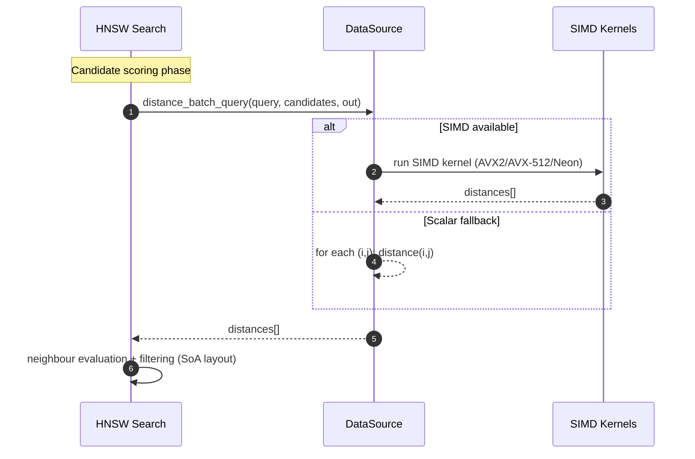
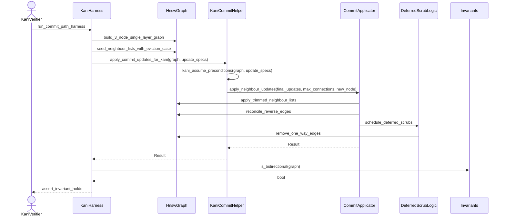

# Chutoro: a high-performance, extensible FISHDBC implementation in Rust

This document presents the architectural design and literature survey for
`chutoro`.

## Part I: Foundational Analysis and State of the Art

While the FISHDBC algorithm's value is proven, a truly high-performance, safe,
and extensible implementation has remained a significant challenge. This
document outlines the architecture for `chutoro`, a Rust-based implementation
poised to unlock new potential in large-scale clustering. By leveraging Rust's
unique ownership model, zero-cost abstractions, and modern concurrency tools,
`chutoro` addresses critical performance and safety gaps not well-served by
existing solutions in Python or C++. This initial section establishes the
theoretical groundwork for this novel implementation, deconstructing the
FISHDBC algorithm and surveying the state-of-the-art to justify the
architectural decisions that make `chutoro` a game-changer in the scalable
clustering space. This Rust and GPU architecture aims for significant speedups
over established benchmarks such as `hnswlib` and existing parallel Python
implementations.

### 1. The FISHDBC Algorithm Deconstructed

To fully appreciate the design of the FISHDBC algorithm and the rationale for
its implementation, it is essential to understand its position within the
broader landscape of density-based clustering. FISHDBC represents a pragmatic
and highly effective engineering solution to the inherent scalability
limitations of its predecessors. Its architecture is a direct response to the
computational challenges posed by large, high-dimensional, or non-metric
datasets.

#### 1.1. Lineage and motivation: from DBSCAN to HDBSCAN\* to FISHDBC

The evolution of density-based clustering algorithms reveals a clear trajectory
toward greater flexibility and scalability. The journey begins with DBSCAN
(Density-Based Spatial Clustering of Applications with Noise), a seminal
algorithm that introduced the powerful concept of identifying clusters as dense
regions of points separated by sparser regions.[^1] Its primary strengths are
its ability to discover clusters of arbitrary shape and its inherent notion of
noise, allowing it to robustly handle outliers.[^2] However, DBSCAN's
effectiveness is critically dependent on two user-defined parameters:

`eps`, the neighbourhood radius, and `minPts`, the minimum number of points
required to form a dense region. The `eps` parameter is particularly
problematic, as a single global value is often insufficient to capture clusters
of varying densities within the same dataset.[^3]

HDBSCAN (Hierarchical Density-Based Spatial Clustering of Applications with
Noise) was developed to address this fundamental limitation.[^4] By
transforming the space based on density and building a hierarchy of clusters,
HDBSCAN effectively converts the

`eps` parameter from a fixed distance threshold into a range of distances,
allowing it to identify clusters with varying densities simultaneously.[^4] The
algorithm constructs a minimum spanning tree (MST) of the data points and
derives a rich cluster hierarchy from it. A stability measure is then applied
to this hierarchy to extract a flat, optimal clustering without requiring the
user to specify the number of clusters or a distance scale.[^3] The most robust
variant, HDBSCAN\*, operates on the mutual reachability graph, but this comes at
a significant computational cost. For arbitrary data types and distance
functions where no specialized indexing structures exist (e.g., k-d trees for
Euclidean distance), HDBSCAN\* has a computational complexity of

O(n^2), stemming from the need to compute a large number of pairwise distances
to build its core data structures.[^3] This quadratic complexity renders it
impractical for large-scale datasets.

This is the precise problem that FISHDBC (Flexible, Incremental, Scalable,
Hierarchical Density-Based Clustering) was designed to solve.[^5] FISHDBC is
explicitly positioned as a scalable

_approximation_ of HDBSCAN\*.[^6] The core philosophy of FISHDBC is to accept a
minor, controlled loss of accuracy in exchange for a massive gain in
performance and scalability. It achieves this by fundamentally altering how the
underlying graph structure is built, thereby avoiding the

O(n^2) bottleneck that plagues its predecessors in non-metric spaces.[^5] This
makes FISHDBC a powerful tool for modern data science, where datasets are often
too large for traditional methods.

The central innovation of FISHDBC is not the creation of a new clustering
paradigm, but a critical act of algorithmic substitution. It recognizes that
the quadratic complexity of HDBSCAN\* originates from the need for an all-pairs
(or near all-pairs) distance computation to construct the exact mutual
reachability graph and, subsequently, the exact minimum spanning tree. FISHDBC
replaces this computationally intractable step with a highly efficient
approximate nearest neighbour (ANN) search. This is a deliberate and
well-reasoned engineering trade-off. By using an ANN method to find candidate
edges for the MST, FISHDBC forgoes the guarantee of finding the mathematically
perfect single-linkage hierarchy. In return, it achieves a complexity class
(often near O(nlogn)) that makes density-based clustering feasible on a scale
that was previously impossible for arbitrary distance metrics.[^5] This
substitution demonstrates the crucial insight that an

_approximate_ single-linkage hierarchy is often sufficient to produce
high-quality, meaningful clusters, effectively unlocking the power of
density-based methods for big data applications.

#### 1.2. The Three Pillars of FISHDBC

The FISHDBC algorithm can be understood as a three-stage pipeline, with each
stage building upon the last. The first two stages are focused on efficiently
constructing a graph that approximates the single-linkage hierarchy of the
data, while the final stage extracts clusters from this graph.

1. **Pillar 1: Approximate nearest neighbour search via HNSW:** The first and
   most critical stage is the construction of an approximate nearest neighbour
   graph using the Hierarchical Navigable Small World (HNSW) algorithm.[^7]
   HNSW is a graph-based data structure that allows for extremely fast ANN
   queries. Instead of computing all

O(n^2) pairwise distances, FISHDBC incrementally builds an HNSW graph. As each
point is added to the HNSW structure, the algorithm performs a search to find
its nearest neighbours. The distances computed during these limited searches
are the only ones the algorithm considers.[^8] This process effectively
generates a sparse set of candidate edges and their weights (distances) that
are likely to be part of the true minimum spanning tree, while avoiding the
vast majority of unnecessary distance calculations. This is the primary source
of the algorithm's scalability and its approximative nature.[^7]

1. **Pillar 2: Minimum Spanning Tree (MST) Construction:** The candidate edges
   and distances discovered during the HNSW construction phase are used to
   build a Minimum Spanning Tree (MST) over the entire dataset.[^5] An MST is a
   subgraph that connects all vertices together with the minimum possible total
   edge weight.[^8] In the context of clustering, the MST is a powerful
   structure because it is equivalent to the dendrogram produced by
   single-linkage hierarchical clustering. It represents the underlying
   connectivity and density structure of the data in a compact and efficient
   format. By building an MST from the sparse set of edges generated by HNSW,
   FISHDBC creates an approximation of the true single-linkage hierarchy
   without the quadratic cost.
2. **Pillar 3: Hierarchical Cluster Extraction:** The final stage of FISHDBC
   mirrors the process used by HDBSCAN to extract clusters from the MST.[^4]
   The edges of the MST are sorted in order of decreasing weight. The algorithm
   then conceptually removes edges one by one, from longest to shortest. Each
   edge removal has the potential to split a connected component into two,
   thereby creating a hierarchy of nested clusters. This process generates a
   complete cluster hierarchy tree. To produce a useful "flat" clustering,
   HDBSCAN's stability-based technique is employed. This method analyzes the
   persistence of clusters as the distance threshold (represented by the edge
   weights) changes. Clusters that exist over a wide range of distances are
   considered more "stable" and are selected for the final output, while
   short-lived clusters are discarded.[^4] This allows the algorithm to
   automatically determine the best clusters without requiring user-defined
   thresholds.

#### 1.3. Key Properties: Flexibility, Incrementality, and Scalability

The three-pillar architecture of FISHDBC endows it with a unique combination of
properties that make it exceptionally well-suited for a wide range of
real-world clustering tasks.

- **Flexibility:** A standout feature of FISHDBC is its ability to work with
  arbitrary data types and user-defined distance functions.[^5] Traditional
  clustering algorithms often require data to be represented as numerical
  feature vectors in a metric space. This forces domain experts to engage in a
  potentially lossy feature extraction process. FISHDBC bypasses this
  requirement. A user can provide a dataset of, for example, protein sequences
  and a function that computes the Levenshtein distance between them.[^8] The
  algorithm will operate directly on this data, allowing domain knowledge to be
  encoded in the distance metric itself. This flexibility is significantly
  enhanced by Rust's powerful type system and compile-time safety guarantees.
  Unlike Python environments which often rely on C++ wrappers and can introduce
  runtime errors at the boundary, Rust allows for the creation of highly
  performant, user-defined distance functions that are verified by the
  compiler, ensuring both safety and speed without compromise.[^5]
- **Incrementality:** The data structures at the core of FISHDBC—the
  HNSW graph and the MST—are amenable to efficient updates. When new data
  points arrive, they can be added to the existing HNSW graph and the MST can
  be updated with lightweight computations, rather than re-running the entire
  clustering process from scratch.[^5] This makes FISHDBC an excellent
  candidate for streaming data applications, where clustering needs to be
  updated dynamically as new information becomes available.
- **Scalability:** As previously discussed, scalability is the primary
  motivation behind FISHDBC. By leveraging HNSW to avoid the computation of a
  full distance matrix, the algorithm circumvents the O(n^2) complexity that
  limits other density-based methods in non-metric spaces.[^5] Experimental
  evidence shows that it can scale to millions of data items, making it a
  viable tool for big data analytics.[^5]

### 2. Survey of Parallel Clustering Techniques

To design a high-performance implementation of FISHDBC, it is crucial to learn
from existing parallelization efforts in the field of clustering. The
literature provides valuable precedents for both multi-core CPU and many-core
GPU architectures. A recurring theme is the decomposition of the problem into
smaller, independently solvable parts, followed by a merge or reduction step.

#### 2.1. Case Study: A Shared-Memory Python Implementation

A master's thesis by Edoardo Pastore presents a detailed parallel
implementation of FISHDBC using Python's `multiprocessing` module, designed for
shared-memory multi-core systems.[^8] This implementation serves as an
invaluable case study, as it directly addresses the specific bottlenecks of the
FISHDBC algorithm.

Profiling of the sequential FISHDBC algorithm reveals two primary performance
bottlenecks: the creation of the HNSW graph (specifically, the `add()`
function, which is called for every point) and the subsequent computation of
the MST.[^8] The parallel implementation focuses on accelerating these two
stages.

The architecture employs a multi-process model to circumvent Python's Global
Interpreter Lock (GIL), which would otherwise prevent true parallelism in a
multi-threaded approach. Data is shared between processes using a combination
of mechanisms. Read-only data, such as the input dataset and the distance
function, is shared efficiently using the `fork` system call's copy-on-write
semantics. The HNSW graph, which must be read from and written to by all
processes, is stored in shared memory buffers managed by
`multiprocessing.shared_memory` and exposed as NumPy arrays.[^8]

The parallelization strategy for HNSW involves partitioning the input data and
assigning each partition to a worker process. These processes then concurrently
call the `add()` function to insert their assigned points into the single,
shared HNSW graph structure. A key design choice is the use of a **lock-free**
strategy for updating the shared arrays that represent the graph's adjacency
lists and weights. This is justified by the inherently approximate nature of
FISHDBC; the potential for rare race conditions is accepted as a trade-off for
eliminating lock contention, with minimal observed impact on final clustering
accuracy.[^8]

For MST computation, the implementation adopts a "local-then-global" approach.
Instead of having one process build the MST from the complete, globally
constructed HNSW graph, each worker process first computes a local MST using
only the candidate edges it discovered while adding its partition of points.
These smaller, local MSTs are then returned to the main process, which performs
a final merge step using Kruskal's algorithm on the union of all edges from the
local trees. This significantly reduces the workload of the final MST
computation stage.[^8]

#### 2.2. GPU Acceleration Strategies for Density-Based Clustering

The massively parallel architecture of Graphics Processing Units (GPUs) makes
them an ideal platform for accelerating clustering algorithms, which are often
dominated by distance calculations and graph operations.

Implementations of GPU-accelerated DBSCAN, such as G-DBSCAN, demonstrate the
core principle: parallelize the neighbourhood search (range query) step.[^9]
This is typically achieved by having thousands of GPU threads concurrently
compute distances. One common approach is to first construct a graph on the GPU
where edges connect all points within the

`eps` radius. This graph construction is itself a parallel process where each
pair of points can be evaluated independently. Once the graph is built, the
connected components (which correspond to the clusters) can be found using
parallel graph traversal algorithms like Breadth-First Search (BFS).[^10] The
RAPIDS cuML library provides a highly optimized DBSCAN implementation that
leverages this approach for significant speedups over CPU-based versions.[^11]

More advanced algorithms like HDBSCAN and OPTICS have also been successfully
ported to GPUs. G-OPTICS, for instance, parallelizes the iterative computations
required to build the reachability plot, achieving speedups of over 100x
compared to optimized CPU versions.[^12] The RAPIDS cuML library also includes
a GPU-accelerated HDBSCAN, which can perform the entire pipeline—from MST
construction to hierarchy extraction—on the GPU.[^13] These examples confirm
that the entire FISHDBC workflow is amenable to GPU acceleration, not just
isolated components. The common thread is the exploitation of data parallelism:
the ability to perform the same operation (like a distance calculation or a
neighbour check) on many different data elements simultaneously, which is the
architectural strength of the GPU.[^10]

The "local-then-global" pattern observed in the multi-process Python
implementation of FISHDBC is not merely an artifact of that specific
architecture; it is a manifestation of a more general and powerful parallel
algorithmic paradigm. This divide-and-conquer strategy is fundamental to
scaling graph algorithms where maintaining a consistent global state is
computationally expensive or creates a synchronization bottleneck. Parallel
DBSCAN implementations on distributed clusters exhibit a similar pattern: data
is partitioned across nodes, local clustering is performed independently on
each node, and a final step merges the clusters across the partition
boundaries.[^14] At a finer grain, many parallel MST algorithms, such as
Borůvka's, operate on the same principle. They begin with trivial local
components (each vertex is its own MST) and iteratively merge them in parallel
rounds.[^15] This recurring pattern—decompose the problem, solve subproblems in
parallel with minimal communication, and perform a final merge or reduction—is
a cornerstone of parallel algorithm design. This principle can be directly
applied to a GPU implementation of FISHDBC. The dataset can be partitioned
among GPU thread blocks, with each block responsible for finding candidate
edges or even constructing local MST fragments within its fast shared memory. A
subsequent global kernel can then efficiently merge these fragments into the
final, complete MST.

### 3. Component-Level Survey: High-Performance Primitives

A successful implementation of chutoro requires high-performance
implementations of its constituent parts. This section surveys the state of the
art for each component, informing the technology choices for both the CPU and
GPU execution paths.

#### 3.1. Approximate nearest neighbour search: HNSW

The performance of the entire FISHDBC algorithm is heavily dependent on the
efficiency of the HNSW implementation.

- **CPU Implementations:** The canonical and most widely used implementation is
  `hnswlib`, a highly optimized C++ library with Python bindings created by the
  algorithm's author, Yury Malkov.[^16] It serves as the de facto performance
  benchmark for any new CPU-based implementation. Its design emphasizes speed
  and efficient memory usage, making it the standard against which the Rust CPU
  module will be measured.
- **GPU Implementations:** The `cuhnsw` library provides a direct CUDA
  implementation of HNSW, demonstrating the feasibility and benefits of porting
  the algorithm to the GPU.[^17] The project's performance analysis yields
  critical findings for the design. index on the GPU can be significantly
  faster (reportedly 8-9 times) than a multi-threaded CPU implementation using

`hnswlib`. Second, it highlights that GPU acceleration for the search phase is
most effective when performed in batches (i.e., searching for the nearest
neighbours of many query points simultaneously). This is because batching
maximizes the parallelism and amortizes the overhead of kernel launches and
memory transfers.[^17] This strongly validates the decision to develop a GPU
path for the index-building phase of chutoro, as it is equivalent to a large
batch insertion process.

#### 3.2. Minimum Spanning Tree Construction

The choice of MST algorithm is critical, especially for a parallel
implementation. The three classical algorithms—Prim's, Kruskal's, and
Borůvka's—have vastly different characteristics when parallelized.

- **Prim's Algorithm:** This algorithm is inherently sequential. It grows the
  MST one edge at a time from an arbitrary starting vertex, always adding the
  cheapest edge that connects a vertex in the tree to a vertex outside the
  tree.[^15] This greedy, step-by-step growth makes it difficult to parallelize
  effectively on a massive scale, as the choice of which edge to add next
  depends on all previous choices. While some of its sub-operations (like
  finding the minimum-weight edge from the current tree) can be parallelized,
  the core logic remains a serial bottleneck.[^18]
- **Kruskal's Algorithm:** This algorithm's strategy is to first sort all edges
  in the graph by weight, from least to greatest. It then iterates through the
  sorted list, adding an edge to the MST if and only if it does not form a
  cycle with the edges already added.[^15] The main challenge for
  parallelization is the global sort, which can be a bottleneck, though
  parallel sorting is a well-studied problem. The subsequent edge addition
  phase can be parallelized using a concurrent union-find data structure to
  detect cycles efficiently.
- **Borůvka's Algorithm:** This algorithm is consistently cited as the most
  suitable for parallel implementation, particularly on many-core architectures
  like GPUs.[^15] It operates in a series of rounds. In each round, every
  component (which is initially just a single vertex) finds its cheapest
  outgoing edge to another component, and all such edges are added to the MST
  simultaneously. This merges components together. Because the number of
  components decreases by at least a factor of two in each round, the algorithm
  terminates in a logarithmic number of rounds. The key advantage for
  parallelism is that the search for the cheapest edge for each component can
  be performed completely independently and concurrently.[^15] This structure
  maps perfectly to the Single Instruction, Multiple Data (SIMD) execution
  model of GPUs.

| Algorithm | Core idea | Parallelism characteristics | Suitability for GPU |
| -------------- | ------------------------------ | ---------------------------- | ------------------- |
| **Prim's** | Grow tree from one component. | Little parallel work. | **Poor** |
| **Kruskal's** | Sort edges, add safe edges. | Sort limits parallelism. | **Moderate** |
| **Borůvka's** | Components pick cheapest edge. | Highly parallel; log rounds. | **Excellent** |

_Table 1: Comparison of MST algorithms for GPU suitability._

The selection of Borůvka's algorithm for the GPU-based MST computation is not
merely a matter of choosing the fastest option; it represents a decision based
on deep architectural synergy. The GPU hardware model is predicated on
executing the same instruction across thousands of threads simultaneously
(SIMD). Borůvka's algorithm's computational rhythm is naturally synchronous
with this model. The first phase of each round—"for each component, find the
minimum weight outgoing edge"—is a perfect SIMD task. One can launch a GPU
kernel with one thread or thread block assigned to each component, and every
thread will execute an identical search-and-reduce operation on its local set
of edges with minimal need for inter-thread communication within this phase.
The second phase—merging the components based on the selected edges—can be
implemented as a subsequent kernel launch, acting as a global synchronization
point. This structure contrasts sharply with Prim's algorithm, where the
single-threaded growth would leave the vast majority of the GPU's cores idle,
and with Kruskal's algorithm, where the required global sort involves complex
communication patterns that can be less efficient than the largely independent
work in Borůvka's approach. Therefore, Borůvka's algorithm does not just run
_on_ the GPU; its design is fundamentally in harmony with the GPU's native
execution model, promising a level of performance and efficiency that
less-aligned algorithms cannot achieve.

## Part II: System Architecture and CPU Implementation

This section translates the foundational analysis into a concrete architectural
design for the proposed Rust library. It begins with a high-level overview of
the system's components and then delves into the specific designs for the
pluggable data provider framework and the multi-threaded CPU implementation of
the core clustering engine. The choice of Rust is central to this architecture,
as its performance characteristics and fine-grained control over system
resources—akin to C++—make it an ideal language for building libraries that
push the boundaries of high-performance computing, without sacrificing the core
safety promises that prevent entire classes of common bugs.

### 4. High-Level System Architecture

The system is designed as a modular and extensible library, separating concerns
to promote maintainability and performance. The architecture consists of
several key components that interact to provide the full clustering
functionality, from data ingestion to result presentation, with clear pathways
for both CPU and GPU execution.

A conceptual diagram of the architecture is as follows:

```plaintext
                                
+--------------------------------+
| Application / User             |
+--------------------------------+
            v
+--------------------------------+      +--------------------------------+
| Core Clustering Engine         |----->| Plugin Manager                 |
| (Orchestrator, API)            |      | (Discovers & Loads Plugins)    |
+--------------------------------+      +--------------------------------+
            ^                                   |
            |                                   v
+--------------------------------+      +--------------------------------+
| Data Provider Interface        |<-----| Plugin Implementations         |
| (DataSource Trait)             |      | (.so, .dll files)              |
+--------------------------------+      +--------------------------------+
            v (Data Flow)
+--------------------------------+
| Execution Path Selector        |
| (CPU or GPU)                   |
+--------------------------------+
       +--------+---------+
       v                  v
+-------------------+  +-------------------+
| CPU Module        |  | GPU Offload Module|
| (Rayon-based)     |  | (rust-cuda based) |
| - HNSW            |  | - Host-Device I/O |
| - MST (Kruskal)   |  | - HNSW Kernels    |
| - Cluster Extract |  | - MST Kernels     |
+-------------------+  +-------------------+
       |                  |
       +--------+---------+
                 v
+--------------------------------+
| Results Handler                |
| (ClusteringResult Struct)      |
+--------------------------------+
            v
+--------------------------------+
| Application / User             |
+--------------------------------+
```

The core components are:

- **Data Provider Interface:** A public-facing Rust `trait` that defines a
  standard contract for all data sources. This is the cornerstone of the
  pluggable architecture.
- **Plugin Manager:** A component responsible for discovering, dynamically
  loading, and managing data provider plugins from the filesystem at runtime.
- **Core Clustering Engine:** The central orchestrator and the primary entry
  point for users of the library. It receives data via the `DataSource` trait,
  manages the overall execution flow, and delegates the heavy computational
  work to either the CPU or GPU module based on configuration.
- **CPU Module:** This module contains a high-performance, multi-threaded
  implementation of the entire FISHDBC pipeline (HNSW, MST, cluster extraction)
  written in pure Rust and parallelized using the `rayon` crate.
- **GPU Offload Module:** This module is responsible for all interactions with
  the GPU. It manages memory transfers between the host (CPU) and the device
  (GPU), launches the CUDA kernels for the computationally intensive steps, and
  synchronizes execution.
- **Results Handler:** A well-defined struct that encapsulates the output of
  the clustering process, including cluster labels for each data point,
  membership probabilities, and the condensed hierarchy tree, providing a clean
  and user-friendly format for the results.

### 5. The Pluggable Data Provider Framework

A key requirement of the design is a pluggable architecture for data sources.
This allows the core clustering logic to remain agnostic to the origin and
format of the data, enabling users to integrate new data sources—such as
different file formats, database connections, or network streams—without
modifying or recompiling the main library. Implementing such a system in Rust
presents a unique set of challenges due to the language's design principles,
particularly its lack of a stable Application Binary Interface (ABI).

#### 5.1. The Challenge: ABI Instability in Rust

An ABI defines the low-level interface between compiled code modules,
specifying details like calling conventions, data type layout, and name
mangling. Most compiled languages, like C and C++, have a stable ABI, which
means that a library compiled with one version of the compiler can be linked
against and used by an application compiled with a different version. Rust, by
contrast, does not currently offer a stable ABI.[^19] The internal
representation of types and the way functions are called can change between
compiler versions to allow for ongoing layout optimizations. This means that a
dynamic library (e.g., a

`.so` or `.dll` file) compiled with one version of `rustc` is not guaranteed to
be compatible with an executable compiled with another. This makes the
straightforward dynamic linking of Rust libraries an inherently fragile and
unsafe proposition for a general-purpose plugin system.

#### 5.2. Evaluating Plugin Strategies in Rust

Several strategies exist for creating plugin systems in Rust, each with a
different set of trade-offs regarding safety, performance, and complexity.

- **Approach 1: Compile-Time Features (Static Linking):** The simplest method
  is to use Cargo's feature flags. A user could enable a feature like
  `csv-provider`, which would statically compile the CSV data source code into
  their final application. This is extremely safe and performant but is not
  truly "pluggable" at runtime, as it requires recompilation to add or change
  data sources.[^20] It serves as a good baseline but does not meet the
  requirement for runtime extensibility.
- **Approach 2: Inter-Process Communication (IPC) / WebAssembly (WASM):** This
  approach runs plugins in separate processes or in a sandboxed WASM runtime.
  Communication occurs via IPC mechanisms (like pipes or shared memory) or a
  well-defined WASM host interface. This is the safest option, as a crash in a
  plugin cannot take down the host application.[^20] It is also
  language-agnostic. However, it introduces significant overhead due to data
  serialization/deserialization and the context switching required for
  communication, making it unsuitable for a high-performance system where the

`distance` function might be called billions of times.

- **Approach 3: ABI Stabilization Crates:** Crates such as `abi_stable` and
  `stabby` aim to solve the ABI problem by providing a set of ABI-safe data
  structures and tools to create a stable interface between dynamically linked
  Rust modules.[^19] This is a powerful and promising approach that maintains
  Rust's safety guarantees. However, it can be complex to use and requires both
  the host and the plugin to be built with and adhere to the specific
  conventions and types provided by the crate.
- **Approach 4: Dynamic Loading via C ABI:** This is the most common, flexible,
  and battle-tested approach for dynamic loading in systems languages. The
  plugin is compiled as a C-compatible dynamic library, exposing its
  functionality through `extern "C"` functions that use only C-compatible types
  (like raw pointers and primitive integers) in their signatures.[^21] The host
  application then uses a library like

`libloading` to load the library at runtime, look up the function symbols by
name, and call them.[^22] This approach is language-agnostic and provides
maximum flexibility, but it requires careful handling of

`unsafe` code at the boundary.

| Approach | Pros | Cons | Suitability |
| --------------------------- | --------------------------- | ----------------------------- | ----------- |
| **Static link (features)** | Safe, fast, easy. | Needs rebuild; not pluggable. | **Low** |
| **IPC / WASM** | Safe and cross-language. | Serialization overhead. | **Low** |
| **ABI crates** | Keeps FFI safe. | Adds complexity; evolving. | **Medium** |
| **Dynamic loading (C ABI)** | Flexible, widely supported. | Requires `unsafe`; ABI risk. | **High** |

_Table 2: Comparison of plugin architecture approaches._

#### 5.3. Proposed Design: A Versioned C-ABI V-Table Handshake

To address Rust's ABI instability while retaining the flexibility of dynamic
loading, the recommended design is to use a versioned, C-compatible v-table
(virtual method table). Instead of passing a Rust-specific
`*mut dyn DataSource` trait object, which has an unstable memory layout, the
plugin will expose a C struct containing function pointers. This creates a
stable, language-agnostic contract.

1. **The Contract (The **`chutoro_v1`** Handshake Struct):** The core library
   and all plugins will share a common definition for a `#[repr(C)]` struct.
   This struct acts as a v-table, containing function pointers for all the
   operations a data source must provide. It also includes versioning and
   capability fields to ensure compatibility and enable feature discovery.

   ```rust
   // In a shared Rust module (repr C v-table shared with plugins)
   #[repr(C)]
   pub struct chutoro_v1 {
       pub abi_version: u32, // e.g., 1
       pub caps: u32,        // Bitflags:
                             // HAS_DISTANCE_BATCH, HAS_DEVICE_VIEW,
                             // HAS_NATIVE_KERNELS
       pub state: *mut std::ffi::c_void, // Opaque pointer to plugin's internal state

       // Function pointers for the data source API
       pub len: unsafe extern "C" fn(state: *const std::ffi::c_void) -> usize,
       pub name: unsafe extern "C" fn(
           state: *const std::ffi::c_void,
       ) -> *const std::os::raw::c_char,
       pub distance: unsafe extern "C" fn(
           state: *const std::ffi::c_void,
           idx1: usize,
           idx2: usize,
           out: *mut f32,
       ) -> StatusCode,

       // Optional, for high-performance providers
      pub distance_pair_batch: Option<unsafe extern "C" fn(
           state: *const std::ffi::c_void,
           pairs: *const Pair,
           out: *mut f32,
           n: usize,
       ) -> StatusCode>,
       // Required: plugin-controlled teardown of `state`
       pub destroy: unsafe extern "C" fn(state: *mut std::ffi::c_void),
   }

   #[repr(C)]
   pub struct Pair {
       pub i: usize,
       pub j: usize,
   }

   #[repr(u32)]
   pub enum StatusCode {
       Ok = 0,
       InvalidArgument = 1,
       Unsupported = 2,
       BackendFailure = 3,
   }

   ```

2. **The Plugin Implementation:** A plugin author implements their data source
   logic in a standard Rust struct. They then expose a single, C-compatible
   function (e.g., `_plugin_create`) with a known name. This function allocates
   the plugin's state struct on the heap, populates an instance of the
   `chutoro_v1` v-table with pointers to C-compatible wrapper functions, and
   returns the v-table struct to the host. The `state` field will hold the
   pointer to the plugin's Rust object.

3. **The Host Loading Mechanism:** The main application's Plugin Manager uses
   `libloading` to load a dynamic library and resolve the `_plugin_create`
   symbol.[^22] It calls this function to get the

   `chutoro_v1` struct. The host checks the `abi_version` to ensure
   compatibility and, on teardown, must call `vtable.destroy(vtable.state)`
   exactly once to release plugin state. Safety contract: the host never calls
   `destroy` more than once; plugins must treat `destroy` as idempotent with
   internal guards to avoid double-free if probed repeatedly.

Returning a raw `f32` directly from the ABI boundary is deliberately avoided.
The distance path already needs a documented non-finite policy for SIMD and GPU
parity (§6.3, §8.1), so NaN cannot double as an FFI error channel without
creating ambiguity. Using `StatusCode + out-parameter` keeps transport failure,
unsupported capability, and valid floating-point payloads distinct. The safe
host wrapper maps status codes into structured `DataSourceError` values.

The ABI contract for `StatusCode` itself should be explicit: it uses
`#[repr(u32)]`, so the wire format is always one 32-bit unsigned integer with
the platform C ABI's enum passing rules for that representation. Existing
numeric values are append-only within `abi_version = 1`; future plugins may add
new failure codes only at unused discriminants, and hosts must treat unknown
codes as opaque plugin failures rather than attempting semantic recovery. Any
change to the representation, size, or meaning of an existing discriminant
requires a new handshake struct and `abi_version`.

Before any function pointer is dereferenced, the host should copy the untrusted
v-table into a pure `PluginDescriptor` validator. This helper validates the ABI
version, capability mask, required-versus-optional callback matrix, and
pointer-nullability rules without performing any FFI calls. Only a validated
descriptor may be wrapped by the `unsafe` host adapter. This keeps the
handshake policy executable in ordinary Rust and gives Kani a bounded,
side-effect-free target for the load-time state machine.

1. **Safe Abstraction in the Host:** After receiving the v-table, the host
   wraps it in a safe Rust struct that implements the internal `DataSource`
   trait. Calls to the trait methods on this wrapper will internally delegate
   to the function pointers in the C struct, passing the opaque `state` pointer
   as the first argument. On `Drop`, it invokes the `destroy` callback if
   present to free plugin resources. This design confines all `unsafe` FFI
   calls to this single wrapper, providing a safe and ergonomic interface to
   the rest of the application while completely avoiding any reliance on Rust's
   unstable trait object layout across the FFI boundary. Crucially, once this
   small, `unsafe` boundary is crossed and safely encapsulated, all subsequent
   interactions with the plugin are fully memory-safe and managed by the Rust
   compiler. This provides an unparalleled level of confidence and
   maintainability that is not easily matched in traditional C or C++ FFI
   scenarios, where the burden of safety remains entirely on the developer. If
   `HAS_DISTANCE_BATCH` is absent, the wrapper routes calls to the scalar
   `distance`. If `HAS_DEVICE_VIEW` is missing, host-managed buffers are used.

The wrapper should track an explicit lifecycle
(`Loaded -> Active -> Quiescing -> Destroyed`) so quiescence, callback gating,
and teardown are not encoded as informal `bool` flags. Optional callbacks
become reachable only when both the descriptor and capability bits allow them,
and `destroy` becomes unreachable after the first successful teardown. This
host-visible state machine is the right verification target: property tests can
explore long lifecycle traces, while bounded Kani harnesses can prove that
nulls and version mismatches are rejected before dereference and that teardown
is exact-once.

#### 5.4. Walking skeleton dense ingestion

The initial CPU-only skeleton now materializes Arrow and Parquet feature
columns through `DenseMatrixProvider`. The provider normalizes
`FixedSizeList<Float32, D>` columns into a contiguous row-major `Vec<f32>` so
the rest of the pipeline can reason about cache-friendly slices instead of
nested Arrow arrays. Rows containing null lists or null scalar values are
rejected with structured errors to keep distance computations deterministic.
The Parquet path pushes a projection mask so only the requested feature column
is scanned, helping future backends reuse the same ingestion contract.

#### 5.5. Walking skeleton text ingestion

The walking skeleton also needs a lightweight provider to exercise non-metric
distances before the dynamic plugin system is available. The `TextProvider`
ingests one UTF-8 string per line via `BufRead`, trimming platform-specific
newline sequences while preserving empty strings as meaningful inputs.
Construction fails fast when the source produces no records so callers receive
an actionable `TextProviderError::EmptyInput` instead of deferred out-of-bounds
errors.

Distances are reported using the `strsim` crate's Levenshtein implementation,
mirroring the DNA/protein use cases outlined in §1.3 without pulling in the
heavier bioinformatics tooling planned for later phases. The provider
implements `DataSource` directly so the same type can be handed to
`Chutoro::run`, keeping the ingestion and computation pathway identical to
numeric providers. Converting the `usize` Levenshtein score into `f32` matches
the trait's contract and establishes the precedent that future non-metric
sources surface distances through the same scalar channel.

#### 5.6. Walking skeleton distance primitives

The core crate now exposes scalar Euclidean and cosine distance routines used
by the dense provider and early algorithm sketches. Both functions share a
`DistanceError` enum so ingestion code and higher-level orchestration can
report dimension mismatches, non-finite inputs, or zero-length vectors with
targeted messages. Internal accumulations use `f64` to reduce precision loss
when working with larger coordinates while still returning the `f32` distances
required by the public `DataSource` API. Cosine distance accepts an optional
`CosineNorms` handle, allowing HNSW search loops to pre-compute norms once per
point and reuse them across many comparisons without re-computing square roots.
Norms are validated eagerly (finite and strictly positive) so cached values
cannot carry invalid state into later kernels.

A subsequent refactor eliminated primitive obsession in these helpers. We now
introduce domain newtypes for vectors, norms, and distances, shifting
validation logic into their constructors. `Vector` validates the slice length
and per-element finiteness, `Norm` guarantees strictly positive magnitudes, and
`Distance` communicates that the return value is already validated. These
smaller abstractions preserve the `f32` public surface area while giving the
compiler more opportunities to guide call sites away from invalid data.

### 6. Core Clustering Engine: A Multi-threaded CPU Implementation

The default execution path for the clustering engine will be a
high-performance, multi-threaded CPU implementation. This design will draw
inspiration from the parallel Python implementation previously analyzed but
will be adapted to leverage the safety, performance, and concurrency idioms of
modern Rust.

#### 6.1. Concurrency Model and Data Structures

- **Parallelism via **`rayon`**:** Instead of using manual process management
  as in the Python example, the implementation will leverage the `rayon` crate
  for high-level data parallelism. `rayon` provides parallel iterators
  (`par_iter()`) that can automatically parallelize loops over data slices
  across a thread pool, simplifying the code and often leading to better
  performance and load balancing.[^8]
- **Shared HNSW Graph:** The central HNSW graph structure, which must be
  accessed and modified by multiple threads concurrently, will be wrapped in
  `Arc<RwLock<HnswGraph>>`. `Arc` (Atomically Referenced Counter) allows for
  shared ownership of the graph across threads. `RwLock` (Read-Write Lock)
  provides the necessary synchronization. It allows any number of threads to
  acquire a read lock simultaneously (for searching the graph), but ensures
  that only one thread at a time can acquire a write lock (for inserting a new
  point and its edges). This robust concurrency model, enforced by Rust's type
  system at compile time, provides strong guarantees against common data races.
  This is a critical advantage over other systems languages where such errors
  might only manifest at runtime, leading to hard-to-debug issues, particularly
  in high-performance, multi-threaded scenarios.[^8]
- **Distance Cache:** To avoid redundant distance calculations, which can be
  expensive for complex user-defined metrics, a concurrent cache will be
  employed. A crate like `dashmap`, which provides a highly concurrent hash
  map, is an excellent choice. Each thread can query the map before computing a
  distance, and if the value is not present, it can compute it and insert it
  into the map for other threads to use. This mirrors the functionality of the
  `decorated_d()` caching decorator in the Python model.[^8]

_Implementation update (2024-07-02)._ The initial CPU index is now realized in
`CpuHnsw`, which wraps the shared graph in `Arc<RwLock<_>>`. Insertion follows
a strict two-phase protocol: worker threads hold a read lock while performing
the HNSW search, drop it, and then acquire a write lock to apply the insertion
plan. Rayon drives batch construction, seeding the entry point synchronously
before the parallel phase to avoid races. Random level assignment is handled by
a `SmallRng` guarded with a `Mutex`, trading a short critical section for
deterministic tests while preserving the geometric tail induced by the
`1/ln(M)` multiplier. The graph limits neighbour fan-out eagerly, pruning edges
under the write lock using the caller-provided `DataSource` for distance
ordering. Trimming now batches by endpoint: each layer collects the nodes whose
adjacency changed, computes their distance orderings once via
  `batch_distances(query, candidates)`, and reapplies the truncated lists,
  keeping the write critical section short even when multiple neighbours are
  added.

A process-local `DistanceCache` now backs both search and trimming. The cache
stores normalized `(min, max)` pairs keyed with the `MetricDescriptor` exposed
by the data source, preventing cross-metric reuse. It uses a `DashMap` for
concurrent lookups and a set of sharded `LruCache`s behind `Mutex` guards to
bound entries while avoiding a single hot lock under contention. Optional
TTL-based expiry remains available for workloads with extremely stale
distances. NaNs never enter the store: misses returning non-finite values log a
`WARN` and bubble a `HnswError::NonFiniteDistance`. The cache publishes
`distance_cache_hits`, `distance_cache_misses`, `distance_cache_evictions`, and
`distance_cache_lookup_latency_histogram` when the `metrics` feature is
enabled, and the hot lookup paths are wrapped in `tracing` spans so production
deployments can attribute latency spikes without sampling.

Neighbour ordering now includes a deterministic tie-break: when distances
match, nodes are ordered by node id and then by an insertion sequence counter
stored alongside every `Node`. This rule stabilises candidate trimming and
layer search under fixed RNG seeds even when the cache changes execution
timing. The sequence numbers are assigned once per insertion and recorded
inside the graph so property tests and deterministic builds see identical
outcomes run after run.

#### 6.2. Algorithmic Implementation Sketch

The implementation will follow the three-pillar structure of FISHDBC, with the
first two stages heavily parallelized.

- **HNSW Construction:** The primary loop for adding points to the graph will
  be parallelized using `rayon`. The input data (represented as a slice of
  indices `0..n`) will be converted into a parallel iterator:
  `(0..data.len()).par_iter().for_each(|&i| {... })`. Inside the closure for
  each point `i`, the thread will:

1. Acquire a read lock on the shared HNSW graph to perform the search for the
   insertion point and candidate neighbours.
2. Drop the read lock and acquire a write lock to update the graph structure
   with the new point and its connections.

This two-phase locking strategy minimizes the duration of the exclusive write
lock, improving concurrency.

- **MST Construction:** The "local-then-global" strategy from the Python
  implementation will be adapted for the `rayon` execution model.[^8]

1. During the HNSW construction phase, the `for_each` closure will be modified
   to not only insert the point into the graph but also to return the set of
   new candidate edges discovered during that insertion. `rayon`'s `map()` and
   `reduce()` operations will be used to collect these edges.
2. The `map` operation will have each thread build a thread-local vector of
   candidate edges.
3. The `reduce` operation will efficiently combine these thread-local vectors
   into a single, large vector of all candidate edges from across all threads.
4. A final, single call to a parallel Kruskal's algorithm implementation will
   be performed on this global list of candidate edges to produce the final
   MST. While Borůvka's algorithm shines on GPUs, Kruskal's provides a robust
   and efficient path for the CPU-only backend. Paired with `rayon`'s highly
   optimized parallel sort and a concurrent union-find data structure for cycle
   detection, it offers a strong balance of implementation complexity and
   performance within the multi-threaded CPU context.

Design decision: the CPU parallel Kruskal implementation canonicalises directed
candidate edges to undirected `(min(u, v), max(u, v))` pairs and rejects
non-finite weights. Edges are globally sorted using Rayon `par_sort_unstable`
with `f32::total_cmp` and deterministic tie-breaks (`source`, `target`,
`sequence`). To preserve Kruskal's correctness guarantees, the scan maintains a
non-decreasing weight order; within each equal-weight bucket, cycle checks are
parallelized via a striped-lock union-find so disjoint unions can proceed
concurrently without deadlocks.

- **Cluster Extraction:** The final stage, which involves processing the MST to
  build the cluster hierarchy and extract the stable clusters, is generally
  less computationally intensive than the graph construction phases. An initial
  implementation can perform this step sequentially in a single thread after
  the parallel MST construction is complete. The required data structures, such
  as a disjoint-set for condensing the tree, are readily available in the Rust
  ecosystem.

_Implementation update (2025-12-18)._ The CPU backend now performs hierarchy
extraction sequentially from the mutual-reachability MST by first deriving the
single-linkage hierarchy (a dendrogram) from the MST edges. The implementation
constructs a single-linkage forest by sorting MST edges in non-decreasing
weight order and performing union-find merges; each merge creates an internal
node annotated with the merge distance.

To obtain a practical hierarchy, the dendrogram is condensed using
`min_cluster_size` in the HDBSCAN style: when a cluster would split into two
subclusters that both satisfy `min_cluster_size`, the split is recorded as two
child clusters. When only one branch satisfies `min_cluster_size`, the cluster
continues down the large branch with the same cluster id while points in the
small branch are emitted as leaves at the split lambda (`lambda = 1 / d`,
treating `d = 0` as `lambda = +∞`). This produces a condensed tree where each
cluster can shed points multiple times before finally splitting into child
clusters.

Cluster stability is computed using an excess-of-mass score:
`stability(cluster) = Σ (lambda_leave - lambda_birth) * child_size`, summing
over point leaves and child-cluster exits. The extractor then selects clusters
using a recursive EOM rule (choose the parent if its stability exceeds the sum
of its children's selected stabilities, otherwise keep the children). Flat
labels are produced by propagating the nearest selected ancestor label to each
point. Points that never observe a selected ancestor are classified as noise
and are assigned a dedicated label appended after the selected clusters so
labels remain contiguous starting at zero. When no clusters are selected, all
points are classified as noise and receive label `0`.

#### 6.3. SIMD utilization

- **Distance kernels (biggest win):** Add a CPU backend that takes contiguous
  structure-of-arrays views of point data and computes distances with stable
  `core::arch` intrinsics (AVX2/AVX-512 on x86) across lanes, with scalar
  fallback per pair where metrics are not vectorizable. Keep an optional nightly
  `std::simd` path behind a non-default feature while the API remains unstable.
  Expose a query-centric
  `distance_batch_query(query, candidates, out)` helper on the core trait and
  make it the default path for HNSW candidate scoring on CPU: collect candidate
  indices in chunks sized to the SIMD width and evaluate with fused
  multiply-adds and vector reductions, exploiting the plugin v-table’s
  `distance_batch_query` hook while retaining the pair-oriented
  `distance_pair_batch(pairs, out)` for algorithms that require arbitrary
  tuples.
- **HNSW search/insert heuristics:** When evaluating neighbours at a level,
  operate on packed indices and a structure-of-arrays layout of coordinates.
  Prefetch upcoming blocks to hide latency. Compute scores in SIMD blocks
  outside the write lock while keeping graph topology updates under the lock.
- **Parallel Kruskal phase:** Keep the global sort in Rayon, but vectorize the
  edge-weight transform and scan or filter candidate edges before the
  union-find stage. Union-find itself remains branchy; focus SIMD effort on the
  pre-filter and maintain cache-friendly structure-of-arrays parent and rank
  arrays.
- **Data layout preconditions:** Introduce an internal `DensePointView<'a>` for
  dense numeric providers to supply structure-of-arrays packing and stride-1
  access. Retain a scalar fallback via the existing trait.
- **Compile-time feature flags and dispatch:** Add `simd_avx2`, `simd_avx512`,
  and `simd_neon` features. Use CPUID-gated function pointers for one-time
  runtime dispatch to avoid monomorph blow-ups while keeping hot loops
  specialized.
  - Use `is_x86_feature_detected!`/`std::arch` on x86 and platform checks on
    ARM.
  - Patch function pointers once at init; avoid branching in hot loops.
  - Define NaN/non-finite handling for reductions; document cross-CPU/GPU
    parity.
  - Guarantee 64-byte alignment and lane-multiple padding for
    `DensePointView<'a>`; zero-pad tails.
- **Shared distance semantics and verification seam:** Define a reusable
  `DistanceSemantics` spec object that fixes zero-vector policy, non-finite
  handling, epsilon, and deterministic tie-breaking across scalar, SIMD, and
  GPU backends. Every backend should either reduce through a single scalar
  oracle helper or prove equivalence to that helper. Verification then splits
  cleanly: property-based differential suites compare scalar, AVX2, AVX-512,
  Neon, and optional nightly `std::simd` behaviour around lane boundaries,
  padding, duplicates, and non-finite cases; bounded Kani harnesses cover the
  executable Rust hazards, namely tail padding and runtime-dispatch selection.
- **Testing and performance hygiene:** Ship microbenchmarks for Euclidean and
  cosine kernels (scalar, auto-vectorized, portable-simd, AVX2/512),
  neighbour-set scoring at varying candidate sizes, and batched
  `distance_batch_query` versus scalar `distance`. Validate that SIMD wins
  persist under realistic HNSW candidate distributions by bucketing and padding
  to lane multiples.

The candidate scoring flow within HNSW search is shown in Figure 1.


```mermaid
sequenceDiagram
  autonumber
  participant HNSW as HNSW Search
  participant DS as DataSource
  participant Kern as SIMD Kernels

  Note over HNSW: Candidate scoring phase
  HNSW->>DS: distance_batch_query(query, candidates, out)
  alt SIMD available
    DS->>Kern: run SIMD kernel (AVX2/AVX-512/Neon)
    Kern-->>DS: distances[]
  else Scalar fallback
    DS-->>DS: for each (i,j): distance(i,j)
  end
  DS-->>HNSW: distances[]
  HNSW->>HNSW: neighbour evaluation + filtering (SoA layout)
  %% Note: CPUID/feature detection and function-pointer dispatch occur once during
  %% initialization; kernel call-sites remain branch-free.
```

_Figure 1: SIMD-backed candidate scoring via `distance_batch_query` with scalar
fallback._

_Implementation update (2026-03-02)._ Roadmap item `2.2.1` is implemented using
stable Rust primitives with toolchain `1.93.1` (latest stable, released
2026-02-12) and minimum supported Rust version (MSRV) `1.89.0`. The default
`DataSource::batch_distances` path now delegates to
`distance_batch_query(query, candidates, out)` when the provider exposes that
specialization; otherwise it materializes `(query, candidate)` tuples and falls
back to `distance_pair_batch(pairs, out)`. That keeps HNSW candidate scoring
query-centric at the call site while still permitting arbitrary-pair
specializations.

`DenseMatrixProvider` now routes Euclidean distance batches through a dedicated
SIMD kernel module (`chutoro-providers/dense/src/simd/mod.rs` and
`chutoro-providers/dense/src/simd/kernels.rs`) with one-time x86 runtime
dispatch:

- AVX2 specialization using `std::arch` intrinsics and lane-tail scalar
  handling.
- AVX-512 specialization using stable `std::arch` intrinsics and
  `#[target_feature(enable = "avx512f")]` (stabilized in Rust `1.89.0`,
  tracking issue `rust-lang/rust#111137`).
- Scalar fallback for all non-x86 targets and unsupported feature sets.

`std::simd` remains a nightly only API (`#![feature(portable_simd)]`; tracking
issue `rust-lang/rust#86656`). The design keeps stable `core::arch` kernels as
the default path and permits an optional nightly only implementation behind a
feature gate for experimentation. AVX-512-specific nightly culprits remain out
of scope for the stable path (`rust-lang/rust#127356` for `bf16` wrappers and
`rust-lang/rust#127213` for AVX512_FP16 intrinsics).

This keeps the scoring-path contract required by §6.3 while preserving stable
toolchain compatibility and deterministic error semantics.

_Implementation update (2026-03-07)._ Roadmap item `2.2.2` is implemented via
an internal `DensePointView<'a>` in
`chutoro-providers/dense/src/simd/point_view.rs`. The type repacks selected
dense rows into a dimension-major Structure of Arrays layout with:

- 64-byte aligned packed storage;
- point counts padded to a 16-lane multiple;
- deterministic `0.0_f32` tail padding for unused packed lanes.

`DenseMatrixProvider::distance_batch_query(...)` now uses this SoA path when
the batch is query-centric, meaning all candidates share the same query row. In
that case the shared row is treated as the query and the varying rows are
packed into `DensePointView<'a>` before scoring. Arbitrary pair batches still
fall back to the existing row-major pairwise path, preserving the general
`distance_pair_batch` contract without widening the scope of §2.2.2 into a full
arbitrary-pair SoA planner.

Scalar fallback remains explicit:

- empty and single-point packed views prefer the scalar path;
- non-query-centric pair batches use the existing row-major fallback;
- non-x86 targets and unsupported CPU feature sets still use scalar kernels.

This keeps the new alignment and SoA preconditions local to dense-provider
internals while preserving existing `DataSourceError` semantics and
all-or-nothing output writes.

_Implementation update (2026-03-11)._ Roadmap item `2.2.3` is implemented via
Cargo feature gating in `chutoro-providers/dense/Cargo.toml` plus a dedicated
dispatch helper in `chutoro-providers/dense/src/simd/dispatch.rs`.

The dense provider now exposes three backend features:

- `simd_avx2`
- `simd_avx512`
- `simd_neon`

They are enabled by default in the dense crate so the existing performance
profile is preserved unless a build opts out with `--no-default-features` or a
selective feature list.

Runtime backend selection remains a one-time patch:

- x86/x86_64 builds use `is_x86_feature_detected!` to choose `Avx512` first,
  then `Avx2`, then `Scalar`;
- `arm` builds use `is_arm_feature_detected!("neon")` to enable the Neon
  backend when both the CPU and `simd_neon` feature allow it;
- `aarch64` builds treat Neon as baseline and select it whenever
  `simd_neon` is compiled in;
- hot loops still call through function pointers cached in `OnceLock`, so the
  steady-state kernel path remains branch-free.

The dense provider now defines one non-finite reduction rule for scalar and
SIMD kernels: any non-finite intermediate or final Euclidean reduction result
is canonicalized to `f32::NAN`. This gives later CPU/GPU parity work a stable
contract and matches the existing HNSW validation layer, which rejects
non-finite batch outputs as `NonFiniteDistance`.

`DensePointView<'a>` remains unchanged from `2.2.2`: it still provides 64-byte
alignment, 16-lane padding, and deterministic `0.0_f32` tail fill. Feature
gating changes which backend consumes that view; it does not weaken the packed
layout guarantees.

_Implementation update (2026-03-30)._ Roadmap items `2.2.4` and `2.2.5` now
ship the optional nightly-only `std::simd` backend behind the non-default
`nightly_portable_simd` feature in `chutoro-providers-dense`.

The dense crate now uses `build.rs` to detect whether Cargo is driving a
nightly compiler and emits `cfg(nightly)` only in that case. The crate root
then gates `#![feature(portable_simd)]` behind
`cfg_attr(all(feature = "nightly_portable_simd", nightly), ...)`, which keeps
stable `--all-features` builds clean while still allowing nightly
experimentation.

Every portable-SIMD module boundary and entrypoint uses the same
`all(feature = "nightly_portable_simd", nightly)` predicate, so stable builds
can compile the dense crate with `--all-features` without attempting to enable
nightly-only language items. Direct unit tests assert the real
`compiled_simd_support()` and `runtime_simd_support()` masks and verify that
the cached backend choice matches
`Avx512 > Avx2 > Neon > PortableSimd > Scalar`.

Dispatch priority is now:

- AVX-512
- AVX2
- NEON
- PortableSimd
- Scalar

The portable SIMD backend uses `Simd<f32, 16>` for pairwise Euclidean distance
and query-to-points scoring so it matches the existing `DensePointView<'a>`
packing and padding rules. Results continue to route through the canonical
`finalize_distance(...)` reducer so any non-finite value is normalized to
`f32::NAN`.

Unit tests cover dispatch ordering, compile-time and runtime support masks,
pairwise parity around the 16-lane boundary, query-to-points parity, and
non-finite canonicalization. Stable CI now includes an explicit dense-provider
gating check that runs Clippy and tests with only the stable SIMD features
enabled, while scheduled validation in
`.github/workflows/nightly-portable-simd.yml` installs the nightly toolchain
and runs the dense-provider test and Clippy passes with `nightly_portable_simd`
enabled. The relevant upstream tracking issues remain `rust-lang/rust#86656`
(`portable_simd`), `rust-lang/rust#127356` (`bf16` wrappers), and
`rust-lang/rust#127213` (AVX512_FP16 intrinsics).

#### 6.4. Property-based input generation for CPU HNSW tests

The CPU module now ships with dedicated property-based generators that exercise
the HNSW pipeline under varied input regimes. Using `test-strategy` to derive
`proptest` strategies keeps the generators declarative whilst providing
shrinking-friendly seeds. Four dataset distributions are synthesized: uniform
hypercubes, tightly clustered clouds, low-dimensional manifolds embedded in
higher-dimensional ambient space, and datasets with controlled duplicate
vectors. Each generation path records structural metadata (cluster layout,
manifold bases, duplicate index groups) so invariant checks can assert the
expected geometry during shrinking.

The generator suite also produces sampled `HnswParams` inputs, constraining the
ranges so `ef_construction` always exceeds `max_connections` and level sampling
remains numerically stable. The concrete parameters are materialized through a
`HnswParamsSeed` helper that propagates validation errors, enabling explicit
tests for unhappy paths. To support end-to-end properties a dense in-memory
`DataSource` fixture wraps generated vectors and enforces dimension checks up
front, preventing silent ingestion of malformed test data. These choices align
the testing surface with the plan described in
`docs/property-testing-design.md`, giving the HNSW unit tests a reproducible
and expressive input space.

#### 6.5. Structural invariant checkers

_Implementation update (2025-11-08)._ The CPU graph now exposes a dedicated
`HnswInvariantChecker` via `CpuHnsw::invariants()`, providing direct access to
the four structural checks enumerated in `docs/property-testing-design.md`
(layer consistency, degree bounds, reachability, and bidirectional links). Each
batch of invariants holds the graph read lock for the entire evaluation so the
caller observes a consistent view of the topology and avoids repeated lock
acquisition. Failures are surfaced via the typed `HnswInvariantViolation` enum.
The payloads capture the offending node, layer, and contextual detail (e.g.,
whether a neighbour is missing entirely or merely lacks the referenced layer),
which keeps property failures actionable during shrinking. Degree checks now
emit a dedicated `ConfigError` variant whenever the configured fan-out would
overflow the base-layer bound (an early warning that the chosen `HnswParams`
are unsound).

The checker can run individual invariants
(`check(HnswInvariant::Reachability)`), subsets (`check_many`), or the entire
suite (`check_all`). This API keeps properties succinct: generators can insert
a batch of points and then call `index.invariants().check_all()` at the end of
each step without cracking open the graph's private representation. The test
harness uses `rstest` cases to cover happy paths alongside intentionally
corrupted graphs (dangling nodes, overfull adjacency lists, disconnected
components, and asymmetric edges), guarding against regressions in the
validator itself and ensuring property tests inherit precise failure
diagnostics.

A new `collect_many`/`collect_all` API complement the fail-fast helpers. These
variants feed every violation into a caller-provided sink, allowing CI and
property tests to gather the entire diagnostic set from a single snapshot of
the graph. Internally the invariant checkers honour the reporting mode so
aggregated runs continue collecting reachable failures (e.g., all unreachable
nodes) while preserving the previous short-circuit behaviour for fail-fast
callers.

The formal verification harnesses extend these guarantees by exercising the
commit path under bounded conditions, ensuring reconciliation and deferred
scrubs still satisfy the bidirectional edge invariant. The sequence below
illustrates the commit-path harness flow used by Kani.


```mermaid
sequenceDiagram
    actor KaniVerifier
    participant KaniHarness
    participant HnswGraph
    participant KaniCommitHelper
    participant CommitApplicator
    participant DeferredScrubLogic
    participant Invariants

    KaniVerifier->>KaniHarness: run_commit_path_harness
    KaniHarness->>HnswGraph: build_3_node_single_layer_graph
    KaniHarness->>HnswGraph: seed_neighbour_lists_with_eviction_case

    KaniHarness->>KaniCommitHelper: apply_commit_updates_for_kani(graph, update_specs)
    KaniCommitHelper->>KaniCommitHelper: kani_assume_preconditions(graph, update_specs)
    KaniCommitHelper->>CommitApplicator: apply_neighbour_updates(final_updates, max_connections, new_node)

    CommitApplicator->>HnswGraph: apply_trimmed_neighbour_lists
    CommitApplicator->>HnswGraph: reconcile_reverse_edges
    CommitApplicator->>DeferredScrubLogic: schedule_deferred_scrubs
    DeferredScrubLogic->>HnswGraph: remove_one_way_edges

    CommitApplicator-->>KaniCommitHelper: Result
    KaniCommitHelper-->>KaniHarness: Result

    KaniHarness->>Invariants: is_bidirectional(graph)
    Invariants-->>KaniHarness: bool
    KaniHarness-->>KaniVerifier: assert_invariant_holds
```

_Figure 2: Commit-path Kani harness flow for bidirectional invariant checks,
using a bounded three-node scenario (the implementation uses level 1 to
exercise eviction and deferred scrubs)._

_Implementation update (2026-01-17)._ A nightly slow CI job runs
`make kani-full` only when the `main` branch has a commit within the last 24
hours (UTC) of the schedule trigger. Manual `workflow_dispatch` runs may force
the job, allowing verification without waiting for fresh commits. The default
PR CI path remains unchanged so formal verification stays opt-in for daily
development loops. Small future timestamp skews (up to 300 seconds) are treated
as skips rather than failures to avoid false negatives from clock drift.

_Implementation update (2026-02-02)._ Verus proofs now cover the edge harvest
primitives described in `docs/property-testing-design.md` Appendix A. The
proofs live in `verus/edge_harvest_proofs.rs` and model
`extract_candidate_edges`, `CandidateEdge::canonicalise`, and
`EdgeHarvest::from_unsorted` with spec-only data types mirroring the helper
signatures. Distances are represented as integers because the proofs only
depend on equality and ordering, not floating-point semantics. Sorting uses
`Seq::sort_by` with an explicit total order that matches the production
ordering by `(sequence, Ord)`, yielding permutation and ordering guarantees.
The pinned Verus release is recorded in `tools/verus/VERSION` with contributor
setup instructions in `docs/verus-toolchain.md`, and CI runs `make verus` to
keep the harnesses green. Scope remains limited to helper invariants, leaving
concurrency and planner proofs to Kani and property tests.

#### 6.6. Search correctness property

_Implementation update (2025-11-12)._ The CPU suite now exercises the oracle
driven search property from `docs/property-testing-design.md §2.3.1`. Each
generated fixture is converted into a `DenseVectorSource`, built into a
`CpuHnsw`, and queried using a deterministic index derived from the sampled RNG
seed so shrinking remains reproducible. For every query the property runs two
searches:

- `CpuHnsw::search` with `ef = max(len, 2 * k, 16)` to model an ANN
  configuration while giving the base-layer search enough headroom to reach
  every inserted node.
- A brute-force oracle that computes every distance and sorts the top `k`
  neighbours.

Results are compared via recall@k. The minimum acceptable recall is drawn from
the `CHUTORO_HNSW_PBT_MIN_RECALL` environment variable, which accepts values in
`(0.0, 1.0]` and defaults to `0.50`. Invalid inputs emit a warning via
`tracing` and fall back to the default so CI remains deterministic. Extremely
large fixtures are rejected up-front using the
`CHUTORO_HNSW_PBT_MAX_FIXTURE_LEN` cap (default `32`), ensuring the brute-force
oracle never dominates CI time; both limits can be overridden per job. To avoid
asking the graph for more detail than its fan-out allows, the property only
evaluates fixtures with
`max_connections >= CHUTORO_HNSW_PBT_MIN_MAX_CONNECTIONS` (default `12`) and
bounds `k` by `min(16, len, max_connections)`. The test captures `Instant`
timings for both the HNSW search and the brute-force scan, logging the
microsecond durations and the derived speed-up ratio at `DEBUG` solely for
observability. Recall falling below the configured threshold is the only
failure condition today; speed-up data helps diagnose regressions but does not
gate CI.

_Implementation update (2026-02-10)._ Property suites now run in a dedicated
workflow at `.github/workflows/property-tests.yml` with two tiers:

- A path-filtered pull request (PR) run that executes the HNSW, candidate edge
  harvest, and parallel Kruskal suites with `PROGTEST_CASES=250`, a 10-minute
  timeout, and `CHUTORO_HNSW_PBT_MIN_RECALL=0.60`.
- A weekly scheduled deep run with `PROGTEST_CASES=25000` and forked execution
  (`CHUTORO_PBT_FORK=true`) to isolate case failures.

The property runners consume a shared profile parser in `chutoro-test-support`
so `PROGTEST_CASES` and fork mode are interpreted consistently across suites.
Weekly failures upload `proptest-regressions` artefacts and suite logs for
replay. To keep coverage jobs within `nextest` timeouts, the idempotency
property now treats `llvm-cov` environments (`LLVM_PROFILE_FILE` or
`CARGO_LLVM_COV`) as low-budget runs and falls back to 4 cases unless
explicitly overridden in the dedicated property workflow.

_Implementation update (2026-02-12)._ The functional ARI/NMI baseline case
`hnsw_pipeline_matches_exact_baseline::case_2` now runs in isolation in
`nextest` (`threads-required = 4`) with a 180-second timeout and one retry.
This replaces the earlier 900-second allowance so a single flaky coverage run
cannot consume most of the CI budget.

#### 6.7. Stateful mutation property

_Implementation update (2025-11-18)._ The property outlined in
`docs/property-testing-design.md §2.3.2` now runs end-to-end. A `MutationPlan`
strategy pairs each generated fixture with a bounded sequence of `Add`,
`Delete`, and `Reconfigure` operations plus an initial population hint. The
harness materializes the vectors into the in-memory `DenseVectorSource`, seeds
`CpuHnsw::with_capacity`, and executes the plan with a deterministic
`MutationPools` tracker that keeps “available” and “inserted” node sets in
sync. After every successful mutation the test calls `CpuHnsw::invariants()` so
the first failing operation is reported with exact context, and the summary of
each step is emitted at `tracing::debug` to make shrinking transcripts
actionable.

Deletions rely on a new graph helper exposed solely to tests: it scrubs the
removed node from every adjacency list, recomputes the entry point by selecting
the highest-level survivor (ties break toward lower ids for determinism), and
updates the public length counter. This keeps the production API unchanged
while allowing the property to stress detachment logic until delete support
ships for end users. Reconfiguration applies sampled `HnswParamsSeed`s but
clamps `max_connections`/`ef_construction` so the property only relaxes fan-out
limits; this prevents false positives from shrinking degree bounds without
trimming the graph. Mutation plans that fail to apply at least one operation
are rejected via `prop_assume!`, guaranteeing CI exercises meaningful
add/delete/reconfigure sequences on every run.

Deletion now guards reachability: the helper snapshots the graph, reconnects
former neighbours, and only commits the mutation when every remaining node is
still reachable from the recomputed entry point. If reconnection would strand a
vertex—common when base-layer fan-out is saturated—the helper restores the
original graph and surfaces a `GraphInvariantViolation`. This fail-fast path
keeps mutation plans deterministic without exposing delete semantics in the
production API.

#### 6.8. Inline reciprocity enforcement

_Implementation update (2025-12-04)._ The insertion executor now enforces
bidirectional links while applying trimmed neighbour lists instead of running a
post-pass scan across touched nodes. `EdgeReconciler` still inserts reverse
edges (or drops the forward edge when capacity or level gaps block
reciprocity), and `ReciprocityWorkspace` rewrites trimmed updates when trimming
evicts the new node. A new debug-only `ReciprocityAuditor` asserts that every
touched node keeps a reciprocal back-link and stays within the per-level degree
limit; production builds skip the scan entirely. The fallback healing path
remains unchanged, so trimmed evictions still replace the weakest candidate
with the new node to guarantee at least one reciprocal link per level.

## Part III: GPU Acceleration Strategy

To achieve the highest possible performance on large datasets, the design
includes a strategy for offloading the most computationally intensive parts of
the algorithm to a GPU. This requires careful selection of a GPU programming
framework within the Rust ecosystem, thoughtful design of the GPU kernels, and
efficient orchestration of data and execution flow between the CPU (host) and
GPU (device).

### 7. GPU Programming Model Selection for Rust

The choice of a GPGPU (General-Purpose computing on Graphics Processing Units)
framework is a critical architectural decision. The Rust ecosystem offers two
primary candidates, each with distinct philosophies and trade-offs.

- **Option A: **`wgpu`** - The Portable Abstraction:** `wgpu` is a pure-Rust
  library that provides a modern, safe API for GPU programming based on the
  WebGPU standard.[^23] Its major advantage is portability; code written with

`wgpu` can run on multiple graphics backends, including Vulkan (Linux, Windows,
Android), Metal (macOS, iOS), and DirectX 12 (Windows).[^23] It is actively
developed and is becoming the standard for graphics programming in Rust.
However,

`wgpu` is a higher-level abstraction designed around the concepts of graphics
pipelines (shaders, buffers, bind groups). While it is capable of
general-purpose compute, it may not expose the low-level, fine-grained control
over thread execution (e.g., warp-level intrinsics), explicit shared memory
management, and advanced synchronization primitives that are often necessary to
extract maximum performance from complex, non-graphical algorithms like those
used in FISHDBC.[^24]

- **Option B: **`rust-cuda`** - The High-Performance Specialist:** The
  `rust-cuda` project is a suite of tools that allows developers to write GPU
  kernels directly in Rust, which are then compiled to NVIDIA's PTX assembly
  language and executed via the CUDA driver API.[^25] This approach provides
  direct, low-level access to the full feature set of the CUDA platform,
  including explicit control over thread blocks, shared memory, and warp-level
  intrinsics.[^26] This level of control is precisely what is needed to
  implement highly optimized parallel graph algorithms. The main drawbacks are
  that it is vendor-specific (NVIDIA-only) and requires the developer to have
  the CUDA toolkit installed and to work with specific nightly versions of the
  Rust compiler.[^25]

| Framework | Pros | Cons | Recommendation for chutoro |
| ----------- | -------------------------------------------------------------------------------------------------------------------------------------------------- | ---------------------------------------------------------------------------------------------------------------------------------------------------- | ---------------------------------------------------------------------------------------------------------------------------------------------------------------------------------------------------------------------------------------------- |
| `wgpu` | Cross-platform (Vulkan, Metal, DX12). Safe, idiomatic Rust API. Strong community support. | Higher-level abstraction. Limited access to low-level GPU features (shared memory, warp intrinsics). May not be optimal for complex compute kernels. | **Not Recommended.** The lack of fine-grained control over memory and execution is a significant impediment to optimizing the required graph algorithms. |
| `rust-cuda` | Direct, low-level access to all CUDA features. Enables writing highly optimized kernels in Rust. Maximum performance potential on NVIDIA hardware. | NVIDIA-only. Requires CUDA toolkit and specific nightly Rust compiler. More complex development experience. | **Recommended.** The performance of HNSW and Borůvka's MST is critically dependent on explicit management of shared memory and thread synchronization. `rust-cuda` provides the necessary control to build a state-of-the-art implementation. |

_Table 3: Comparison of Rust GPU frameworks for `chutoro`._

For a library where maximum performance is a primary design goal, the
recommendation is to use `rust-cuda`. The ability to explicitly manage fast
on-chip shared memory and to orchestrate fine-grained synchronization between
threads within a block is not a minor optimization; it is fundamental to
achieving high performance in parallel graph algorithms.[^10] The performance
gains from leveraging these features will far outweigh the loss of portability
for a library targeting high-performance computing scenarios.

#### 7.1. GPU Hardware Abstraction Layer and Backends

Directly wiring the algorithm to CUDA would make future portability painful.
Instead, a minimal GPU hardware abstraction layer (HAL) defines the contract
that all device backends must satisfy. Algorithm code invokes only this trait
family; each backend implements it using its native toolchain.

```rust
pub trait GpuBackend {
    type Device;
    type Stream;
    type Module;
    type Kernel;
    type Buffer<T>;

    fn alloc<T: bytemuck::Pod>(&self, n: usize) -> Result<Self::Buffer<T>>;
    fn upload<T: bytemuck::Pod>(&self, host: &[T]) -> Result<Self::Buffer<T>>;
    fn download<T: bytemuck::Pod>(
        &self,
        buf: &Self::Buffer<T>,
        out: &mut [T],
    ) -> Result<()>;

    fn load_module(&self, image: &[u8]) -> Result<Self::Module>;
    fn get_kernel(&self, m: &Self::Module, name: &str) -> Result<Self::Kernel>;
    fn launch(
        &self,
        k: &Self::Kernel,
        grid: [u32; 3],
        block: [u32; 3],
        args: &mut KernelArgs,
    ) -> Result<()>;

    fn stream(&self) -> Result<Self::Stream>;
    fn synchronize(&self) -> Result<()>;
}
```

On top of this HAL, a small set of graph primitives is defined: segmented
min‑reduce, stream compaction, union‑find, and batched distance kernels. The
core HNSW and MST algorithms depend only on these primitives, keeping the
implementation free from backend-specific details.

Three backends sit behind the HAL:

1. **CUDA specialist:** implemented with `cust`[^27] or `cudarc`[^28] plus
   `rust-cuda` kernels. This path provides maximum performance and remains the
   default for NVIDIA hardware.
2. **Portable path:** CubeCL[^29] kernels compile once and dispatch to CUDA,
   ROCm, or WGPU (Vulkan/Metal/DX12). Performance is lower but it covers a
   broad range of devices.
3. **SYCL/oneAPI shim:** SYCL kernels compiled with DPC++ are exposed through a
   thin C layer targeting the Level Zero runtime[^30]; Codeplay's plugins
   enable the same binaries on NVIDIA and AMD GPUs[^31].

The HAL composes with the existing plugin system. Capability bits allow a
`DataSource` plugin to advertise GPU-friendly features:

- `HAS_DISTANCE_BATCH` – provider supplies a vectorized batch distance.
- `HAS_DEVICE_VIEW` – provider can expose device-resident buffers.
- `HAS_NATIVE_KERNELS` – provider ships its own device kernels.

At runtime the core negotiates with both the HAL and plugins to pick the most
efficient path. If `HAS_DISTANCE_BATCH` is absent, the host invokes the scalar
`distance` path. If `HAS_DEVICE_VIEW` is absent, the host uses host-managed
buffers.

Crate organization mirrors this split:

- `chutoro-core` – algorithms, HAL, and CPU path.
- `chutoro-backend-cuda` – CUDA implementation, feature `backend-cuda`.
- `chutoro-backend-cubecl` – portable CubeCL backend, feature
  `backend-portable`.
- `chutoro-backend-sycl` – optional SYCL shim, feature `backend-sycl`.

An execution-path selector first chooses CPU or GPU. When the GPU path is
selected, a backend dispatcher initializes the first enabled backend and binds
function pointers to the appropriate kernel implementations.

### 8. Design of GPU-Accelerated Components

The following sections outline the design of the CUDA kernels, to be written in
Rust using the `rust-cuda` toolchain, for each major stage of the algorithm.

#### 8.1. HNSW on the GPU

Parallelizing the _construction_ of an HNSW graph is notoriously difficult.
While a fully parallel GPU construction is theoretically appealing, it is
severely limited by irregular memory access patterns and the extreme
synchronization overhead required to manage concurrent updates to the graph's
layered structure, making it impractical for this implementation. The process
is inherently sequential: the insertion of each new point involves a traversal
through the graph structure created by all previous points. A fully parallel
construction would lead to massive contention and race conditions. Therefore,
this design adopts a hybrid CPU-GPU strategy. This approach is not a compromise
but a strategic trade-off, representing an optimized solution given the current
state-of-the-art in parallel HNSW research and practice.

1. **CPU-driven Traversal:** The high-level logic of the HNSW insertion
   algorithm—traversing from the entry point down through the layers of the
   graph—will remain on the CPU. The CPU will be responsible for maintaining
   the graph's data structure in host memory.
2. **GPU-accelerated Distance Calculations:** At each level of the graph during
   an insertion, the CPU identifies a set of candidate neighbours that must be
   evaluated. Instead of calculating these distances sequentially, the CPU will
   offload this task to the GPU.
3. **Distance Kernel:** A GPU kernel will be launched. The coordinates of the
   new point and the set of candidate neighbours will be passed to it. The
   kernel will launch one thread for each candidate neighbour, and each thread
   will compute the distance between the new point and its assigned candidate
   in parallel.
4. **Results Return:** The resulting array of distances will be copied back to
   the CPU. The CPU can then quickly scan this array to find the best
   neighbours, select them using the required heuristics, and update the HNSW
   graph structure in host memory.

This hybrid approach localizes the GPU's contribution to the most
arithmetic-intensive part of the problem, which is where it excels. This
strategy is inspired by the findings from `cuhnsw`, which demonstrated that
GPUs are most effective at batch _searches_.[^17] This approach effectively
reframes the core of the HNSW insertion process as a series of small, ad-hoc
batch searches, enabling accelerated construction.

The GPU distance path should consume the same `DistanceSemantics` contract used
by the CPU backends (§6.3). In particular, zero vectors, duplicate vectors, and
non-finite intermediate values must be interpreted identically before the CPU
neighbour-selection heuristics run, otherwise backend parity tests will be
comparing different semantics rather than different implementations.

#### 8.2. MST on the GPU: Parallel Borůvka's Algorithm

As established, Borůvka's algorithm is the ideal choice for MST construction on
the GPU.[^15] The implementation will consist of a host-side loop that
repeatedly launches two main kernels until the MST is complete.

- **Data Representation on GPU:** The primary data structures will reside in
  the GPU's global memory to avoid costly transfers. This includes the graph's
  edge list (an array of structs, each containing the two vertex indices and
  the edge weight) and a Disjoint-Set Union (DSU) data structure, which can be
  efficiently represented as a simple `parent` array of integers, where
  `parent[i]` stores the representative of the component containing vertex `i`.

- **Kernel 1: Find Minimum Edges:** This kernel will be launched with a grid of
  thread blocks, where the total number of threads is equal to the number of
  vertices in the graph.

- Each thread is assigned to a single vertex.

- The thread iterates through all edges connected to its assigned vertex.

- For each edge, it checks if the two endpoints belong to different components
  by finding their representatives in the global DSU `parent` array.

- The thread keeps track of the minimum-weight edge it has found that connects
  to a different component.

- Finally, each thread atomically writes its best-found edge (or an indicator
  of no edge found) to a global output array. This step is highly parallel,
  with minimal thread divergence or memory contention.

- **Kernel 2: Component Merging (Union-Find):** This kernel processes the list
  of minimum edges generated by the first kernel.

- The list of minimum edges is processed in parallel. Each edge represents a
  "union" operation between two components.

- A parallel union-find algorithm is required to merge the components. This is
  a non-trivial task that requires careful use of atomic operations to update
  the DSU `parent` array concurrently without introducing race conditions. Each
  thread processing an edge will attempt to merge the two components by
  atomically updating the parent pointer of one component's representative to
  point to the other's, using an atomic compare-and-swap (`atomicCAS`)
  operation to ensure correctness.

- **Host Loop:** The CPU host will orchestrate the process. It will launch
  Kernel 1, wait for it to complete, then launch Kernel 2. It will repeat this
  cycle, checking a flag or the number of components after each iteration,
  until the DSU array indicates that only one component remains.

Verification should not start by attempting to prove raw CUDA kernels. The
first-class seam is a pure Rust planner or reference layer that canonicalizes
edge comparisons with a deterministic tie-break tuple
`(weight, min(u, v), max(u, v), discovery_order)` and can execute on tiny
graphs. Property-based differential tests can then compare GPU Borůvka output
against this CPU reference on small connected and disconnected graphs,
including equal-weight ties, while leaving device code under executable testing
rather than theorem proving in the first pass.

#### 8.3. Hierarchy Extraction on the GPU

Once the final MST is formed (represented as a list of edges in GPU memory),
the final cluster extraction steps can also be accelerated.

- **Parallel Sort:** The first step is to sort the MST edges by weight in
  descending order. This can be accomplished using a high-performance,
  library-grade parallel sorting primitive on the GPU. Libraries like CUB
  (which can be interfaced with from Rust) provide state-of-the-art radix sort
  implementations that are orders of magnitude faster than CPU sorting for
  large arrays.
- **Hierarchy Condensation and Cluster Selection:** This final step, which
  involves calculating cluster stability by processing the sorted edge list, is
  more complex to parallelize efficiently. It can be framed as a parallel tree
  traversal or a series of parallel prefix scans (scans) and reductions.
  However, the data dependencies are more intricate than in the graph
  construction phases. For an initial implementation, a pragmatic approach
  would be to transfer the sorted MST edge list back to the CPU and perform
  this final, less computationally dominant stage using a sequential or
  multi-threaded CPU algorithm. This simplifies the design while still keeping
  the most significant bottlenecks (HNSW and MST) on the GPU.

### 9. Host-Device Orchestration

A naive implementation that performs each step synchronously
(`copy data to GPU -> launch kernel -> wait -> copy results to CPU`) will
suffer from severe performance degradation, as the GPU will remain idle during
all data transfers. An expert-level design must use asynchronous operations to
create a true execution pipeline that maximizes hardware utilization.

#### 9.1. Memory Management Strategy

The core principle is to minimize data movement between the host and device.

1. The initial, complete dataset is copied from host memory to device global
   memory exactly once at the beginning of the process.
2. All large intermediate data structures—such as the HNSW graph, the candidate
   edge lists, the DSU `parent` array, and the final MST edge list—are
   allocated, manipulated, and deallocated entirely on the device.
3. Only the final, compact result (the array of cluster labels for each point)
   is copied back from the device to the host at the very end of the
   computation.

#### 9.2. Asynchronous Execution with CUDA Streams

CUDA streams are the primary mechanism for achieving asynchronous execution and
overlapping operations.[^26] A stream is a sequence of commands that execute in
order on the GPU. Commands in different streams can be executed concurrently or
out of order by the GPU hardware.

A pipelined design will be implemented using multiple CUDA streams to overlap
data transfers with computation, effectively hiding memory latency. This
advanced orchestration can be placed behind a feature gate (e.g., `gpu_async`)
so the default CPU and synchronous GPU builds remain simpler and more
reproducible. For example, a simplified pipeline for the overall process could
look like this:

- **Stream 1:** Responsible for memory operations. It would handle the initial
  transfer of the dataset from host to device.
- **Stream 2:** Responsible for HNSW-related computations. Kernels for distance
  calculations would be launched on this stream.
- **Stream 3:** Responsible for MST-related computations. The Borůvka's
  algorithm kernels would be launched on this stream.

The host can enqueue a memory copy on Stream 1, and while that copy is in
progress, it can immediately enqueue a compute kernel on Stream 2 that operates
on data already present on the device from a previous step. The CUDA driver and
hardware can then execute the memory copy on the GPU's copy engine at the same
time as the compute kernel runs on the GPU's shader cores. By carefully
managing dependencies between streams (e.g., ensuring the MST kernel on Stream
3 does not start until the HNSW stage on Stream 2 is complete for the necessary
data), a continuous flow of work can be maintained, keeping all parts of the
GPU busy and achieving maximum throughput. This is a cornerstone of
high-performance GPU programming and is essential for an expert-level
implementation.

The pinned host-device ring buffer should model each slot with explicit states
such as `Empty`, `Filling`, `Ready`, `InFlight`, and `Reclaiming`. Doing so
makes the host orchestration rules executable in ordinary Rust: no slot reuse
before completion, no read-before-ready, no missing wait edge, and no
double-release on unwind. Those host-visible transitions are the preferred
verification target for this phase: property tests can drive mocked-stream
traces, and Kani can exhaust bounded buffer and event state machines without
needing to reason about GPU kernel concurrency, which it does not support.

## Part IV: Implementation Roadmap and Recommendations

This final section provides concrete, actionable guidance for the
implementation phase. It includes a proposed public API for the Rust library, a
list of recommended crates from the ecosystem, and a phased development plan to
manage complexity and ensure a robust final product.

### 10. API Design and Crate Ecosystem

The public API should be ergonomic, safe, and idiomatic Rust, abstracting away
the internal complexity of the CPU/GPU execution paths from the end-user.

#### 10.1. Core Chutoro struct and builder

A builder pattern will be used to configure the clustering algorithm.

```rust
use crate::datasource::DataSource;
use crate::result::ClusteringResult;
use crate::error::ChutoroError;
use std::sync::Arc;

/// Builder for the chutoro implementation of the FISHDBC algorithm.
pub struct ChutoroBuilder {
    min_cluster_size: usize,
    // HNSW parameters (e.g., ef_construction, M)
    //... other configuration...
}

impl ChutoroBuilder {
    pub fn new() -> Self {
        // Default parameters
        Self { min_cluster_size: 5, /*... */ }
    }

    pub fn min_cluster_size(mut self, size: usize) -> Self {
        self.min_cluster_size = size;
        self
    }

    //... other builder methods for HNSW/HDBSCAN parameters...

    pub fn build(self) -> Result<Chutoro, ChutoroError> {
        let min_cluster_size = NonZeroUsize::new(self.min_cluster_size)
            .ok_or(ChutoroError::InvalidMinClusterSize { got: self.min_cluster_size })?;

        Ok(Chutoro {
            min_cluster_size,
            execution_strategy: self.execution_strategy,
        })
    }
}

/// The main chutoro clustering algorithm struct.
pub struct Chutoro {
    min_cluster_size: NonZeroUsize,
    execution_strategy: ExecutionStrategy,
}

impl Chutoro {
    /// Runs the clustering algorithm on the given data source.
    ///
    /// The CPU implementation validates the dataset before dispatch and then
    /// executes the FISHDBC pipeline (HNSW → MST → hierarchy extraction).
    pub fn run<D: DataSource + Sync>(&self, source: &D) -> Result<ClusteringResult, ChutoroError> {
        let len = source.len();
        if len == 0 {
            return Err(ChutoroError::EmptySource {
                data_source: Arc::from(source.name()),
            });
        }
        if len < self.min_cluster_size.get() {
            return Err(ChutoroError::InsufficientItems {
                data_source: Arc::from(source.name()),
                items: len,
                min_cluster_size: self.min_cluster_size,
            });
        }

        // If neither the `cpu` nor `gpu` feature is enabled, the orchestrator
        // cannot select a backend and returns `BackendUnavailable`.
        match self.execution_strategy {
            ExecutionStrategy::Auto => {
                if cfg!(feature = "cpu") {
                    self.run_cpu(source, len)
                } else {
                    // Falls back to `run_gpu`, which returns `BackendUnavailable`
                    // until the accelerator implementation is complete.
                    self.run_gpu(source, len)
                }
            }
            ExecutionStrategy::CpuOnly => self.run_cpu(source, len),
            ExecutionStrategy::GpuPreferred => self.run_gpu(source, len),
        }
    }

    #[cfg(feature = "cpu")]
    fn run_cpu<D: DataSource + Sync>(
        &self,
        source: &D,
        items: usize,
    ) -> Result<ClusteringResult, ChutoroError> {
        // The detailed CPU pipeline lives in `chutoro-core/src/cpu_pipeline.rs`.
        //
        // Precondition: `items > 0` due to earlier source validation in `run`.
        cpu_pipeline::run_cpu_pipeline_with_len(source, items, self.min_cluster_size)
    }

    #[cfg(feature = "gpu")]
    fn run_gpu<D: DataSource>(
        &self,
        source: &D,
        items: usize,
    ) -> Result<ClusteringResult, ChutoroError> {
        Err(ChutoroError::BackendUnavailable {
            requested: ExecutionStrategy::GpuPreferred,
        })
    }
}

`ChutoroBuilder::build` rejects zero-sized clusters while deferring backend
availability to runtime so GPU-preferred configurations can be constructed
ahead of accelerated support. The struct stores the validated
`min_cluster_size` and `execution_strategy`, and [`Chutoro::run`] fails fast on
empty or undersized sources while sharing `Arc<str>` handles for the
data-source name so repeated errors avoid cloning.

_Implementation update (2025-12-18)._ The CPU pipeline is available when the
`cpu` feature is enabled (it is part of the default feature set). The `Auto`
execution strategy runs the CPU FISHDBC pipeline (HNSW construction with
candidate edge harvest, mutual-reachability MST construction, and hierarchy
extraction). The `gpu` feature prepares the orchestration surface for the
accelerator backend; requesting `GpuPreferred` continues to surface
`BackendUnavailable` until the accelerator implementation lands (tracking issue
#13).

`ClusteringResult` caches the number of unique clusters and exposes
`try_from_assignments` so callers can surface non-contiguous identifiers
instead of panicking. The helper returns a `NonContiguousClusterIds` enum to
differentiate missing zero, gap, and overflow conditions. The CPU pipeline
emits contiguous identifiers by construction, keeping the result surface stable
while allowing future work to introduce explicit noise modelling or membership
probabilities without breaking the identifier invariants.

```

#### 10.2. The DataSource plugin trait

This is the public trait that all data provider plugins must implement. It is
designed to be forward-compatible to support high-throughput GPU operations.

```rust
/// A trait for providing data to the clustering algorithm.
pub trait DataSource {
    /// Returns the total number of items in the data source.
    fn len(&self) -> usize;
    /// Returns whether the data source is empty.
    #[must_use]
    fn is_empty(&self) -> bool { self.len() == 0 }

    /// Returns a descriptive name for the data source.
    fn name(&self) -> &str;

    /// Calculates the distance (or dissimilarity) between two items,
    /// identified by their zero-based indices.
    fn distance(&self, index1: usize, index2: usize) -> Result<f32, DataSourceError>;

    /// Calculates distances for a batch of index pairs.
    ///
    /// Contract:
    /// - `out.len() == pairs.len()`.
    /// - Indices must be in-range for this source.
    /// - `out` must not alias provider-internal storage.
    /// Error handling: implementations should document behaviour on invalid
    /// indices and treatment of NaNs for non-metric inputs.
    fn distance_pair_batch(
        &self,
        pairs: &[(usize, usize)],
        out: &mut [f32],
    ) -> Result<(), DataSourceError> {
        if pairs.len() != out.len() {
            return Err(DataSourceError::OutputLengthMismatch {
                out: out.len(),
                expected: pairs.len(),
            });
        }
        for (k, &(i, j)) in pairs.iter().enumerate() {
            out[k] = self.distance(i, j)?;
        }
        Ok(())
    }
}
```

The default `distance_pair_batch` iterates over each pair and validates the
output buffer length, returning `DataSourceError::OutputLengthMismatch` on
mismatch. Distances return `Result` to surface invalid indices without
panicking. An additional `DimensionMismatch` variant reports attempts to
compare vectors of differing lengths; providers like `DenseSource::try_new`
validate row dimensions up front to avoid this at runtime.

#### 10.3. Plugin Definition and Handshake

Plugins will be defined using the stable C-ABI v-table approach described in
Section 5.3. A plugin author will implement the `DataSource` trait and then
expose a C function that provides the host with a populated v-table struct.

```rust
// In the plugin author's crate (e.g., my_csv_plugin/src/lib.rs)
use std::ffi::c_void;
use std::os::raw::c_char;

// 1. Define the struct and implement the DataSource trait.
struct MyCsvDataSource { /*... */ }
impl DataSource for MyCsvDataSource { /*... implementation... */ }

// 2. Define C-compatible wrapper functions that delegate to the Rust methods.
unsafe extern "C" fn csv_distance(
    state: *const c_void,
    i: usize,
    j: usize,
    out: *mut f32,
) -> StatusCode {
    if state.is_null() || out.is_null() {
        return StatusCode::InvalidArgument;
    }

    let source = &*(state as *const MyCsvDataSource);
    match source.distance(i, j) {
        Ok(distance) => {
            *out = distance;
            StatusCode::Ok
        }
        Err(_err) => StatusCode::BackendFailure,
    }
}
unsafe extern "C" fn csv_len(state: *const c_void) -> usize {
    let source = &*(state as *const MyCsvDataSource);
    source.len()
}
unsafe extern "C" fn csv_name(_state: *const c_void) -> *const c_char {
    // Stable for entire process lifetime; no free required.
    static NAME: &[u8] = b"my_csv\0";
    NAME.as_ptr() as *const c_char
}
unsafe extern "C" fn csv_destroy(state: *mut c_void) {
    if !state.is_null() {
        drop(Box::from_raw(state as *mut MyCsvDataSource));
    }
}

// 3. Implement the creation function that returns the v-table.
#[no_mangle]
pub extern "C" fn _plugin_create() -> *mut chutoro_v1 {
    let source = MyCsvDataSource::new();
    let state = Box::into_raw(Box::new(source)) as *mut c_void;

    let vtable = Box::new(chutoro_v1 {
        abi_version: 1,
        caps: 0, // No special capabilities
        state,
        len: csv_len,
        name: csv_name,
        distance: csv_distance,
        distance_pair_batch: None, // Use default scalar fallback
        destroy: csv_destroy,
    });

    Box::into_raw(vtable)
}

```

#### 10.4. Recommended Crates

The implementation will rely on a selection of high-quality crates from the
Rust ecosystem.

- **Core Numerics & Parallelism:**

- `ndarray`: For efficient, multi-dimensional array manipulation, especially
  for the CPU backend.

- `rayon`: For high-level, data-parallel CPU execution.

- **Plugin System:**

- `libloading`: For low-level, cross-platform dynamic loading of `.so`, `.dll`,
  and `.dylib` files.

- **GPU Backend:**

- `rust-cuda` ecosystem:

- `rustc_codegen_nvvm`: The compiler backend to produce PTX from Rust code.

- `cuda_builder`: A build script helper to automate the compilation of GPU
  crates.

- `cuda_std`: The standard library for GPU kernels, providing access to thread
  indices, etc.

- `cust`: High-level, safe bindings to the CUDA Driver API for managing the GPU
  from the host.

- **Utilities:**

- `log`: A lightweight logging facade.

- `env_logger` or similar: An implementation for the `log` facade.

- `thiserror`: For ergonomic, boilerplate-free error handling.

- `dashmap`: For a high-performance, concurrent hash map for the distance cache.

#### 10.5. Walking skeleton CLI

The first binary ships as a focused walking skeleton that exercises the core
pipeline without depending on the unfinished plugin system. The `chutoro`
executable is implemented with `clap` to provide a declarative command model
and helpful error messages. The CLI exposes a single `run` command with two
data-source variants:

- `chutoro run parquet <path> --column <name>` loads a
  `FixedSizeList<Float32, D>` column using
  `DenseMatrixProvider::try_from_parquet_path`.
- `chutoro run text <path> --metric levenshtein` streams UTF-8 lines into a
  `TextProvider` and compares them via the Levenshtein distance from `strsim`.

Both variants share common options:

- `--min-cluster-size <usize>` maps to `ChutoroBuilder::with_min_cluster_size`
  and defaults to `5`, matching the library baseline.
- `--name <string>` overrides the data-source name reported in diagnostics and
  output. When omitted the CLI derives the name from the file name using a
  lossy UTF-8 conversion to preserve visibility for non-Unicode paths.

The CLI executes the builder once per invocation and maps ingestion and
orchestration failures onto a `thiserror`-based `CliError` so tests and future
integration can inspect precise failure modes. Output is human-readable text:

```text
data source: <name>
clusters: <count>
<index>\t<cluster-id>
```

`stdout` writes forward directly to the summary renderer while structured
diagnostics are emitted via `tracing`. The CLI initializes a subscriber that
defaults to a human-readable formatter, supports opt-in JSON output via
`CHUTORO_LOG_FORMAT=json`, and honors `RUST_LOG` through `tracing-subscriber`'s
`EnvFilter`. Diagnostics are routed to `stderr` so the machine-readable
summaries on `stdout` remain stable. The `tracing-log` bridge ensures any crate
still using the `log` facade produces the same structured events, and the CLI
warns when structured logging is already configured so it can reuse an existing
global logger. Tests construct Parquet fixtures with Arrow/Parquet writers and
rely on `rstest` parameterization to cover successful execution, builder
validation failures, unsupported columns, and the text ingestion edge cases
(empty files and insufficient items).

#### 10.6. Error taxonomy and propagation

Public crates expose structured errors built with `thiserror`. The core crate
now surfaces `ChutoroError` and `DataSourceError` together with companion
`ChutoroErrorCode` and `DataSourceErrorCode` enums. Each error instance exposes
`code()` for programmatic inspection, and each code enum provides `as_str()` so
callers can attach stable, machine-readable identifiers to logs or metrics.

Binary crates prefer `anyhow::Error` for ergonomic bubbling. The CLI
initializes logging up front, executes command handling inside
`try_main() -> anyhow::Result<()>`, and layers context when rendering output
fails. When a `CliError::Core` escapes, the wrapper logs the high level code
alongside the inner data source code, preserving diagnostics without leaking
implementation types across crate boundaries.

### 11. Concluding Recommendations

This document has laid out a comprehensive architectural blueprint for a
high-performance, extensible chutoro implementation in Rust. The design is
grounded in a thorough analysis of the algorithm's structure and a survey of
state-of-the-art parallel computing techniques. The following recommendations
summarize the most critical decisions and suggest a path forward for
implementation.

The key architectural pillars of this design are:

1. **A Versioned C-ABI Plugin System:** Utilizing a C-ABI v-table handshake
   provides the best balance of runtime flexibility, performance, and long-term
   stability, allowing users to extend the library with custom data sources
   without recompilation or fear of breakage from compiler updates.
2. **A Dual-Backend Execution Model:** Providing both a `rayon`-based
   multi-threaded CPU implementation and a `rust-cuda`-based GPU implementation
   ensures the library can scale from desktops to high-performance computing
   clusters.
3. **Algorithm-Hardware Synergy:** The deliberate choice of parallel-friendly
   algorithms, particularly Borůvka's algorithm for MST construction on the
   GPU, is crucial for achieving state-of-the-art performance by aligning the
   computational patterns with the underlying hardware architecture.

A phased implementation approach is strongly recommended to manage complexity
and allow for iterative testing and validation:

- **Phase 1: CPU-Only Implementation with Statically-Linked Providers.** The
  first goal should be to build a complete, correct, and well-tested
  multi-threaded CPU version. This phase will validate the core algorithmic
  logic and the `rayon`-based parallelism strategy. The `DataSource` trait will
  be used with providers that are compiled directly into the test harness
  (statically linked), preserving the API while deferring the complexity and
  `unsafe` code associated with dynamic loading.
- **Phase 2: GPU-Accelerated MST.** The next step should be to implement the
  parallel Borůvka's algorithm using `rust-cuda`. This component is the most
  well-defined and self-contained part of the GPU pipeline. The CPU version can
  be modified to offload only the MST construction, allowing for direct
  performance comparison and validation of this critical kernel.
- **Phase 3: Full GPU Pipeline Integration.** This phase involves implementing
  the hybrid CPU-GPU strategy for HNSW construction and integrating all
  components into a fully asynchronous, stream-based pipeline. This includes
  managing all memory on the device and orchestrating kernel launches and data
  transfers to maximize overlap and throughput.
- **Phase 4: Enable Dynamic Plugin Loading.** Once the core CPU and GPU
  execution paths are stable and well-tested, the final step is to implement
  the dynamic loading functionality in the Plugin Manager using `libloading`.
  This will enable the host application to discover and load the C-ABI
  compatible plugin libraries from the filesystem at runtime.

Throughout this process, rigorous and continuous benchmarking is essential.
Performance should be measured against established libraries like `hnswlib` and
the parallel Python FISHDBC implementation at each stage to quantify the
benefits of the Rust implementation and the GPU acceleration. By following this
roadmap, the resulting library will not only be a powerful tool for large-scale
data analysis but also a showcase of high-performance, concurrent systems
programming in Rust.

### 11.1. Benchmark synthetic source expansion (roadmap 2.1.2)

To strengthen the CPU benchmark harness and keep synthetic coverage aligned
with real workloads, `chutoro-benches` extends `SyntheticSource` with
additional generator families and a cached MNIST baseline:

- **Gaussian blobs** now support configurable cluster count, centroid
  separation, and anisotropy. These fixtures primarily stress HNSW insertion
  quality under controllable overlap, then expose edge-harvest sensitivity when
  clusters are close enough to compete for neighbours.
- **Ring and manifold patterns** model non-linearly-separable geometry that
  cannot be captured by axis-aligned cluster assumptions. These fixtures stress
  approximate nearest-neighbour (ANN) recall, candidate edge sufficiency, and
  minimum spanning tree (MST) robustness when local neighbourhoods curve.
- **Synthetic text strings** generated for Levenshtein distance exercise the
  non-vector distance path with branch-heavy edit-distance scoring. This
  surfaces CPU costs and pruning behaviour that dense numeric benchmarks do not
  cover.
- **MNIST (70,000 × 784)** is available through a download-and-cache helper
  that stores compressed IDX files locally and reuses them across benchmark
  runs. This provides a stable, real-world Euclidean baseline for end-to-end
  CPU pipeline timing.

The benchmark suite keeps MNIST execution opt-in via environment control so the
default developer loop remains deterministic and offline-friendly while still
supporting full baseline runs in dedicated performance environments.

### 11.2. HNSW memory footprint tracking (roadmap 2.1.3)

Roadmap item 2.1.3 extends the CPU HNSW benchmark harness so memory is tracked
alongside elapsed time for each `(n, M)` configuration. The implementation uses
a separate in-process profiler rather than a Criterion custom measurement:

- During each `CpuHnsw::build_with_edges` profiling run, a lightweight sampler
  polls `/proc/self/status` and records the maximum observed `VmRSS` relative
  to the run's starting baseline.
- The sampler emits peak resident-set size in bytes together with elapsed wall
  time.
- For each run, the benchmark reports:
  `memory_per_point_bytes = peak_rss_bytes / point_count` and
  `memory_per_edge_bytes = peak_rss_bytes / edge_count`.
- Profiling currently targets `M in {8, 12, 16, 24}` and writes a
  machine-readable report to `target/benchmarks/hnsw_memory_profile.csv` by
  default. `CHUTORO_BENCH_HNSW_MEMORY_REPORT_PATH` can override this location.
- `CHUTORO_BENCH_HNSW_MEMORY_PROFILE` can explicitly enable/disable memory
  profiling (`1`/`true`/`on` or `0`/`false`/`off`) when benchmark runners need
  deterministic setup behaviour.

To validate expected scaling, each run computes `expected_edges = n * M` and
marks whether the harvested edge count remains within a bounded multiplicative
tolerance of that expectation. This preserves a robust "same-order" guard in
the presence of parallel insertion variability while still detecting gross
regressions in edge growth.

### 11.3. HNSW `ef_construction` parameter coverage (roadmap 2.1.4)

The `ef_construction` parameter controls the search beam width used during HNSW
index construction. More candidates evaluated per insertion produces a
higher-quality graph at the cost of longer build time. Prior to this work, all
benchmarks hardcoded `ef_construction = M * 2`, the cheapest viable setting.
Varying `ef_construction` independently reveals the build-time versus recall
trade-off curve that practitioners need when tuning production indices.

**Parameter choices.** The sweep uses `ef_construction` values
`{M*2, 100, 200, 400}`:

- `M*2` is the minimum value accepted by `HnswParams::new` and the existing
  baseline. It provides the cheapest build and the lowest-quality graph.
- `100` is a commonly recommended practical default in the HNSW literature and
  the value used by the reference `hnswlib` implementation.
- `200` captures the quality plateau where most applications see diminishing
  returns from further increases.
- `400` shows the full diminishing-returns tail, confirming that
  `ef_construction` beyond ~200 rarely justifies the additional build cost.

**Benchmark structure.** A dedicated Criterion group `hnsw_build_ef_sweep` (in
`chutoro-benches/benches/hnsw_ef_sweep.rs`) benchmarks build time across
`n in {500, 5000}`, `M in {8, 24}`, and
`ef_construction in {M*2, 100, 200, 400}`, yielding 16 benchmark cases. The
reduced matrix uses the extremes of both dataset size and graph connectivity to
show interaction effects without combinatorial explosion. Existing benchmark
groups (`hnsw_build`, `hnsw_build_with_edges`, `hnsw_build_diverse_sources`)
remain unchanged.

**Recall methodology.** A one-shot recall measurement pass (gated by
`CHUTORO_BENCH_HNSW_RECALL_REPORT`, defaulting to enabled outside nextest
discovery) builds an index for each `(M, ef_construction)` pair at `n = 1000`,
then evaluates recall@10 against a brute-force oracle over `Q = 50`
deterministic queries with `ef_search = 64`. Results are written to
`target/benchmarks/hnsw_recall_vs_ef.csv` with columns: `point_count`,
`max_connections`, `ef_construction`, `recall_hits`, `recall_total`,
`recall_fraction`, `build_time_ms`. The output path can be overridden via
`CHUTORO_BENCH_HNSW_RECALL_REPORT_PATH`.

**Performance/quality trade-off guidance:**

- Build time scales roughly linearly with `ef_construction`.
- Recall improves with diminishing returns: the jump from `M*2` to `100` is
  typically larger than from `100` to `200` or `200` to `400`.
- `M` controls graph density (stored edges per node); `ef_construction`
  controls insertion thoroughness. They are complementary: increasing `M`
  without sufficient `ef_construction` wastes connectivity, while high
  `ef_construction` with low `M` is limited by the graph's fan-out capacity.
- Memory footprint is primarily a function of `M` (not `ef_construction`)
  since `ef_construction` only affects the construction search beam, not the
  stored graph structure. Memory scaling is tracked in §11.2.

### 11.4. Memory guards and estimation (roadmap 2.1.5)

The `--max-bytes` CLI flag (and the corresponding
`ChutoroBuilder::with_max_bytes` API) provides a pre-flight memory guard that
rejects datasets whose estimated peak memory exceeds the configured limit. The
guard fires before any pipeline allocation, avoiding wasted work and
out-of-memory crashes.

**Estimation formula.** The function `estimate_peak_bytes(n, M)` computes a
conservative upper bound on the peak memory that the CPU pipeline will require:

```text
hnsw_adjacency     = n × (2 × M) × 8       (level-0 neighbour IDs)
hnsw_node_overhead = n × 80                 (Node structs, Vec headers)
distance_cache     = 1 048 576 × 80          (full cache capacity)
candidate_edges    = n × M × 32             (CandidateEdge structs)
core_distances     = n × 4                  (f32 per point)
mutual_edges       = n × M × 32             (recomputed edges)
mst_forest         = n × 32                 (MstEdge structs)

estimated_bytes = (sum of above) × 1.5      (safety multiplier)
```

The 1.5× safety multiplier covers heap fragmentation, Rayon thread-local
buffers, and transient allocations that are difficult to predict statically.
The estimate is intentionally pessimistic: it is better to reject a dataset
that might have fit than to begin processing and run out of memory mid-pipeline.

**Expected memory requirements.** The following table shows estimated peak
memory for common dataset sizes and HNSW `M` values:

| Points | M = 8 | M = 16 | M = 24 |
| ---------- | --------- | --------- | --------- |
| 10,000 | ~131 MiB | ~140 MiB | ~149 MiB |
| 100,000 | ~228 MiB | ~320 MiB | ~411 MiB |
| 1,000,000 | ~1.2 GiB | ~2.1 GiB | ~3.0 GiB |
| 10,000,000 | ~10.7 GiB | ~19.6 GiB | ~28.6 GiB |

_Table 4: Estimated peak memory by dataset size and `M` parameter. All values
include the 1.5× safety multiplier._

**Guidance.** For interactive exploration on a workstation with 16 GiB of RAM,
datasets up to ~1M points with `M = 16` are practical. For million-point-scale
work, ensure at least 4 GiB of headroom above the estimate. The `--max-bytes`
flag accepts human-readable suffixes: `--max-bytes 2G`, `--max-bytes 512M`, or
plain byte counts.

**Limitations.** The estimate assumes the default HNSW `M = 16` and
`DistanceCacheConfig::DEFAULT_MAX_ENTRIES = 1 048 576`. Custom HNSW parameters
or enlarged caches will shift actual memory usage. The formula does not
account for the data source's own memory footprint (e.g., the in-memory Parquet
column or text corpus), which must be added separately for a complete picture.

### 11.5. Optional Gaussian clustering-quality tracking (roadmap 2.1.6)

Benchmark timing alone cannot detect quality regressions when tuning HNSW
construction parameters. Roadmap item 2.1.6 adds an optional quality pass to
`hnsw_build_ef_sweep` so every `(M, ef_construction)` pair can be evaluated
against deterministic Gaussian ground truth.

**Ground-truth source.** `SyntheticSource` now exposes
`generate_gaussian_blobs_with_labels`, returning both vectors and stable
labels. Labels follow centroid round-robin assignment, so benchmark runs are
deterministic under a fixed seed and can be compared across revisions.

**Metrics.** Shared metric helpers in `chutoro-core/src/clustering_quality.rs`
compute:

- **Adjusted Rand Index (ARI):** agreement between predicted and true
  partitions, adjusted for chance.
- **Normalized Mutual Information (NMI):** information overlap between
  partitions, scaled to `[0, 1]`.

Benchmark reporting in `chutoro-benches/src/clustering_quality.rs` delegates to
these shared helpers and focuses on CSV row modelling plus report output.

The quality pass reuses the same HNSW parameter matrix as the timing sweep and
writes `target/benchmarks/hnsw_cluster_quality_vs_ef.csv` with columns:
`point_count`, `max_connections`, `ef_construction`, `min_cluster_size`, `ari`,
`nmi`, `build_time_ms`.

**Operational controls.** Quality reporting is optional and follows the same
pattern as recall reporting:

- `CHUTORO_BENCH_HNSW_CLUSTER_QUALITY_REPORT`:
  - `1`/`true`/`on` to force enable,
  - `0`/`false`/`off` to disable.
- `CHUTORO_BENCH_HNSW_CLUSTER_QUALITY_REPORT_PATH` overrides the default output
  path.
- During benchmark discovery (`--list` or `--exact`), reporting remains off by
  default to avoid unnecessary setup overhead.

**Why optional?** ARI/NMI are secondary guardrail metrics, not timing targets.
Running quality evaluation outside Criterion's measured closure preserves
timing fidelity while still detecting parameter settings that improve speed at
the expense of clustering quality.

### 11.6. Benchmark CI regression detection strategy (roadmap 2.1.7)

Roadmap item 2.1.7 is implemented with a two-tier benchmark CI strategy in
`.github/workflows/benchmark-regressions.yml`:

- A path-filtered pull request (PR) job runs benchmark discovery checks
  (`cargo bench ... -- --list`) across benchmark binaries. This keeps PR
  feedback fast while still validating benchmark harness health.
- A scheduled weekly job (plus manual `workflow_dispatch`) runs Criterion
  baseline comparison for each benchmark binary using the previous commit on
  the same branch as the reference:
  - in a temporary worktree at `HEAD^`, run
    `cargo bench ... -- --save-baseline ci-reference --noplot`
  - on the current commit, run
    `cargo bench ... -- --baseline ci-reference --noplot`

This avoids comparing a benchmark against a baseline generated from the same
revision.

The workflow uses a shared policy parser in
`chutoro-test-support/src/ci/benchmark_regression_profile.rs`, invoked via the
`benchmark_regression_gate` binary, so event-to-mode mapping remains explicit,
testable, and consistent:

- `scheduled-baseline` (default): PR discovery-only, scheduled/manual baseline
  comparison.
- `always-baseline`: baseline comparison for all events.
- `disabled`: skip benchmark CI checks.

To reduce noise and keep comparison costs bounded, scheduled baseline jobs
disable optional benchmark side reports:

- `CHUTORO_BENCH_HNSW_MEMORY_PROFILE=0`
- `CHUTORO_BENCH_HNSW_RECALL_REPORT=0`
- `CHUTORO_BENCH_HNSW_CLUSTER_QUALITY_REPORT=0`

This strategy treats baseline comparison as a scheduled regression detector
rather than a PR merge gate, matching the roadmap allowance for expensive
benchmarks while preserving a reproducible developer-run workflow.

### 12. Incremental clustering

The FISHDBC paper explicitly describes its algorithm as incremental: the HNSW
graph and MST admit lightweight updates when a few items are added, avoiding
full recomputation.[^6] The reference Python implementation exposes an `add()`
method that inserts points into the HNSW graph, harvests candidate edges, runs
an `update_mst()` step over only the new candidates plus existing MST edges,
and then re-extracts clusters. This section describes the design for bringing
equivalent incremental clustering to chutoro as a first-class capability.

#### 12.1. Gap analysis: batch pipeline versus incremental engine

The current public API surface is `ChutoroBuilder` → `build()` → `run(&source)`
(§10.1). `Chutoro` itself stores configuration (min cluster size, execution
strategy) rather than live clustering state, and `run()` dispatches to
`cpu_pipeline::run_cpu_pipeline_with_len`, which rebuilds the HNSW index,
recomputes core distances for every point, runs `parallel_kruskal` over the
harvested edges, and extracts labels from the resulting MST. There is no public
`add`, `update`, `delete`, `refresh`, or long-lived clustering-session API.

The lower-level primitives are closer to incremental readiness than the public
API suggests. `CpuHnsw` already exposes `with_capacity()` and a public
`insert()`, and internally `insert_with_edges()` harvests candidate edges
during insertion via the `EdgeCollector` trait. The obstacle is that the public
`insert()` path uses `NoopCollector`, discarding the harvested edges that an
incremental MST update would need, while the edge-harvesting path remains
`pub(super)`. The crate also re-exports `CpuHnsw`, `EdgeHarvest`,
`parallel_kruskal`, and `extract_labels_from_mst` as building blocks. Deletion
helpers exist in `Graph::delete_node` but are exposed solely to tests (§6.7),
with production delete semantics explicitly withheld until reachability
guarantees are fully validated.

The raw ingredients exist; the assembled incremental clustering engine does not.

#### 12.2. Scope and constraints

The incremental clustering feature targets the following scope:

- **In scope (v1):**

  - Append-only point insertion into a live clustering session.
  - Incremental edge harvesting during HNSW insertion.
  - Incremental MST refresh: merge new candidate edges with existing MST edges
    and rerun Kruskal over the combined candidate set.
  - Periodic re-extraction of flat cluster labels from the updated MST.
  - Micro-batched snapshot model: apply a batch of appends, refresh MST, and
    publish an immutable label snapshot. Single writer, concurrent readers.
  - Differential testing harness comparing incremental results against full
    batch `run()` using ARI/NMI rather than raw label identity (cluster IDs
    are not semantically stable across refreshes).

- **Out of scope (v1):**

  - Point deletion or in-place mutation. Production delete semantics require
    safe graph detachment, core-distance invalidation, and relabelling, which
    are deferred until the test-only delete helpers (§6.7) are promoted to
    the public API.
  - Per-point exact relabelling. Flat labels derive from hierarchy extraction
    over the MST, so a new point can alter existing assignments; this is a
    global clustering, not a nearest-cluster lookup. Exact per-point streaming
    labels are a non-goal for v1.
  - GPU-accelerated incremental MST. The GPU Borůvka path (§8.2) is designed
    for batch offload; adapting it for incremental delta merges is deferred.
  - Stable cluster identity across snapshots. Cluster IDs may change between
    refreshes; semantic stability requires a separate label-alignment layer.

#### 12.3. Proposed architecture: `ClusteringSession`

The incremental engine introduces a stateful session object that owns the live
clustering state, in contrast to the stateless `Chutoro::run()` path.

```rust,no_run
/// A live, mutable clustering session that supports incremental point
/// insertion, MST refresh, and periodic label snapshot extraction.
pub struct ClusteringSession<D: DataSource + Sync> {
    /// Configuration inherited from `ChutoroBuilder`.
    config: SessionConfig,

    /// Live HNSW index, receiving incremental insertions.
    index: CpuHnsw,

    /// Per-point core distances, extended on each refresh.
    core_distances: Vec<f32>,

    /// Accumulated MST edges from the most recent complete refresh.
    mst_edges: Vec<MstEdge>,

    /// Non-MST edges retained from previous refreshes whose
    /// mutual-reachability weights may shift when core distances
    /// change. Bounded by `config.historical_edge_cap`.
    historical_edges: Vec<CandidateEdge>,

    /// Delta candidate edges harvested since the last refresh,
    /// awaiting merge into the MST.
    pending_edges: Vec<CandidateEdge>,

    /// Most recent flat label snapshot, published after each refresh.
    labels: Arc<Vec<usize>>,

    /// Monotonically increasing snapshot version counter.
    snapshot_version: u64,

    /// Reference to the data source backing the session.
    source: Arc<D>,

    /// Number of points present at the last completed refresh.
    last_refresh_len: usize,
}
```

_Figure 3: Sketch of `ClusteringSession` state. The session owns the live HNSW
index, cached core distances, current MST edges, pending delta edges, and the
latest label snapshot._

**Memory growth and edge retention.** Between refreshes, `pending_edges` grows
by roughly O(M) entries per appended point (where M is the HNSW connectivity
parameter), because each insertion discovers up to M candidate edges. On
refresh, `pending_edges` is drained: the edges are merged into the Kruskal
candidate set, and the buffer is cleared. After refresh, the session retains
two edge collections: (a) `mst_edges`, whose size is bounded by n − 1 where n
is the total point count; and (b) `historical_edges`, a bounded set of non-MST
edges retained for correctness under core-distance drift (see §12.5). The
`historical_edges` set is capped at a configurable multiple of the MST edge
count (default 2×); edges with the highest mutual-reachability weight are
evicted first when the cap is exceeded. This bounds total edge memory to O(n ×
cap_factor) regardless of how many refresh cycles the session undergoes. The
compaction path (§15.3) resets both edge sets by rebuilding from scratch.

The session lifecycle follows four phases:

1. **Seeding.** Create a session from a `ChutoroBuilder` configuration and an
   initial `DataSource`. Optionally run a full batch pipeline on the initial
   data to seed the MST and labels, or start empty.
2. **Appending.** Insert new points via `session.append(indices)`. Each
   insertion calls the edge-harvesting HNSW insertion path (currently
   `insert_with_edges`) and accumulates delta candidate edges in
   `pending_edges`.
3. **Refreshing.** Call `session.refresh()` to merge `pending_edges` with the
   existing `mst_edges`, recompute core distances for new points, apply
   mutual-reachability weighting to the merged edge set, rerun
   `parallel_kruskal`, extract labels via `extract_labels_from_mst`, and
   publish a new immutable label snapshot.
4. **Reading.** Concurrent readers access the latest label snapshot via
   `session.labels()`, which returns an `Arc<Vec<usize>>` that does not block
   the writer.

#### 12.4. Edge harvesting for incremental insertion

The current `CpuHnsw::insert()` discards edges via `NoopCollector`. The
incremental path requires a `VecCollector` (or equivalent) that returns
harvested `CandidateEdge` values to the caller. Two approaches were considered:

1. **Expose `insert_with_edges` publicly.** The method already exists as
   `pub(super)` and returns `Vec<CandidateEdge>`. Promoting it to `pub` (or
   adding a public wrapper) is the minimal change.
2. **Add an `InsertResult` return type** to the public `insert()` method that
   optionally includes harvested edges, controlled by a configuration flag or a
   separate method name (for example, `insert_harvesting`).

**Decision:** Option 1 was implemented via a new public method
`CpuHnsw::insert_harvesting()`, which wraps the existing `insert_with_edges()`
helper. This approach:

- Preserves the existing `insert()` signature for backward compatibility.
- Provides a clear, discoverable API name (`insert_harvesting`) that signals
  the edge-harvesting behaviour to callers.
- Reuses the existing `VecCollector` infrastructure without code duplication.

The `insert_harvesting()` method returns `Result<Vec<CandidateEdge>, HnswError>`
and is fully documented with examples. Unit tests verify that:

- The initial insert (entry point) returns an empty edge vector.
- Subsequent inserts return valid, in-bounds, finite-distance edges.
- Duplicate inserts return `HnswError::DuplicateNode`.
- The graph state after `insert_harvesting()` matches that of `insert()`.

In addition to the new edges harvested during insertion, the session must
maintain the neighbourhood/core-distance state that the batch pipeline
currently recomputes from scratch. Specifically:

- **Core distances.** The batch pipeline computes core distances by searching
  the HNSW index for each point's `min_cluster_size`-th nearest neighbour. The
  incremental path must compute core distances for newly inserted points and
  may need to update core distances for existing points whose neighbourhoods
  changed due to new insertions. A pragmatic v1 approach recomputes core
  distances only for new points and for existing points that appear as
  neighbours of new insertions. This local recomputation can drift from the
  true values over many append cycles, because a new insertion may improve a
  distant point's k-th neighbour without that point appearing as a direct
  neighbour of the new insert. To bound drift, the session should perform a
  **full core-distance recomputation** when any of the following conditions
  hold: (a) the cumulative number of appended points since the last full
  recomputation exceeds a configurable fraction of the total dataset (default
  25%); (b) the differential test ARI/NMI against a cached batch baseline drops
  below a configurable threshold (default 0.92); or (c) the caller explicitly
  requests it via `refresh_full()`. Full recomputation searches the HNSW index
  for every point's `min_cluster_size`-th nearest neighbour, identical to the
  batch pipeline. This is more expensive than the incremental path but resets
  drift to zero.

  **Baseline contract for trigger (b).** The "batch baseline" is a label
  snapshot produced by a full batch `Chutoro::run()` on the current dataset. To
  avoid placing a full-batch recompute on the hot refresh path, the baseline is
  produced offline and cached alongside a version identifier (the
  `snapshot_version` at which it was computed plus the dataset size at that
  point). `SessionConfig` exposes a `baseline_mode` field controlling how and
  when the cached baseline is refreshed:

  - `manual_only` (default) — the baseline is refreshed only when the
    caller invokes `refresh_full()`, which performs a full batch run and
    caches the resulting labels as the new baseline. ARI/NMI trigger (b)
    compares incremental labels against this cached baseline; if no
    baseline has been cached yet, trigger (b) is inert.
  - `periodic_sampled` — the session periodically recomputes a
    lightweight validation metric by running a full batch pipeline on a
    small randomized holdout (configurable fraction, default 5% of total
    points) and comparing the holdout's incremental labels against the
    holdout batch labels. This avoids the cost of a full-dataset batch
    run while still detecting drift. The cadence is controlled by
    `baseline_refresh_every_n` (default: same as the append-fraction
    trigger, i.e. every 25% cumulative appends).
  - `cached_offline` — an external process supplies the baseline label
    snapshot via `ClusteringSession::set_baseline(labels, version)`. The
    session never recomputes the baseline itself; trigger (b) compares
    against the externally provided snapshot.

  **Staleness detection.** The cached baseline carries the `snapshot_version`
  and `dataset_size` at which it was produced. Staleness is determined by two
  independent checks:

  1. **Point-id compatibility.** The baseline's `dataset_size` must
     be ≤ `session.point_count()` (because the session is
     append-only, a baseline produced on a smaller dataset is still
     compatible — the shared point-id prefix is valid). If
     `baseline.dataset_size > session.point_count()`, the baseline
     is **incompatible** (this can occur after a session reset or
     data-source swap) and trigger (b) is skipped.
  2. **Age threshold.** `SessionConfig` exposes a
     `baseline_max_age_refreshes` field (default 50): the baseline
     is considered **stale** when the number of refresh cycles since
     the baseline was produced
     (`session.snapshot_version - baseline.snapshot_version`)
     exceeds this threshold.

  When the baseline is incompatible or stale:

  - In `manual_only` and `cached_offline` modes, trigger (b) is
    skipped and the session logs a `"baseline stale"` or
    `"baseline incompatible"` diagnostic. The caller should supply
    a fresh baseline (via `refresh_full()` or
    `ClusteringSession::set_baseline(labels, version)`) to
    reactivate trigger (b). Trigger (b) remains executable when
    the baseline is compatible and within the allowed age window.
  - In `periodic_sampled` mode, the holdout pipeline always operates
    on current data, so trigger (b) remains active regardless of
    cached-baseline staleness or age.

  **Label-length mismatch.** Because appends grow the dataset between baseline
  snapshots, the incremental label vector may be longer than the baseline. When
  lengths differ, comparison is restricted to the **intersection** — the first
  `min(len(incremental), len(baseline))` point IDs that are present in both
  vectors. `adjusted_rand_index(incremental, baseline)` and
  `normalized_mutual_information(incremental, baseline)` are computed over this
  intersection only. To prevent a near-empty overlap from producing misleading
  metrics, `SessionConfig` exposes a `minimum_overlap_fraction` field (default
  0.50): if the overlap size divided by the current dataset size falls below
  this fraction, the baseline is treated as stale and the same staleness rules
  above apply. This ensures trigger (b) fires only when the comparison is
  statistically meaningful.

  **Comparison semantics.** In all modes, when the baseline is fresh and
  overlap is sufficient, the comparison proceeds identically: if either
  `adjusted_rand_index(incremental, baseline)` or
  `normalized_mutual_information(incremental, baseline)` falls below its
  configured threshold, `refresh_full()` is invoked automatically.

  The refresh-policy branch structure should be factored into pure helpers
  rather than buried in the imperative refresh path. Two small enums are
  sufficient: `BaselineCompatibility`, which captures fresh/stale/incompatible
  states plus overlap metadata, and `RefreshDecision`, which records whether
  the next step is `SkipMetrics`, `RefreshIncremental`, or
  `RefreshFull { reason }`. This keeps the control logic
  specification-friendly, makes diagnostics precise, and gives Verus a compact
  target for proving the staleness, overlap, compatibility, and threshold gates.

- **Mutual-reachability weighting.** After core distance updates, the pending
  edges and any affected existing MST edges must be reweighted using the
  mutual-reachability formula:
  `weight = max(distance, core_dist[source], core_dist[target])`.

#### 12.5. Incremental MST refresh strategy

The v1 MST refresh strategy follows the same pragmatic approach as the
reference FISHDBC implementation rather than implementing a fully dynamic MST
data structure:

1. Collect the existing `mst_edges` from the previous refresh (already stored
   in the session).
2. Collect the `historical_edges` — non-MST edges retained from previous
   refreshes whose mutual-reachability weights may have changed due to
   core-distance updates (see §12.4). These edges are necessary because
   core-distance recomputation changes the mutual-reachability weights of
   old-old edges; a previously non-MST edge may become lighter than a current
   MST edge and belong in the true MST. Without retaining these candidates, the
   refresh candidate set would be incomplete and incremental clustering could
   silently drift from the batch baseline.
3. Append the new `pending_edges` (converted to mutual-reachability weights).
4. Reweight all edges in the combined set using current core distances:
   `weight = max(distance, core_dist[source], core_dist[target])`.
5. Construct a fresh `EdgeHarvest` from the combined edge set
   (`mst_edges` + `historical_edges` + `pending_edges`).
6. Run `parallel_kruskal` over the combined harvest. The candidate set is
   larger than `mst_edges + pending_edges` alone but still much smaller than
   the full O(n × M) edge set that a from-scratch build would produce.
7. Extract labels via `extract_labels_from_mst` with the current
   `HierarchyConfig`.
8. Partition the Kruskal output: edges selected for the MST become the new
   `mst_edges`; non-MST edges are retained in `historical_edges` up to the
   configured cap (default 2× MST edge count, heaviest edges evicted first).
   Clear `pending_edges`.
9. Publish the new label snapshot and advance `snapshot_version`.

This strategy produces a high-quality approximate MST rather than a universally
exact one. Kruskal's algorithm is exact over its input edge set, so the output
is the true MST _of the combined candidate set_. However, the combined set is a
strict subset of all pairwise mutual-reachability edges: HNSW insertion
discovers high-quality candidate edges for new points, the existing MST
captures the optimal spanning structure for old points, and the retained
historical edges cover non-MST old-old edges whose weights may have shifted due
to core-distance updates—but the historical edge cap can evict edges that a
future core-distance shift would promote into the true MST. Empirically, this
approximation is very close to the exact MST (validated by the ARI/NMI
differential tests in §12.7), because the lightest non-MST edges —those most
likely to re-enter the MST—are retained preferentially. The trade-off is
explicit: the historical edge cap bounds memory at the cost of potentially
losing true-MST edges, making the result an approximate MST with high empirical
quality rather than a guaranteed exact one.

For large datasets where even the combined Kruskal pass becomes expensive, a
future optimization could use a cut-based update: identify the MST edges that
might be displaced by lighter new edges (those whose weight exceeds the
lightest new candidate crossing the same cut) and rerun Kruskal only over the
affected subgraph. This is explicitly out of scope for v1.

#### 12.6. Concurrency model

The `ClusteringSession` uses a single-writer, multiple-reader concurrency model:

- **Writer thread.** A single writer thread (or serialized writer task)
  performs `append()` and `refresh()` operations. The HNSW `insert_mutex`
  already serializes insertions, so the writer acquires this lock during
  appends. During refresh, the writer holds exclusive access to `mst_edges`,
  `core_distances`, and `pending_edges`.
- **Reader threads.** Readers access the latest label snapshot via
  `Arc<Vec<usize>>`. Because the snapshot is immutable and reference-counted,
  readers never block the writer and vice versa. A new snapshot is published
  atomically by swapping the `Arc`.
- **Refresh scheduling.** The session supports two refresh policies:
  - **Count-triggered:** Refresh after every N appended points.
  - **Manual:** The caller explicitly invokes `refresh()`.
    A future extension could add time-triggered refresh (every T seconds) via an
    async task, but this is out of scope for v1.

#### 12.7. Differential testing and correctness validation

After each incremental refresh, correctness is validated by comparing the
incremental result against a full batch `run()` on the identical dataset.
Because cluster label integers are not semantically stable (a relabelling can
produce different integers for the same partition), comparison uses clustering
quality metrics rather than raw label equality:

- **Adjusted Rand Index (ARI):** Measures agreement between two partitions,
  adjusted for chance. The shared helper `chutoro_core::adjusted_rand_index`
  (§11.5) is used directly.
- **Normalized Mutual Information (NMI):** Measures mutual information between
  partitions, scaled to `[0, 1]`. The shared helper
  `chutoro_core::normalized_mutual_information` (§11.5) is used directly.

The differential test harness:

1. Seeds a `ClusteringSession` with an initial dataset.
2. Appends a batch of new points and calls `refresh()`.
3. Runs a full batch `Chutoro::run()` on the complete dataset (initial +
   appended).
4. Compares incremental labels against batch labels using ARI and NMI.
5. Asserts that ARI ≥ 0.95 and NMI ≥ 0.95 (thresholds tuneable per test).

Property-based tests use `proptest` to generate random append sequences and
verify that incremental results remain within acceptable quality bounds across
a range of dataset sizes, dimensionalities, and cluster separations.

The differential harness should be complemented by a stateful property suite
over the session API itself. That model should explore `append`, `refresh`,
`refresh_full`, and `labels()` sequences, asserting `snapshot_version`
monotonicity, `pending_edges` clearing, `refresh_every_n` behaviour, and label
length consistency. Once checkpoint and restore are implemented (§13.2), the
same state machine should gain a `checkpoint -> restore` transition so
round-trip correctness is verified in the same long-lived workflow that will
exist in production.

#### 12.8. Path to delete and edit support

Point deletion and in-place edits are deferred from v1 but are anticipated in
the architecture. The required steps for future enablement are:

1. **Promote `Graph::delete_node` from test-only to public API.** The existing
   helper (§6.7) already validates reachability via BFS and rolls back on
   failure. The remaining work is to define production-grade error semantics
   and ensure thread-safe deletion under the `insert_mutex`.
2. **Core-distance invalidation.** When a point is deleted, its former
   neighbours may have stale core distances. The session must track affected
   neighbourhoods and recompute their core distances during the next refresh.
3. **MST edge pruning.** Edges incident on deleted points must be removed from
   `mst_edges` before the next Kruskal pass. Edges whose mutual-reachability
   weights depended on invalidated core distances must be reweighted.
4. **Relabelling semantics.** Deletion can split or merge clusters. The
   refresh strategy (§12.5) handles this naturally via the full Kruskal +
   extraction pass, but callers must be prepared for existing points to change
   cluster assignment after a deletion-triggered refresh.

### 13. Persistent snapshots and lineage

Once clustering becomes incremental (§12), "current labels" stop being a
sufficient output model. Consumers need a stable read model they can inspect,
diff, persist, and reason about over time. This section promotes the output
surface from a bare label vector to a richer `ClusteringSnapshot`, adds
checkpoint/restore for `ClusteringSession`, introduces stable cluster-identity
matching across refreshes, and defines a structural diff API that reports
lifecycle events. These capabilities are prerequisites for downstream systems
that perform policy-driven maintenance over clustered data, such as the
theme-management and retrieval pipelines described in the xMemory
literature.[^32]

#### 13.1. `ClusteringSnapshot`

The `ClusteringSnapshot` replaces the raw `Arc<Vec<usize>>` label vector as the
primary output of `ClusteringSession::refresh`. It is an immutable,
self-describing record of one clustering state:

```rust,no_run
/// An immutable, versioned record of a single clustering state.
pub struct ClusteringSnapshot {
    /// Monotonically increasing version, set by the session on publish.
    version: SnapshotVersion,

    /// Flat cluster labels, one per point (length == total point count).
    labels: Arc<Vec<ClusterLabel>>,

    /// Per-point outlier/membership scores in [0, 1], derived from
    /// hierarchy stability during extraction. Points closer to 0 are
    /// more likely outliers; points closer to 1 are strongly assigned.
    /// Populated when the `probabilities` feature is enabled.
    probabilities: Option<Arc<Vec<f32>>>,

    /// Per-cluster summary statistics (size, cohesion, separation,
    /// noise ratio, nearest-cluster distance).
    cluster_stats: Arc<Vec<ClusterStats>>,

    /// Lineage metadata: parent snapshot version (if any), point count
    /// at creation, timestamp, and the set of point indices appended
    /// (or deleted) since the parent snapshot.
    lineage: SnapshotLineage,
}
```

_Figure 4: Sketch of `ClusteringSnapshot`. Each refresh publishes a new
immutable snapshot carrying labels, optional probabilities, per-cluster summary
statistics, and lineage metadata linking it to its predecessor._

The `probabilities` field is gated behind a non-default `probabilities` Cargo
feature. When enabled, the hierarchy extraction pass (§6.2) records each
point's stability-weighted membership score and propagates it into the
snapshot. This avoids the cost of probability computation for callers that do
not need it.

#### 13.2. Checkpoint and restore

`ClusteringSession` supports serializing its mutable state to a checkpoint and
restoring from one, enabling crash recovery, migration, and long-lived sessions
that survive process restarts.

The checkpoint captures:

- HNSW index state (graph adjacency, entry point, level assignments,
  insertion sequence counter).
- Accumulated MST edges.
- Pending delta edges.
- Per-point core distances.
- Current `ClusteringSnapshot` (labels, probabilities, stats, lineage).
- Session configuration (`SessionConfig`).

The serialization format uses a self-describing binary envelope with a version
tag so that future schema changes can be handled via explicit migration rather
than silent corruption. The initial implementation targets a flat file; an
`object_store`-backed adapter follows the DataFusion provider pattern (§7).

The envelope should use a canonical section table with explicit section ids,
ordering, lengths, and checksums. Parsing that table is a small, parser-shaped
Rust problem with a clean verification split: property tests can generate tiny
session states and corrupted section permutations to cover round-trip and
semantic restoration failures, while Kani can exhaust bounded header and
section-table shapes to rule out overflow, out-of-bounds access, and silent
acceptance of malformed lengths before the higher-level deserializer runs.

Restore validates the checkpoint against a supplied `DataSource` (point count,
metric descriptor) and returns a `SessionRestorationError` on mismatch,
preventing silent use of stale or incompatible state.

#### 13.3. Stable cluster-identity matching

Cluster label integers are not semantically stable across refreshes (§12.2).
The stable-identity layer assigns each cluster a persistent `ClusterId` and
maintains a mapping from the raw extraction labels in each snapshot to these
persistent identifiers.

Matching uses a bipartite assignment between the previous snapshot's clusters
and the new snapshot's clusters, scored by Jaccard overlap of point membership.
Clusters above a configurable overlap threshold (default 0.5) are matched and
retain their `ClusterId`. Unmatched new clusters receive fresh identifiers.
Unmatched old clusters are recorded as extinct.

To keep matching deterministic, cluster memberships should be materialized in a
canonical ordered form before scoring, and the algorithm should return an
explicit matched/unmatched partition rather than relying on map iteration
order. That pure helper layer is small enough for Verus proofs covering Jaccard
bounds and symmetry, deterministic tie-break behaviour, injective reuse of
persistent identifiers, and monotonic allocation of fresh identifiers.

This layer is explicitly opt-in (enabled via `SessionConfig`) because it
introduces a dependency on the previous snapshot and adds per-refresh cost
proportional to the number of clusters. Callers that do not need stable
identity can continue using raw labels at no extra cost.

#### 13.4. Structural diff API

The diff API compares two `ClusteringSnapshot` values (typically consecutive)
and emits a stream of `ClusterEvent` values describing structural changes:

- **`Survive { id, size_delta }`**: a cluster persists across snapshots with
  the same `ClusterId`.
- **`Split { parent_id, child_ids }`**: a cluster from the old snapshot maps
  to two or more clusters in the new snapshot.
- **`Merge { parent_ids, child_id }`**: two or more old clusters merge into a
  single new cluster.
- **`Birth { id }`**: a cluster appears with no matched predecessor.
- **`Death { id }`**: a cluster disappears with no matched successor.

Detection reuses the bipartite Jaccard assignment from §13.3. A split is
detected when one old cluster has Jaccard overlap above a threshold with
multiple new clusters. A merge is the reverse. Birth and death are the residual
unmatched entries.

This classification should also be phrased in terms of the explicit
matched/unmatched partition from §13.3. That keeps the helper layer pure and
deterministic, and it gives Verus a tractable proof target for completeness and
disjointness: every structural change must fall into exactly one of `Survive`,
`Split`, `Merge`, `Birth`, or `Death`.

The diff output is a `Vec<ClusterEvent>`, not a streaming iterator, because the
number of clusters is typically small relative to the number of points.
Downstream consumers can use the event stream for observability dashboards,
drift alerting, or policy-driven restructuring decisions without inspecting raw
label arrays.

### 14. Local reclustering and diagnostics

Downstream systems performing maintenance over clustered data frequently need
local operations rather than global reclustering. A theme management layer may
need to split an overcrowded cluster, merge two related clusters, or inspect a
cluster's internal quality without triggering a full MST refresh. This section
defines the generic primitives that `ClusteringSession` exposes for local
inspection and restructuring.[^32]

#### 14.1. `ClusterStats`

Each cluster in a `ClusteringSnapshot` carries a `ClusterStats` summary:

```rust,no_run
/// Per-cluster summary statistics, computed during snapshot
/// construction.
pub struct ClusterStats {
    /// Persistent cluster identifier (if stable-identity matching is
    /// enabled; otherwise mirrors the raw label).
    id: ClusterLabel,

    /// Number of points assigned to this cluster.
    size: usize,

    /// Index of the medoid: the point whose average distance to all
    /// other cluster members is minimal. Computed over the DataSource
    /// distance function, so it is metric-agnostic.
    medoid: usize,

    /// Indices of up to k exemplar points, selected as the most
    /// central members after the medoid. Useful for downstream
    /// summarization without requiring vector access.
    exemplars: Vec<usize>,

    /// Intra-cluster cohesion: mean pairwise distance among members.
    /// Lower values indicate tighter clusters.
    cohesion: f32,

    /// Inter-cluster separation: distance from medoid to the nearest
    /// neighbouring cluster's medoid. Higher values indicate more
    /// distinct clusters.
    separation: f32,

    /// Fraction of points whose outlier probability (§13.1) falls below
    /// a configurable threshold. Requires the `probabilities` feature.
    noise_ratio: Option<f32>,

    /// Identifier of the nearest neighbouring cluster by medoid
    /// distance.
    nearest_cluster: ClusterLabel,
}
```

_Figure 5: `ClusterStats` summary. Medoid and exemplars are computed over the
generic `DataSource::distance` function, avoiding vector-space assumptions.
Centroids are deliberately absent from the generic API; a vector-only extension
trait provides them for `DataSource` implementations that expose raw vectors._

The decision to use medoids rather than centroids as the generic path is
deliberate. Centroids require an averaging operation that is undefined for
non-metric or non-Euclidean distance functions (for example, Levenshtein
distance over strings). Medoids are defined for any distance function because
they are actual data points. A separate `VectorClusterStats` extension trait
can provide centroids for `DataSource` implementations that expose
`row_slice()` or equivalent vector access (§6.3), keeping Euclidean assumptions
behind an opt-in surface.

Verification for this layer should be data-source agnostic: generate tiny
partitions and symmetric distance matrices, then assert medoid minimality,
exemplar membership, finite and non-negative cohesion and separation, and
probability-bound or noise-ratio consistency when the optional probability
surface is enabled.

#### 14.2. Subset reclustering

`ClusteringSession` exposes a `recluster_subset` method that reruns the MST +
hierarchy extraction pipeline over a caller-specified set of point indices,
without modifying the session's global state:

```rust,no_run
impl<D: DataSource + Sync> ClusteringSession<D> {
    /// Recluster a subset of points and return a local snapshot.
    ///
    /// The subset is clustered independently using the session's HNSW
    /// index for neighbour lookup but builds a fresh local MST from
    /// edges incident on the specified indices. The global session
    /// state (labels, MST, core distances) is not modified.
    pub fn recluster_subset(
        &self,
        indices: &[usize],
        config: HierarchyConfig,
    ) -> Result<ClusteringSnapshot, ClusteringError>;
}
```

A convenience wrapper `recluster_cluster(cluster_id)` resolves the cluster's
member indices from the current snapshot and delegates to `recluster_subset`.

These methods are read-only with respect to the session: they do not alter the
global MST, labels, or HNSW index. They return a local `ClusteringSnapshot`
that the caller can inspect, diff against the global state, and use to inform
restructuring decisions. If the caller decides to accept the local result, a
separate `apply_local_result` method can merge the local labels back into the
global snapshot (this is deferred to the mutability phase, §15).

#### 14.3. Graph and MST slice export

For advanced diagnostics, the session exposes read-only accessors for the
subgraph and MST edges incident on a given set of point indices:

- `hnsw_neighbours(index) -> Vec<Neighbour>`: returns the HNSW neighbours of a
  point at all layers, useful for inspecting local graph density.
- `mst_edges_for(indices) -> Vec<MstEdge>`: returns MST edges where at least
  one endpoint belongs to the specified set, useful for visualizing the local
  spanning structure.

These accessors are intentionally narrow: they expose copies, not references to
internal state, and they do not permit mutation.

### 15. Mutability and long-lived maintenance

The incremental MVP (§12) is append-only, which is a sensible start, but real
datasets change. Points become stale, erroneous entries need retraction, and
long-running sessions accumulate structural debt. This section defines the
tombstone-based deletion model, refresh semantics after deletion, compaction,
and memory-budget instrumentation that bring `ClusteringSession` from
append-only to a credible long-lived engine.[^6]

#### 15.1. Tombstone-based soft deletion

Rather than immediately removing a point from the HNSW graph and MST, the
session marks deleted points with a tombstone. Tombstoned points are excluded
from label snapshots and cluster statistics but remain in the graph until
compaction removes them.

```rust,no_run
impl<D: DataSource + Sync> ClusteringSession<D> {
    /// Mark one or more points as deleted. Tombstoned points are
    /// excluded from the next snapshot but remain in the HNSW graph
    /// until compaction.
    pub fn delete(&mut self, indices: &[usize]) -> Result<(), ClusteringError>;
}
```

Tombstoned points are tracked in a `BitVec` or equivalent compact set. During
`refresh()`, the label extraction pass skips tombstoned points, and
`ClusterStats` computation excludes them. Tombstoned points are included in the
lineage delta (§13.2) so that downstream consumers can observe retractions.

This approach avoids the complexity of immediate graph detachment (§12.8) while
still supporting retractions, churn, and long-running sessions. It is the same
pragmatic strategy used by many LSM-tree storage engines: mark now, reclaim
later.

#### 15.2. Refresh after deletion

When tombstoned points exist, the refresh path (§12.5) extends as follows:

1. MST edges incident on tombstoned points are removed from the candidate set
   before the Kruskal pass.
2. Core distances for neighbours of tombstoned points are marked stale and
   recomputed during the refresh.
3. The label extraction pass operates over the reduced point set (total minus
   tombstoned).
4. The resulting snapshot's `labels` vector has entries for all non-tombstoned
   points, indexed by a mapping from the original point indices to the reduced
   set.

That reduced-index mapping should be promoted to an explicit `LiveIndexMap`
helper carried through refresh and compaction rather than left implicit in
prose. Doing so makes the surviving-point projection executable and
specification-friendly: stateful property tests can compare append/delete/
refresh traces against fresh batch runs on the surviving points, and Verus can
later prove that `old_to_new` and `new_to_old` form a bijection over live
points while tombstoned points map nowhere.

This is less efficient than exact decremental MST maintenance but far simpler
and robust. The periodic compaction pass (§15.3) eliminates accumulated
tombstones and restores optimal index density.

#### 15.3. Compaction

Compaction rebuilds the session state to remove accumulated tombstones and
structural debt. It is triggered manually or when the tombstone ratio exceeds a
configurable threshold (for example, 20% of total points):

1. Rebuild the HNSW index from scratch over the surviving (non-tombstoned)
   points with full edge harvesting.
2. Recompute all core distances.
3. Run a full `parallel_kruskal` + `extract_labels_from_mst` pass.
4. Publish a new snapshot with a fresh lineage root.

Compaction is expensive (equivalent to a full batch `run()`) but restores the
index to optimal density and eliminates the incremental drift that accumulates
from append-plus-tombstone cycles. The session exposes
`compaction_recommended() -> bool` based on the current tombstone ratio, and
`compact()` to execute the rebuild.

The compaction publish step should require a fresh lineage root and an empty
tombstone set as explicit postconditions, not just emergent behaviour. That
keeps the `LiveIndexMap` and lineage-reset helpers small enough for proof and
prevents future maintenance work from reintroducing stale reduced-index state
after a rebuild.

#### 15.4. Memory-budget instrumentation

Long-running sessions must be observable. The session exposes the following
memory-budget metrics behind the existing `metrics` feature flag:

- `session_point_count`: total points (including tombstoned).
- `session_live_point_count`: non-tombstoned points.
- `session_tombstone_count`: tombstoned points.
- `session_tombstone_ratio`: tombstoned / total.
- `session_mst_edge_count`: edges in the current MST.
- `session_pending_edge_count`: delta edges awaiting the next refresh.
- `session_snapshot_version`: current snapshot version.
- `session_hnsw_memory_bytes`: estimated HNSW graph memory footprint,
  extending the per-point memory tracking from §11.2.
- `session_refresh_duration_seconds`: histogram of refresh wall-times.
- `session_compaction_duration_seconds`: histogram of compaction wall-times.

These metrics enable operators to set alerting thresholds for tombstone
accumulation, memory growth, and refresh latency, and to trigger compaction
proactively.

### 16. Streaming text validation

If chutoro is to serve as a clustering substrate for systems that process
streaming textual data, such as email intelligence pipelines[^33] and
agent-memory systems,[^32] the benchmark suite must include a profile that
reflects that workload shape. This section defines a streaming text corpus
recipe and the metrics that validate incremental clustering under text-oriented
streaming conditions.

#### 16.1. Corpus recipe

The streaming text benchmark uses a deterministic synthetic corpus generator
that produces a sequence of short text documents with controlled properties:

- **Reply-chain growth.** Documents arrive in reply chains of configurable
  depth (1–10). Each reply quotes a prefix of its parent, simulating the
  high-correlation/near-duplicate structure that causes similarity-based
  retrieval to collapse in agent-memory settings.[^32]
- **Recurring near-duplicates.** A configurable fraction (default 10%) of
  documents are near-duplicates of earlier documents, differing only in
  timestamp, salutation, or formatting. This exercises chutoro's ability to
  place correlated points in the same cluster without creating degenerate
  singletons.
- **Newsletters and digests.** Periodic documents aggregate content from
  multiple topics, simulating multi-topic messages that span cluster
  boundaries. These documents exercise the outlier/noise detection path (§13.1)
  and cluster-boundary diagnostics (§14.1).
- **Topic drift.** The topic distribution shifts over time: new topics emerge,
  old topics decay, and some topics merge. This validates that incremental
  refresh (§12.5) and the structural diff API (§13.4) correctly surface
  `Birth`, `Death`, `Split`, and `Merge` events.

The corpus generator is seeded and fully deterministic. A manifest records
ground-truth topic labels and topic-drift breakpoints for quality scoring.

That determinism should be treated as a contract, not a convenience. Property
tests should assert that generation from the same seed is byte-for-byte stable,
reply depth and near-duplicate rates stay within configured bounds, and the
manifest's labelled drift breakpoints agree with the generated document stream
that later feeds the structural-diff metrics.

#### 16.2. Distance function

The corpus is embedded using a fixed, reproducible text embedding (for example,
a frozen Sentence-BERT checkpoint with a pinned model card) to produce dense
vectors. The benchmark pipeline then uses chutoro's dense Euclidean or cosine
distance path (§6.3) for clustering. Alternatively, a direct Levenshtein path
over raw text exercises the non-metric distance support (§1.3) at smaller scale.

The embedding model and preprocessing are version-pinned and documented
alongside the corpus recipe to ensure reproducibility across benchmark runs.

#### 16.3. Streaming benchmark protocol

The benchmark runs the `ClusteringSession` lifecycle:

1. **Seed phase.** Create a session from an initial batch of documents
   (for example, the first 1,000).
2. **Streaming phase.** Append documents one-at-a-time or in micro-batches
   (configurable), triggering periodic refreshes.
3. **Measurement phase.** After each refresh, record:
   - **ARI/NMI** against ground-truth topic labels.
   - **Label churn:** fraction of existing points whose cluster assignment
     changed since the previous snapshot. High churn without corresponding
     topic drift indicates instability.
   - **Append p95 latency:** wall-time for the `append()` call at the 95th
     percentile.
   - **Refresh cost:** wall-time for `refresh()`.
   - **Cluster stability:** fraction of clusters that survive across
     consecutive snapshots (using the stable-identity matching from §13.3).
   - **Drift event quality:** precision and recall of `Birth`/`Death`/`Split`/
     `Merge` events (§13.4) against ground-truth topic-drift breakpoints.

#### 16.4. Acceptance criteria

- ARI ≥ 0.85 and NMI ≥ 0.85 against ground-truth topic labels after the
  streaming phase completes (lower than the Gaussian threshold in §12.7 because
  text embeddings introduce more noise).
- Label churn per refresh ≤ 5% of existing points when no topic drift occurs
  in the corresponding append window.
- Append p95 latency ≤ 2× the mean single-point HNSW insertion time measured
  in the benchmarking phase (§2).
- Structural diff events align with ground-truth topic-drift breakpoints with
  precision ≥ 0.7 and recall ≥ 0.7.

#### **Works cited**

[^1]: 2.3. Clustering — scikit-learn 1.7.1 documentation, accessed on September
6, 2025,
[https://scikit-learn.org/stable/modules/clustering.html](https://scikit-learn.org/stable/modules/clustering.html)
[https://en.wikipedia.org/wiki/DBSCAN](https://en.wikipedia.org/wiki/DBSCAN)
[^2]: dbscan: Fast Density-based Clustering with R - The Comprehensive R
Archive Network, accessed on September 6, 2025,
[https://cran.r-project.org/web/packages/dbscan/vignettes/dbscan.pdf](https://cran.r-project.org/web/packages/dbscan/vignettes/dbscan.pdf)
Software, accessed on September 6, 2025,
[https://www.jstatsoft.org/article/view/v091i01/1318](https://www.jstatsoft.org/article/view/v091i01/1318)
[^3]: An Implementation of the HDBSCAN\* Clustering Algorithm - MDPI, accessed
on September 6, 2025,
[https://www.mdpi.com/2076-3417/12/5/2405](https://www.mdpi.com/2076-3417/12/5/2405)
[^4]: How HDBSCAN Works — hdbscan 0.8.1 documentation, accessed on September 6,
2025,
[https://hdbscan.readthedocs.io/en/latest/how_hdbscan_works.html](https://hdbscan.readthedocs.io/en/latest/how_hdbscan_works.html)
[^5]: [PDF] hdbscan: Hierarchical density based clustering - Semantic Scholar,
accessed on September 6, 2025,
[https://www.semanticscholar.org/paper/hdbscan%3A-Hierarchical-density-based-clustering-McInnes-Healy/d4168c0480bc8e060599fe954de9be1007529c93](https://www.semanticscholar.org/paper/hdbscan%3A-Hierarchical-density-based-clustering-McInnes-Healy/d4168c0480bc8e060599fe954de9be1007529c93)
[^6]: FISHDBC: Flexible, Incremental, Scalable, Hierarchical … - arXiv,
accessed on September 6, 2025,
[https://arxiv.org/pdf/1910.07283](https://arxiv.org/pdf/1910.07283)
Semantic Scholar, accessed on September 6, 2025,
[https://www.semanticscholar.org/paper/Accelerated-Hierarchical-Density-Based-Clustering-McInnes-Healy/ddaa43040c2401bf361accac952497e3a58f5a3b/figure/5](https://www.semanticscholar.org/paper/Accelerated-Hierarchical-Density-Based-Clustering-McInnes-Healy/ddaa43040c2401bf361accac952497e3a58f5a3b/figure/5)
ResearchGate, accessed on September 6, 2025,
[https://www.researchgate.net/figure/Merging-two-connected-components-a-c-d-e-and-f-b-of-primitive-clusters-into-two_fig3_324416908](https://www.researchgate.net/figure/Merging-two-connected-components-a-c-d-e-and-f-b-of-primitive-clusters-into-two_fig3_324416908)
Clustering for Arbitrary Data and Distance | DeepAI, accessed on
September 6, 2025,
[https://deepai.org/publication/fishdbc-flexible-incremental-scalable-hierarchical-density-based-clustering-for-arbitrary-data-and-distance](https://deepai.org/publication/fishdbc-flexible-incremental-scalable-hierarchical-density-based-clustering-for-arbitrary-data-and-distance)
[^7]: Sonic: Fast and Transferable Data Poisoning on Clustering Algorithms -
arXiv, accessed on September 6, 2025,
[https://arxiv.org/html/2408.07558v1](https://arxiv.org/html/2408.07558v1)
[^8]: Parallel Flexible Clustering Edoardo Pastorino - UniRe - UniGe, accessed
on September 6, 2025,
[https://unire.unige.it/bitstream/handle/123456789/7200/tesi26654510.pdf?sequence=1](https://unire.unige.it/bitstream/handle/123456789/7200/tesi26654510.pdf?sequence=1)
2025,
[https://unire.unige.it/handle/123456789/7200](https://unire.unige.it/handle/123456789/7200)
[^9]: Fast (Correct) Clustering in Time and Space using the GPU - Pure,
accessed on September 6, 2025,
[https://pure.au.dk/portal/files/429062897/Fast_Correct_Clustering_in_Time_and_Space_using_the_GPU-Katrine_Scheel_Killmann.pdf](https://pure.au.dk/portal/files/429062897/Fast_Correct_Clustering_in_Time_and_Space_using_the_GPU-Katrine_Scheel_Killmann.pdf)
clustering, accessed on September 6, 2025,
[https://www.researchgate.net/publication/249642413_G-DBSCAN_A_GPU_accelerated_algorithm_for_density-based_clustering](https://www.researchgate.net/publication/249642413_G-DBSCAN_A_GPU_accelerated_algorithm_for_density-based_clustering)
[^10]: An Experimental Comparison of GPU Techniques for DBSCAN Clustering - OU
School of Computer Science, accessed on September 6, 2025,
[https://www.cs.ou.edu/~database/HIGEST-DB/publications/BPOD%202019.pdf](https://www.cs.ou.edu/~database/HIGEST-DB/publications/BPOD%202019.pdf)
[^11]: Here's how you can accelerate your Data Science on GPU | by Practicus AI
  Medium, accessed on September 6, 2025, via [https://medium.com/data-science/heres-how-you-can-accelerate-your-data-science-on-gpu-4ecf99db3430](https://medium.com/data-science/heres-how-you-can-accelerate-your-data-science-on-gpu-4ecf99db3430)

[^12]: G-OPTICS: Fast ordering density-based cluster objects using graphics
processing units | Request PDF - ResearchGate, accessed on September 6,
2025,
[https://www.researchgate.net/publication/326000395_G-OPTICS_Fast_ordering_density-based_cluster_objects_using_graphics_processing_units](https://www.researchgate.net/publication/326000395_G-OPTICS_Fast_ordering_density-based_cluster_objects_using_graphics_processing_units)
[^13]: Faster HDBSCAN Soft Clustering with RAPIDS cuML | NVIDIA Technical Blog,
accessed on September 6, 2025,
[https://developer.nvidia.com/blog/faster-hdbscan-soft-clustering-with-rapids-cuml/](https://developer.nvidia.com/blog/faster-hdbscan-soft-clustering-with-rapids-cuml/)
accelerators, accessed on September 6, 2025,
[https://www.researchgate.net/publication/312344418_PARALLEL_IMPLEMENTATION_OF_DBSCAN_ALGORITHM_USING_MULTIPLE_GRAPHICS_ACCELERATORS](https://www.researchgate.net/publication/312344418_PARALLEL_IMPLEMENTATION_OF_DBSCAN_ALGORITHM_USING_MULTIPLE_GRAPHICS_ACCELERATORS)
[^14]: Research on the Parallelization of the DBSCAN Clustering Algorithm for
Spatial Data Mining Based on the Spark Platform - MDPI, accessed on
September 6, 2025,
[https://www.mdpi.com/2072-4292/9/12/1301](https://www.mdpi.com/2072-4292/9/12/1301)
[^15]: A High-Performance MST Implementation for GPUs - Computer Science :
Texas State University, accessed on September 6, 2025,
[https://userweb.cs.txstate.edu/~mb92/papers/sc23b.pdf](https://userweb.cs.txstate.edu/~mb92/papers/sc23b.pdf)
Parlaylib and CUDA | 15618-Final - GitHub Pages, accessed on September
6, 2025,
[https://jzaia18.github.io/15618-Final/](https://jzaia18.github.io/15618-Final/)
[^16]: nmslib/hnswlib: Header-only C++/python library for fast approximate
nearest neighbors - GitHub, accessed on September 6, 2025,
[https://github.com/nmslib/hnswlib](https://github.com/nmslib/hnswlib)
[^17]: js1010/cuhnsw: CUDA implementation of Hierarchical Navigable Small World
Graph algorithm - GitHub, accessed on September 6, 2025,
[https://github.com/js1010/cuhnsw](https://github.com/js1010/cuhnsw)
[^18]: Parallel Privacy-preserving Computation of Minimum Spanning Trees -
SciTePress, accessed on September 6, 2025,
[https://www.scitepress.org/Papers/2021/102557/102557.pdf](https://www.scitepress.org/Papers/2021/102557/102557.pdf)
[^19]: bevy_dynamic_plugin - Rust - [Docs.rs](http://Docs.rs), accessed on
September 6, 2025,
[https://docs.rs/bevy_dynamic_plugin/latest/bevy_dynamic_plugin/](https://docs.rs/bevy_dynamic_plugin/latest/bevy_dynamic_plugin/)
[^20]: Dynamic loading of plugins : r/rust - Reddit, accessed on September 6,
2025,
[https://www.reddit.com/r/rust/comments/1ap147a/dynamic_loading_of_plugins/](https://www.reddit.com/r/rust/comments/1ap147a/dynamic_loading_of_plugins/)
[^21]: Designing a Rust -> Rust plugin system : r/rust - Reddit, accessed on
September 6, 2025,
[https://www.reddit.com/r/rust/comments/sboyb2/designing_a_rust_rust_plugin_system/](https://www.reddit.com/r/rust/comments/sboyb2/designing_a_rust_rust_plugin_system/)
September 6, 2025,
[https://internals.rust-lang.org/t/a-plugin-system-for-business-applications/12313](https://internals.rust-lang.org/t/a-plugin-system-for-business-applications/12313)
Forum, accessed on September 6, 2025,
[https://users.rust-lang.org/t/writing-a-plugin-system-in-rust/119980](https://users.rust-lang.org/t/writing-a-plugin-system-in-rust/119980)
[^22]: dynamic-plugin - [crates.io](http://crates.io): Rust Package Registry,
accessed on September 6, 2025,
[https://crates.io/crates/dynamic-plugin](https://crates.io/crates/dynamic-plugin)
accessed on September 6, 2025,
[https://mayer-pu.medium.com/in-a-recent-project-we-encountered-an-issue-that-required-dynamic-loading-of-different-runtime-2b58aab9f6ad](https://mayer-pu.medium.com/in-a-recent-project-we-encountered-an-issue-that-required-dynamic-loading-of-different-runtime-2b58aab9f6ad)
[^23]: gfx-rs/wgpu: A cross-platform, safe, pure-Rust graphics API. - GitHub,
accessed on September 6, 2025,
[https://github.com/gfx-rs/wgpu](https://github.com/gfx-rs/wgpu)
[^24]: Rust running on every GPU, accessed on September 6, 2025,
[https://rust-gpu.github.io/blog/2025/07/25/rust-on-every-gpu/](https://rust-gpu.github.io/blog/2025/07/25/rust-on-every-gpu/)
[^25]: Frequently Asked Questions - GPU Computing with Rust using CUDA,
accessed on September 6, 2025,
[https://rust-gpu.github.io/Rust-CUDA/faq.html](https://rust-gpu.github.io/Rust-CUDA/faq.html)
[^26]: Getting Started - GPU Computing with Rust using CUDA, accessed on
September 6, 2025,
[https://rust-gpu.github.io/Rust-CUDA/guide/getting_started.html](https://rust-gpu.github.io/Rust-CUDA/guide/getting_started.html)
executing fast GPU code fully in Rust. - GitHub, accessed on September
6, 2025,
[https://github.com/Rust-GPU/Rust-CUDA](https://github.com/Rust-GPU/Rust-CUDA)
[^27]: `cust` crate - Safe CUDA driver bindings for Rust, accessed on
September 6, 2025,
[https://github.com/denzp/rust-cuda](https://github.com/denzp/rust-cuda)
[^28]: `cudarc` crate - Ergonomic CUDA runtime for Rust, accessed on
September 6, 2025,
[https://github.com/coreylowman/cudarc](https://github.com/coreylowman/cudarc)
[^29]: CubeCL - Multi-backend GPU kernel DSL for Rust, accessed on
September 6, 2025,
[https://github.com/tracel-ai/cubecl](https://github.com/tracel-ai/cubecl)
[^30]: oneAPI Level Zero Specification, accessed on September 6, 2025,
[https://spec.oneapi.com/level-zero/latest/](https://spec.oneapi.com/level-zero/latest/)
[^31]: Codeplay oneAPI plugins for NVIDIA and AMD GPUs, accessed on
September 6, 2025,
[https://github.com/codeplaysoftware/oneapi-construction-kit](https://github.com/codeplaysoftware/oneapi-construction-kit)
[^32]: Hu, Z., Zhu, Q., Yan, H., He, Y. and Gui, L. — Beyond RAG for Agent
Memory: Retrieval by Decoupling and Aggregation, arXiv:2602.02007v2,
February 2026,
[https://arxiv.org/abs/2602.02007](https://arxiv.org/abs/2602.02007)
[^33]: limela — Development roadmap for the email intelligence pipeline,
accessed on March 16, 2026,
[https://github.com/leynos/limela/blob/main/docs/roadmap.md](https://github.com/leynos/limela/blob/main/docs/roadmap.md)
