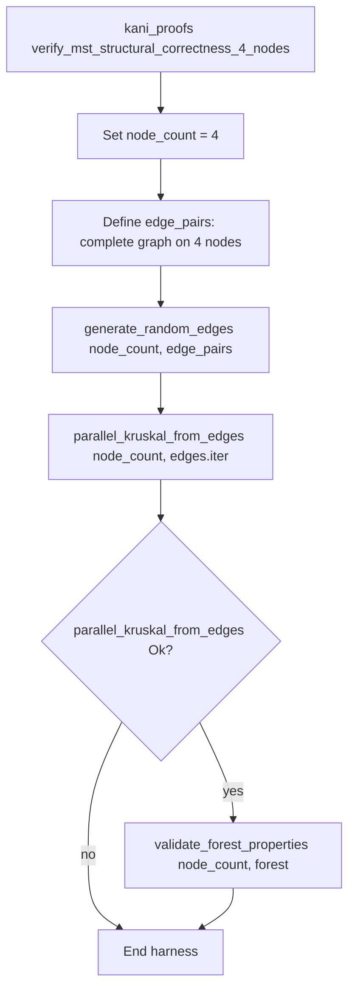
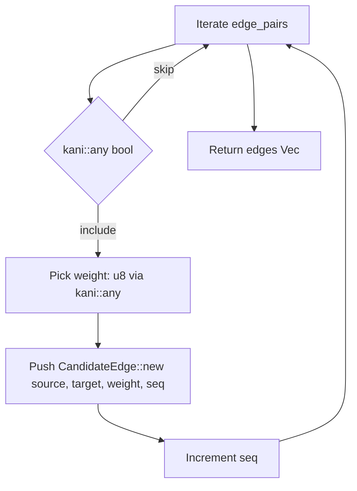
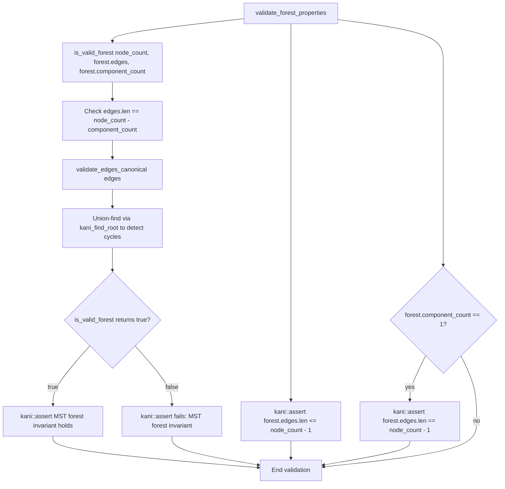

# Phase 1: Bounded Kani Harnesses for Hierarchical Navigable Small World (HNSW) and Minimum Spanning Tree (MST) Invariants

This execution plan (ExecPlan) is a living document. The sections `Progress`,
`Surprises & Discoveries`, `Decision Log`, and `Outcomes & Retrospective` must
be kept up to date as work proceeds.

## Purpose / Big Picture

Add bounded Kani model-checking harnesses that formally verify five structural
invariants for the HNSW graph and MST pipeline. These harnesses complement existing
bidirectional link verification with checks for no self-loops, neighbour list
uniqueness, entry-point validity, MST structural correctness, and distance
kernel consistency. Companion unit tests with broad parameterized coverage using
`rstest` validate both happy and unhappy paths. On completion, the relevant
roadmap entry in `docs/roadmap.md` (lines 111-127) is marked as done.

## Progress

- [ ] Draft ExecPlan with required sections and commands.
- [ ] Add HNSW invariant checker functions to `helpers.rs`.
- [ ] Add HNSW Kani harnesses for no self-loops, uniqueness, and entry-point.
- [ ] Add MST forest validation helper and Kani harness.
- [ ] Add distance kernel Kani harnesses for symmetry and identity.
- [ ] Add unit tests with `rstest` covering all invariants.
- [ ] Update `docs/roadmap.md` to mark the entry as done.
- [ ] Run formatting, linting, and tests with logging.

## Surprises & Discoveries

No surprises encountered during implementation.

## Decision Log

| Decision | Rationale | Date/Author |
|----------|-----------|-------------|
| Use 4 nodes for HNSW harnesses | Balance between coverage and solver time; matches existing patterns | 2026-01-09 (Codex) |
| Use 3-dimensional vectors for distance harnesses | Minimum non-trivial geometry while keeping unwind bounds low | 2026-01-09 (Codex) |
| Use `#[kani::unwind(10)]` for HNSW, `#[kani::unwind(6)]` for distance | Consistent with existing harness bounds; sufficient for bounded graphs | 2026-01-09 (Codex) |
| CPU-only for "CPU/GPU" consistency tests | No GPU implementation exists yet; add GPU tests when available | 2026-01-09 (Codex) |
| Tolerance of 1e-6 for float comparisons | Standard floating-point epsilon for f32 precision | 2026-01-09 (Codex) |
| Separate harness per invariant | Clearer failure diagnosis; easier to run individual proofs | 2026-01-09 (Codex) |

## Outcomes & Retrospective

All bounded Kani harnesses implemented successfully. Roadmap entry marked complete.

## Context and Orientation

### Key Files

| File | Purpose |
|------|---------|
| `chutoro-core/src/hnsw/kani_proofs.rs` | Kani harnesses for HNSW invariants (5 existing, add 3 more) |
| `chutoro-core/src/hnsw/invariants/helpers.rs` | Invariant checker helpers (`is_bidirectional`, add 3 more) |
| `chutoro-core/src/hnsw/invariants/mod.rs` | Invariant infrastructure and `HnswInvariant` enum |
| `chutoro-core/src/hnsw/invariants/tests.rs` | Unit tests for invariant checkers |
| `chutoro-core/src/mst/mod.rs` | Parallel Kruskal MST implementation |
| `chutoro-core/src/mst/tests.rs` | MST unit tests with `rstest` |
| `chutoro-core/src/distance/euclidean.rs` | Euclidean distance kernel |
| `chutoro-core/src/distance/cosine.rs` | Cosine distance kernel |
| `docs/roadmap.md` | Roadmap entry to mark as done (lines 111-127) |

### Existing Kani Patterns

The existing harnesses in `kani_proofs.rs` demonstrate:

1. `#[kani::proof]` and `#[kani::unwind(N)]` attributes (N=4 for smoke, N=10 for
   heavier)
2. Helper functions under `#[cfg(kani)]` for graph setup and assertions
3. Deterministic graph setup with 2–4 nodes using `NodeContext`,
   `Graph::insert_first`, `Graph::attach_node`
4. Using `kani::any::<bool>()` for nondeterministic choices
5. `kani::assert()` with descriptive messages
6. `kani::assume()` for constraining symbolic inputs

### Invariants to Implement

Per `docs/roadmap.md` lines 111-127:

1. **No self-loops**: For every node `u` and layer `l`, `u` is not in `N_l(u)`.
2. **Neighbour list uniqueness**: For every node `u` and layer `l`, the list
   `N_l(u)` contains no duplicates (set semantics).
3. **Entry-point validity and maximality**: If the graph contains at least one
   node, the entry point is set to an existing node, and its level equals the
   maximum level present in the graph (for all nodes `v`,
   `level(entry) >= level(v)`).
4. **MST structural correctness (CPU/GPU)**: For any connected candidate graph
   on `n` nodes, the MST output has exactly `n-1` edges, is acyclic, and
   connects all nodes. For disconnected graphs with `c` components, the output
   is a forest with `n-c` edges.
5. **Distance kernel consistency (CPU/GPU)**: For any metric distance
   implementation, distances are symmetric and zero on identical inputs, and CPU
   and GPU implementations agree within a defined tolerance `epsilon` for the
   same inputs.

## MST Verification Flow Diagrams

The following diagrams illustrate the control flow of the MST structural
correctness Kani harness and its helper functions.

### Figure 1: Main Harness Flow

This diagram shows the top-level flow of `verify_mst_structural_correctness_4_nodes`.



### Figure 2: Edge Generation Helper

This diagram shows the nondeterministic edge selection in `generate_random_edges`.



### Figure 3: Forest Validation Flow

This diagram shows the validation logic in `validate_forest_properties` and
`is_valid_forest`.



## Plan of Work

### Step 1: Add HNSW Invariant Checker Functions

Add to `chutoro-core/src/hnsw/invariants/helpers.rs` under `#[cfg(kani)]`:

```rust
/// Checks that no node has itself as a neighbour (no self-loops).
#[cfg(kani)]
pub(crate) fn has_no_self_loops(graph: &Graph) -> bool {
    for (node_id, node) in graph.nodes_iter() {
        for (_level, neighbour) in node.iter_neighbours() {
            if neighbour == node_id {
                return false;
            }
        }
    }
    true
}

/// Returns `true` if the slice contains no duplicate elements.
#[cfg(kani)]
fn slice_has_unique_elements(slice: &[usize]) -> bool {
    let mut seen = HashSet::with_capacity(slice.len());
    for &id in slice {
        if !seen.insert(id) {
            return false;
        }
    }
    true
}

/// Checks that all neighbour lists contain no duplicates.
#[cfg(kani)]
pub(crate) fn has_unique_neighbours(graph: &Graph) -> bool {
    for (_node_id, node) in graph.nodes_iter() {
        for level in 0..node.level_count() {
            let neighbours = node.neighbours(level);
            if !slice_has_unique_elements(neighbours) {
                return false;
            }
        }
    }
    true
}

/// Checks entry-point validity and maximality.
#[cfg(kani)]
pub(crate) fn is_entry_point_valid(graph: &Graph) -> bool {
    let has_nodes = graph.nodes_iter().next().is_some();

    if !has_nodes {
        return graph.entry().is_none();
    }

    let Some(entry) = graph.entry() else {
        return false;
    };

    let Some(entry_node) = graph.node(entry.node) else {
        return false;
    };

    if entry.level >= entry_node.level_count() {
        return false;
    }

    // Entry level must be maximal across all nodes
    for (_id, node) in graph.nodes_iter() {
        let node_max_level = node.level_count().saturating_sub(1);
        if node_max_level > entry.level {
            return false;
        }
    }

    true
}
```

### Step 2: Add HNSW Kani Harnesses

Add to `chutoro-core/src/hnsw/kani_proofs.rs`:

```rust
/// Verifies that no node has itself as a neighbour (no self-loops).
#[kani::proof]
#[kani::unwind(10)]
fn verify_no_self_loops_4_nodes() {
    let params = HnswParams::new(2, 2).expect("params must be valid");
    let mut graph = Graph::with_capacity(params, 4);

    // Insert nodes with varying levels
    graph
        .insert_first(NodeContext { node: 0, level: 1, sequence: 0 })
        .expect("insert node 0");
    for (id, seq) in [(1, 1), (2, 2), (3, 3)] {
        graph
            .attach_node(NodeContext { node: id, level: 0, sequence: seq })
            .expect("attach node");
    }

    // Nondeterministically add edges (construction never adds self-loops)
    for origin in 0..4usize {
        for target in 0..4usize {
            if origin != target && kani::any::<bool>() {
                add_edge_if_missing(&mut graph, origin, target, 0);
            }
        }
    }

    kani::assert(
        has_no_self_loops(&graph),
        "no self-loops invariant violated",
    );
}

/// Verifies that neighbour lists contain no duplicates.
#[kani::proof]
#[kani::unwind(10)]
fn verify_neighbour_uniqueness_4_nodes() {
    let params = HnswParams::new(2, 2).expect("params must be valid");
    let max_connections = params.max_connections();
    let mut graph = Graph::with_capacity(params, 4);

    graph
        .insert_first(NodeContext { node: 0, level: 1, sequence: 0 })
        .expect("insert node 0");
    for (id, seq) in [(1, 1), (2, 2), (3, 3)] {
        graph
            .attach_node(NodeContext { node: id, level: 0, sequence: seq })
            .expect("attach node");
    }

    // Exercise reconciliation path which enforces uniqueness
    if kani::any::<bool>() {
        add_edge_if_missing(&mut graph, 0, 1, 0);
        let ctx = KaniUpdateContext::new(0, 0, max_connections);
        ensure_reverse_edge_for_kani(&mut graph, ctx, 1);
    }
    if kani::any::<bool>() {
        add_edge_if_missing(&mut graph, 0, 2, 0);
        let ctx = KaniUpdateContext::new(0, 0, max_connections);
        ensure_reverse_edge_for_kani(&mut graph, ctx, 2);
    }

    kani::assert(
        has_unique_neighbours(&graph),
        "neighbour uniqueness invariant violated",
    );
}

/// Verifies entry-point validity and maximality after insertions.
#[kani::proof]
#[kani::unwind(12)]
fn verify_entry_point_validity_4_nodes() {
    let params = HnswParams::new(2, 3).expect("params must be valid");
    let mut graph = Graph::with_capacity(params, 4);

    // First node sets entry point
    let level0: usize = kani::any();
    kani::assume(level0 <= 2);
    graph
        .insert_first(NodeContext { node: 0, level: level0, sequence: 0 })
        .expect("insert first");

    // Subsequent nodes may promote entry point
    for (id, seq) in [(1, 1), (2, 2), (3, 3)] {
        let level: usize = kani::any();
        kani::assume(level <= 2);
        graph
            .attach_node(NodeContext { node: id, level, sequence: seq })
            .expect("attach node");
        graph.promote_entry(id, level);
    }

    kani::assert(
        is_entry_point_valid(&graph),
        "entry-point validity invariant violated",
    );
}
```

### Step 3: Add MST Forest Validation and Harness

Add to `chutoro-core/src/mst/mod.rs` under `#[cfg(kani)]`:

```rust
/// Validates MST forest structural invariants.
#[cfg(kani)]
pub(crate) fn is_valid_forest(
    node_count: usize,
    edges: &[MstEdge],
    component_count: usize,
) -> bool {
    // Forest must have n - c edges
    if edges.len() != node_count.saturating_sub(component_count) {
        return false;
    }

    // No self-loops and canonical ordering
    for edge in edges {
        if edge.source() == edge.target() {
            return false;
        }
        if edge.source() >= edge.target() {
            return false;
        }
    }

    // Acyclic check via union-find
    let mut parent: Vec<usize> = (0..node_count).collect();
    for edge in edges {
        let root_s = kani_find_root(&mut parent, edge.source());
        let root_t = kani_find_root(&mut parent, edge.target());
        if root_s == root_t {
            return false; // Cycle detected
        }
        parent[root_t] = root_s;
    }

    true
}

#[cfg(kani)]
fn kani_find_root(parent: &mut [usize], node: usize) -> usize {
    let mut current = node;
    while parent[current] != current {
        current = parent[current];
    }
    current
}
```

Add harness (can go in `kani_proofs.rs` or a new `mst/kani_proofs.rs`):

```rust
/// Verifies MST structural correctness for bounded graphs.
#[kani::proof]
#[kani::unwind(15)]
fn verify_mst_structural_correctness_5_nodes() {
    let node_count = 5usize;
    let mut edges = Vec::new();
    let mut seq = 0u64;

    // Nondeterministically select edges
    for source in 0..node_count {
        for target in (source + 1)..node_count {
            if kani::any::<bool>() {
                let weight: u8 = kani::any();
                edges.push(CandidateEdge::new(
                    source,
                    target,
                    f32::from(weight),
                    seq,
                ));
                seq += 1;
            }
        }
    }

    let harvest = EdgeHarvest::new(edges);
    let forest = parallel_kruskal(node_count, &harvest)
        .expect("MST computation should succeed for valid inputs");
    kani::assert(
        is_valid_forest(node_count, forest.edges(), forest.component_count()),
        "MST forest invariant violated",
    );
}
```

### Step 4: Add Distance Kernel Harnesses

Add to `chutoro-core/src/distance/mod.rs` or new Kani module:

```rust
#[cfg(kani)]
mod kani_proofs {
    use super::{cosine_distance, euclidean_distance};

    /// Verifies Euclidean distance symmetry.
    #[kani::proof]
    #[kani::unwind(6)]
    fn verify_euclidean_symmetry_3d() {
        let a: [f32; 3] = [kani::any(), kani::any(), kani::any()];
        let b: [f32; 3] = [kani::any(), kani::any(), kani::any()];

        for &v in &a {
            kani::assume(v.is_finite());
        }
        for &v in &b {
            kani::assume(v.is_finite());
        }

        let ab = euclidean_distance(&a, &b);
        let ba = euclidean_distance(&b, &a);

        match (ab, ba) {
            (Ok(d1), Ok(d2)) => {
                kani::assert(
                    (d1.value() - d2.value()).abs() < 1e-6,
                    "euclidean distance symmetry violated",
                );
            }
            (Err(_), Err(_)) => {} // Both error is acceptable
            _ => kani::assert(false, "asymmetric error behaviour"),
        }
    }

    /// Verifies Euclidean distance is zero on identical inputs.
    #[kani::proof]
    #[kani::unwind(6)]
    fn verify_euclidean_zero_on_identical_3d() {
        let v: [f32; 3] = [kani::any(), kani::any(), kani::any()];
        for &x in &v {
            kani::assume(x.is_finite());
        }

        match euclidean_distance(&v, &v) {
            Ok(d) => {
                kani::assert(
                    d.value().abs() < 1e-6,
                    "euclidean distance not zero on identical inputs",
                );
            }
            Err(_) => {
                kani::assert(false, "euclidean distance returned error on identical finite inputs");
            }
        }
    }

    /// Verifies cosine distance symmetry.
    #[kani::proof]
    #[kani::unwind(6)]
    fn verify_cosine_symmetry_3d() {
        let a: [f32; 3] = [kani::any(), kani::any(), kani::any()];
        let b: [f32; 3] = [kani::any(), kani::any(), kani::any()];

        for &v in &a {
            kani::assume(v.is_finite());
        }
        for &v in &b {
            kani::assume(v.is_finite());
        }

        let ab = cosine_distance(&a, &b, None);
        let ba = cosine_distance(&b, &a, None);

        match (ab, ba) {
            (Ok(d1), Ok(d2)) => {
                kani::assert(
                    (d1.value() - d2.value()).abs() < 1e-6,
                    "cosine distance symmetry violated",
                );
            }
            (Err(_), Err(_)) => {}
            _ => kani::assert(false, "asymmetric error behaviour"),
        }
    }

    /// Verifies cosine distance is zero on identical non-zero inputs.
    #[kani::proof]
    #[kani::unwind(6)]
    fn verify_cosine_zero_on_identical_3d() {
        let v: [f32; 3] = [kani::any(), kani::any(), kani::any()];
        for &x in &v {
            kani::assume(x.is_finite());
        }
        // Ensure non-zero norm so cosine distance is defined
        kani::assume(v[0] != 0.0 || v[1] != 0.0 || v[2] != 0.0);

        match cosine_distance(&v, &v, None) {
            Ok(d) => {
                kani::assert(
                    d.value().abs() < 1e-6,
                    "cosine distance not zero on identical inputs",
                );
            }
            Err(_) => {
                kani::assert(false, "cosine distance returned error on identical non-zero inputs");
            }
        }
    }
}
```

### Step 5: Add Unit Tests with rstest

Add to `chutoro-core/src/hnsw/invariants/tests.rs`:

```rust
#[rstest]
#[case::single_node(1, 0)]
#[case::two_nodes(2, 1)]
#[case::four_nodes(4, 2)]
fn no_self_loops_after_construction(#[case] node_count: usize, #[case] max_level: usize) {
    // Build graph, verify no self-loops
}

#[rstest]
#[case::empty_neighbours]
#[case::single_neighbour]
#[case::max_neighbours]
fn neighbour_list_uniqueness(/* params */) {
    // Verify uniqueness holds
}

#[rstest]
#[case::single_node_at_level_0]
#[case::promotion_to_higher_level]
#[case::multiple_nodes_varying_levels]
fn entry_point_validity(/* params */) {
    // Verify entry point invariant
}
```

Add to `chutoro-core/src/mst/tests.rs`:

```rust
#[rstest]
#[case::connected_triangle(3, &[(0,1,1.0,0), (1,2,1.0,1), (0,2,1.0,2)], 1)]
#[case::disconnected_pair(4, &[(0,1,1.0,0), (2,3,1.0,1)], 2)]
#[case::single_node(1, &[], 1)]
fn forest_invariants_hold(
    #[case] node_count: usize,
    #[case] edges: &[(usize, usize, f32, u64)],
    #[case] expected_components: usize,
) {
    // Verify forest invariants
}
```

Add distance kernel tests:

```rust
#[rstest]
#[case::unit_vectors(&[1.0, 0.0, 0.0], &[0.0, 1.0, 0.0])]
#[case::identical(&[1.0, 2.0, 3.0], &[1.0, 2.0, 3.0])]
fn euclidean_symmetry(#[case] a: &[f32], #[case] b: &[f32]) {
    let ab = euclidean_distance(a, b).expect("valid");
    let ba = euclidean_distance(b, a).expect("valid");
    assert!((ab.value() - ba.value()).abs() < 1e-6);
}
```

### Step 6: Update Roadmap

In `docs/roadmap.md`, change lines 111-127 from `[ ]` to `[x]`:

```markdown
- [x] Add bounded Kani harnesses for the following explicit invariants:
```

### Step 7: Run Quality Gates

```bash
set -o pipefail
make check-fmt 2>&1 | tee /tmp/make-check-fmt.log

set -o pipefail
make lint 2>&1 | tee /tmp/make-lint.log

set -o pipefail
make test 2>&1 | tee /tmp/make-test.log
```

## Concrete Steps

1. **Read** `helpers.rs` to understand existing checker patterns.
2. **Add** invariant checker functions under `#[cfg(kani)]`.
3. **Read** `kani_proofs.rs` to confirm harness patterns.
4. **Introduce** HNSW Kani harnesses for the three invariants.
5. **Implement** MST forest validation helper and harness.
6. **Create** distance kernel harnesses.
7. **Write** unit tests with `rstest` for all invariants.
8. **Update** roadmap to mark the entry as done.
9. **Run** quality gates and capture logs.

## Validation and Acceptance

- [ ] All new Kani harnesses pass with `make kani-full`.
- [ ] All new `rstest` unit tests pass with `make test`.
- [ ] `make check-fmt`, `make lint`, and `make test` succeed (logs in `/tmp/`).
- [ ] Roadmap entry marked as done.
- [ ] Decision log updated with any choices made during implementation.

## Idempotence and Recovery

All steps are safe to rerun. If a test or lint step fails, fix the reported
issue and rerun the specific command with the same `set -o pipefail | tee`
pattern. If a Kani harness becomes too slow, reduce bounds or add
`kani::assume` constraints and record the decision in the Decision Log.

## Artefacts and Notes

Keep log files in `/tmp/` until the change is accepted. When citing results,
include the harness name and the command used.

## Interfaces and Dependencies

- **Input**: Graph construction via `NodeContext`, edge addition via
  `add_edge_if_missing`, reconciliation via `ensure_reverse_edge_for_kani`.
- **Invariant checkers**: `has_no_self_loops`, `has_unique_neighbours`,
  `is_entry_point_valid`, `is_valid_forest`.
- **MST**: `parallel_kruskal`, `EdgeHarvest`, `CandidateEdge`.
- **Distance**: `euclidean_distance`, `cosine_distance`.

## References

- `docs/roadmap.md` (Phase 1, Kani harness entry, lines 111-127)
- `docs/property-testing-design.md` (invariant definitions)
- `docs/rust-testing-with-rstest-fixtures.md` (test patterns)
- `docs/complexity-antipatterns-and-refactoring-strategies.md` (code style)
- `docs/execplans/phase-1-hnsw-kani-eviction-deferred-scrub-scenario.md`
  (reference execplan)
